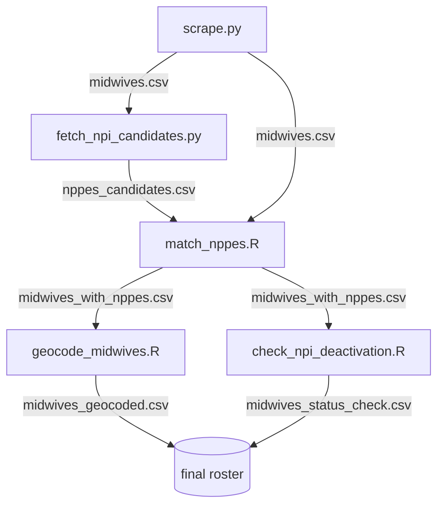

# Architecture & onboarding guide

A map of the codebase for someone seeing it for the first time. The
[README](README.md) explains *why* the project works the way it does; this file
explains *how the pieces fit together* and *how to run and test them*.

## What this project does

It builds a geolocated roster of every midwife certified by the American
Midwifery Certification Board (AMCB):

1. **Scrape** the AMCB public certification directory (names + certification
   status only — AMCB does not publish location).
2. **Fetch** candidate provider records from the national NPI Registry, keyed on
   surname, to supply the missing geography.
3. **Match** each AMCB certificant to the right NPI, using name similarity
   gated by clinical evidence (a same-surname pool means a perfect name match
   can still be the wrong person).
4. **Geocode** the matched practice addresses and **cross-check** certification
   status against NPI deactivations.

## The pipeline

Each stage reads the previous stage's output file and writes its own, so the
scripts run in order and can be re-run independently.



### Stage-by-stage

| # | Script | Reads | Writes | Notes |
|---|--------|-------|--------|-------|
| 1 | `scrape.py` | AMCB directory (live) | `midwives.csv` | Python stdlib only. Works around the report's 500-row cap with digit-by-digit certification-number sweeps. |
| 2 | `fetch_npi_candidates.py` | `midwives.csv`, NPI Registry API (live) | `nppes_candidates.csv`, `nppes_api_cache.jsonl` | Python stdlib only. Queries by surname; caches every response so re-runs resume. |
| 3 | `match_nppes.R` | `midwives.csv`, `nppes_candidates.csv` | `midwives_with_nppes.csv`, `midwives_unmatched.csv`, `artifacts/match_ledger.csv`, `artifacts/exclusion_ledger.csv` | The matcher. Built on the external *isochrones* matching stack (see below). |
| 4 | `geocode_midwives.R` | `midwives_with_nppes.csv` | `midwives_geocoded.csv`, `geocode_queue.csv` | Joins against the shared isochrones geocoding cache (DuckDB); does **not** call a geocoding service. |
| 5 | `check_npi_deactivation.R` | `midwives_with_nppes.csv`, NPPES Deactivated NPI Report (xlsx) | `midwives_status_check.csv` | Cross-checks AMCB status against NPI deactivations. |

### Supporting files

| File | Role |
|------|------|
| `credential_compatibility.R` | The credential gate used by the matcher (`are_credentials_compatible_midwifery()`). Re-implemented for this cohort because the isochrones gate only understands MD/DO. Pure, dependency-free. |
| `extract_nppes_midwives.R` | Alternative candidate source: extracts midwifery providers from the 9.8 GB NPPES bulk dissemination file to parquet. The pipeline prefers the **live API** (stage 2) because the bulk snapshot is stale; this script is kept for offline/bulk work. |
| `dbg.py` | Interactive scratch script for poking at the AMCB report by hand. Not part of the pipeline. |
| `tests/` | pytest suite for the Python parsing/transform logic. See [TEST_COVERAGE.md](TEST_COVERAGE.md). |

## The isochrones dependency

Stages 3 and 4 lean on a **separate project** — *isochrones* — for the heavy
matching and geocoding machinery (name parsing, Jaro-Winkler scoring, the
nickname dictionary, the match/exclusion ledgers, and the geocoding cache).
This repo owns only the *glue*: the credential gate, the evidence tiers, the
acceptance ladder, and the data plumbing. If that project lives somewhere other
than `~/isochrones`, point the scripts at it with `ISOCHRONES_R` and
`GEOCODING_CACHE_PATH` (below).

## Environment variables

| Variable | Used by | Default | Purpose |
|----------|---------|---------|---------|
| `ISOCHRONES_R` | `match_nppes.R` | `~/isochrones/R` | Path to the isochrones `R/` source directory the matcher sources. |
| `GEOCODING_CACHE_PATH` | `geocode_midwives.R` | `~/isochrones/data/geocoding_cache.duckdb` | The shared geocoding cache (DuckDB). |
| `NPI_DEACTIVATION_REPORT` | `check_npi_deactivation.R` | `~/Documents/NPPES Deactivated NPI Report 20240408.xlsx` | The NPPES Deactivated NPI Report to cross-check against. |
| `NPI_BUILD_ONLY` | `fetch_npi_candidates.py` | unset | Set to `1` to rebuild `nppes_candidates.csv` from the existing cache without issuing any API requests. |

## Dependencies

- **Python 3** — the scrapers use only the standard library. `pytest` is needed
  to run the test suite.
- **R** with: `dplyr`, `readr`, `stringdist`, `tidyr` (matcher); `DBI`,
  `duckdb` (geocoding, bulk extract); `readxl` (deactivation check).
- **The isochrones project** — sourced by the R matcher/geocoder (see above).

## Getting started

```bash
# 1. Scrape the directory (no dependencies, writes midwives.csv)
python3 scrape.py

# 2. Pull NPI candidates (resumable; cached to nppes_api_cache.jsonl)
python3 fetch_npi_candidates.py

# 3. Match to NPPES  (needs R + the isochrones project on ISOCHRONES_R)
Rscript match_nppes.R

# 4. Geocode and status-check
Rscript geocode_midwives.R
Rscript check_npi_deactivation.R
```

## Running the tests

```bash
pip install pytest
pytest        # 24 tests over the Python parsing/transform logic
```

The Python scripts are safe to `import` without running anything — each guards
its entry point behind `if __name__ == "__main__":`, which is what lets the
tests reach the pure functions. See [TEST_COVERAGE.md](TEST_COVERAGE.md) for the
current coverage and the proposed next steps (including a `testthat` plan for
the R side).

## Reading order for a newcomer

1. This file, then the [README](README.md) for the scraping/matching rationale.
2. `scrape.py` — small, self-contained, and the source of the whole dataset.
3. `credential_compatibility.R` — short, pure, and central to match precision.
4. `match_nppes.R` — the matcher; start at `score_one()`, which is documented
   with the two-stage (exact → fuzzy) contract.
