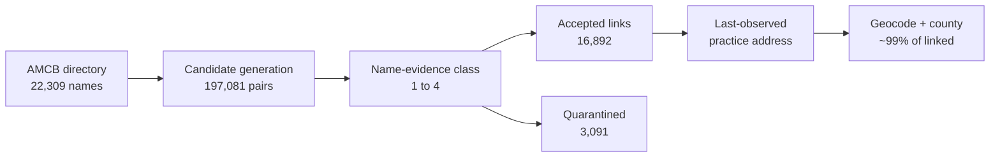

# midwifery

**[→ Interactive pipeline diagrams](https://claude.ai/code/artifact/9a541a9f-038f-458b-bb9d-d3b0120ca2cd)**
&nbsp;·&nbsp; [source](docs/pipeline.html)

Flowcharts of the whole chain — AMCB name to NPI to county — with the real counts at every stage
and the defects each guard caught. (Private link; visible to the repo owner.)

| Stage | Result |
|---|---|
| AMCB roster scraped | 22,309 certificants (reconciles to AMCB's own totals) |
| Primary linkage | 14,668 (65.7%) — midwifery taxonomy confirmed |
| Sensitivity tiers | +1,896 nursing, +328 fuzzy → 16,892 accepted (75.7%) |
| Quarantined | 3,091 — candidates exist but identity is ambiguous |
| Unmatched | 2,326 — no plausible NPI at all |
| County (enhanced) | 98.9% of primary links, ~99% in every tier |

Linkage certainty and geographic completeness are separate properties: **65.7% primary linkage is
the inferential limitation; the geography is essentially complete for anything linked.** Linkage
also varies sharply by certification status (82.3% ACTIVE vs 19.6% DECEASED), so the linked subset
is not a random sample of the roster.

Scraper for the [AMCB certification directory](https://ams.amcbmidwife.org/amcbssa/f?p=AMCBSSA:17800)
(American Midwifery Certification Board public primary-source verification listing).

> **New to this codebase?** Start with [ARCHITECTURE.md](ARCHITECTURE.md) for the
> end-to-end pipeline, per-file roles, environment variables, and how to run and
> test each stage. This README covers the scraping and matching rationale in
> depth.

## Maps

Built with [mufflyt/mysterymaps](https://github.com/mufflyt/mysterymaps) (`mysterymaps_map_base()`
for the leaflet base; state and county layers drawn against the same TIGER 2023 vintage the linkage
assigned counties from).

### Two filters, kept separate

`linkage_tier` answers *how sure are we this is the right NPI?* `AMCB status` answers *is this person
part of the current workforce?* Conflating them turns a confidently-linked deceased certificant into a
practising midwife. Of the 14,618 primary-tier links with geography:

| Status | n | % |
|---|---:|---:|
| **ACTIVE** | **11,877** | **81.2** |
| LAPSED | 2,020 | 13.8 |
| RETIRED | 579 | 4.0 |
| DECEASED | 93 | 0.6 |
| EMERITUS | 20 | 0.1 |
| DEACTIVATED | 16 | 0.1 |
| REVOKED | 8 | 0.1 |
| SURRENDERED | 5 | 0.0 |
| **Total** | **14,618** | 100 |

**Workforce rule: `status == "ACTIVE"`, nothing else.** RETIRED is "permanently retired from
practice"; LAPSED, REVOKED and SURRENDERED holders may not use the CNM/CM title. EMERITUS carries a
status AMCB's own definitions page does not document. DEACTIVATED usually means a CM↔CNM switch — 16
of 22 have an ACTIVE record under the same name so the person is still counted, and 6 are dropped.
Verified: 11,913 ACTIVE primary-linked rows map to 11,913 distinct NPIs, so nobody is double-counted.

### Denominator flow

| Stage | n | % of previous | % of roster |
|---|---:|---:|---:|
| Full AMCB roster | 22,309 | — | 100.0 |
| ACTIVE status | 15,285 | 68.5 | 68.5 |
| + primary NPI link | 11,913 | 77.9 | 53.4 |
| + `county_best` | **11,877** | 99.7 | **53.2** |
| + `county_exact` | 11,780 | 99.2 | 52.8 |

Primary linkage by status — geography cannot repair people who never linked: ACTIVE 77.9%,
RETIRED 45.6%, LAPSED 39.2%, DECEASED 18.6%.

### The maps

| Map | Cohort | Reading |
|---|---|---|
| [`active_state_rate.png`](docs/maps/active_state_rate.png) | ACTIVE | supply per 100k women 15–44 |
| [`active_county_counts.png`](docs/maps/active_county_counts.png) | ACTIVE | counts by county |
| [`roster_county_descriptive.png`](docs/maps/roster_county_descriptive.png) | **all statuses** | **descriptive only — not workforce** |
| [`active_midwives_by_state.csv`](docs/maps/active_midwives_by_state.csv) | ACTIVE | counts and rates |
| County leaflet | ACTIVE | rebuild with `Rscript map_midwife_geography.R` |
| Person-level points | ACTIVE | **internal QA only**, not committed |

Active supply per 100,000 women aged 15–44: **WA 24.9, NY 21.4, NC 19.5, GA 18.1**; by raw count
**CA 1,015, NY 971, FL 670**. 1,173 of 3,109 CONUS counties contain at least one linked active
practice location.

### What these maps are not

They show **last-observed NPPES practice location**, not confirmed current practice at that site.
They are **practice-location distribution, not access** — patients cross county lines, and 22% of
ACTIVE certificants have no linked location, so an empty county is not a county without midwifery
care. Travel-time isochrones would answer access. Person-level point maps stay internal: jittering
is not de-identification, and in a rural county with one CNM the jitter is cosmetic.

## Usage

    python3 scrape.py    # writes midwives.csv

No dependencies beyond the Python standard library.

## How it works

The directory is an Oracle APEX classic report that hard-caps any result set at
500 rows — paging past row 500 returns *"Invalid set of rows requested"*. The
per-discipline `Total : N` line, however, is exact even when the rows are
capped.

Only four search items are honoured by the report: certification, certification
number, last name and first name. Certification number matches by `INSTR`
(substring, no wildcards), which gives the partition used here:

* numbers prefixed `CNM`/`CM` — walk the prefix digit by digit; the prefix only
  occurs at the start, so a prefixed pattern is effectively anchored
* bare digit numbers — sweep every 3-digit substring, since any number with at
  least three digits contains one. The 2- and 1-digit sweeps run only if the
  running count still falls short

Each bucket under the cap is fetched in a single 500-row request and
de-duplicated on (certification, certification number). The scraper checks its
result against the reported total before writing.

Collected 2026-08-06: 22,309 records (183 Certified Midwives, 22,126 Certified
Nurse-Midwives), matching the directory's own totals exactly.

## Location data

AMCB does not publish city/state — those sit behind its paid primary-source
verification, linked per row as `purchase_product?p_related_cust_id=...`. The
scraper records that `customer_id` (present for ACTIVE certifications only) so
individual verifications can be purchased through AMCB's normal checkout; it
does not touch the purchase endpoint.

Geography instead comes from NPPES:

    python3 fetch_npi_candidates.py    # NPI Registry API -> nppes_candidates.csv
    Rscript match_nppes.R              # -> midwives_with_nppes.csv
    Rscript geocode_midwives.R         # -> midwives_geocoded.csv
    Rscript check_npi_deactivation.R   # -> midwives_status_check.csv

Candidates come from the live NPI Registry API keyed on surname, not from a
bulk dissemination file: the local March 2024 snapshot is two years stale and
simply lacks recently certified midwives. Querying by surname (rather than by
midwifery taxonomy) also returns CNMs enumerated under other taxonomies, and
returns each provider's former/maiden names, which matter in a cohort that is
~99% women.

Matching is built on the isochrones matching stack — `parse_physician_name_enhanced()`,
`calculate_similarities()` + `apply_scoring()`, `score_middle_name_match()`,
the nickname dictionary, `write_match_ledger()`, `validate_pipeline_output()`
and `log_exclusion()`. Set `ISOCHRONES_R` if that project lives elsewhere.
A deterministic exact pass runs first; only the residual pays for
Jaro-Winkler scoring.

Acceptance scales with clinical evidence, because a surname-blocked pool means
a perfect name match can still be the wrong person: 0.82 with a midwifery
taxonomy or CNM/CM credential, 0.88 with nursing/women's-health evidence, 0.95
and sole candidate with neither. Only `Accept` rows carry geography.

`credential_compatibility.R` documents why the project's credential gate is
re-implemented here (its enum is MD/DO/UNKNOWN, which either no-ops or
fails closed on a CNM) and why gender blocking is deliberately not used.

Known coverage gap: 106 first+last name combinations are common enough to
still hit the API's 200-row response cap, so their candidate lists are
truncated.

## Output columns

`certification, certification_number, status, certification_date,
expiration_date, last_name, first_name, middle_name, discipline, primary_source`
