# midwifery

**[→ Interactive pipeline diagrams](https://claude.ai/code/artifact/9a541a9f-038f-458b-bb9d-d3b0120ca2cd)**
&nbsp;·&nbsp; [source](docs/pipeline.html)

Flowcharts of the whole chain — AMCB name to NPI to county — with the real counts at every stage
and the defects each guard caught. (Private link; visible to the repo owner.)

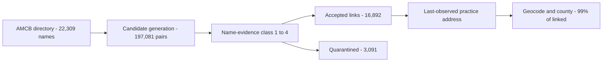

| Stage | Result |
|---|---|
| AMCB roster scraped | 22,309 certificants (reconciles to AMCB's own totals) |
| Primary linkage | 14,668 (65.7%) — midwifery taxonomy confirmed |
| Sensitivity tiers | +1,896 nursing, +328 fuzzy → 16,892 accepted (75.7%) |
| Quarantined | 3,091 — candidates exist but identity is ambiguous |
| Unmatched | 2,326 — no plausible NPI at all |
| County (enhanced) | 98.9% of primary links, ~99% in every tier |

Linkage certainty and geographic completeness are separate properties: **65.7% primary linkage is
the inferential limitation; the geography is essentially complete for anything linked.** Linkage
also varies sharply by certification status (82.3% ACTIVE vs 19.6% DECEASED), so the linked subset
is not a random sample of the roster.

Scraper for the [AMCB certification directory](https://ams.amcbmidwife.org/amcbssa/f?p=AMCBSSA:17800)
(American Midwifery Certification Board public primary-source verification listing).

> **New to this codebase?** Start with [ARCHITECTURE.md](ARCHITECTURE.md) for the
> end-to-end pipeline, per-file roles, environment variables, and how to run and
> test each stage. This README covers the scraping and matching rationale in
> depth.

## From a midwife's name to a county on a map

The American Midwifery Certification Board publishes **22,309 certified midwives
and no addresses at all**. Everything geographic in this project rests on turning
each name into an NPI, and each NPI into a practice location.

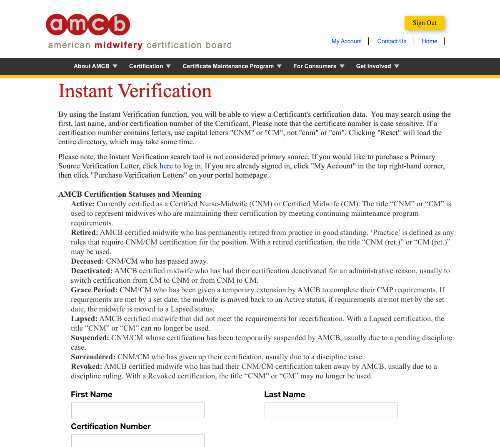

*The source. Names, certification numbers, status and dates are public; location
is not published at any level. AMCB's own status definitions are reproduced
above, and they are why `status` and `linkage_tier` are kept apart below —
"Deactivated" is an administrative CM↔CNM switch, not an exit from practice.*

### The whole pipeline

Four stages, each writing an artifact its successor verifies by SHA-256 before
doing any work. Identity is decided first; taxonomy and geography follow.

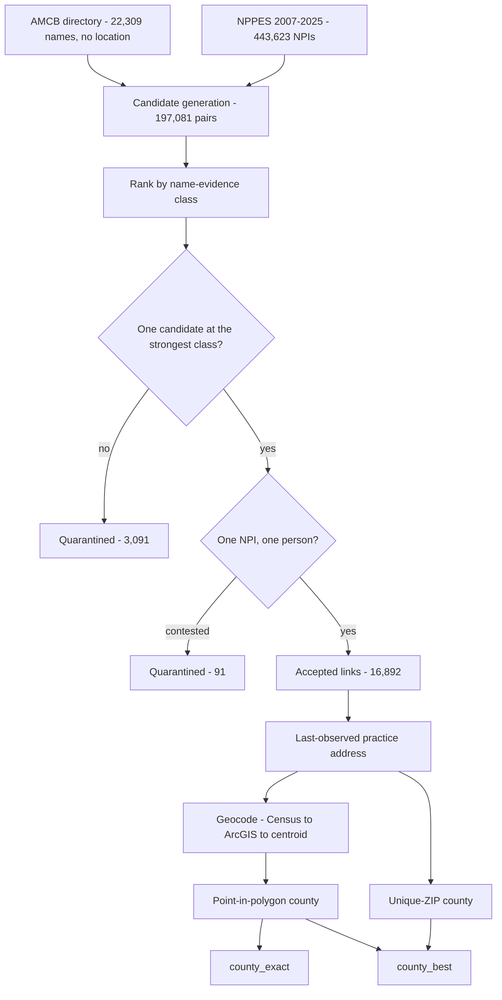

Quarantine is an outcome, not a failure: it marks records where the evidence
cannot identify one person.

### Identity evidence is ordered, not scored

Two people who are both exact first-and-last-name matches, with no middle name,
no address and no date of birth, **are** indistinguishable. A numeric score would
only manufacture certainty, so evidence is a ranked class and taxonomy never
breaks a name tie.

| Class | Evidence | Candidate pairs |
|---|---|---:|
| **1** (strongest) | exact first + last, with a recorded middle name | 10,412 |
| **2** | exact first + last, no middle information | 12,258 |
| **3** | exact last + first initial | 150,745 |
| **4** | fuzzy last (Levenshtein ≤ 2) + exact first | 23,666 |

A candidate is resolved only when exactly one sits at a roster row's best
available class. **Class 2 was empty until a defect was found:**
`paste(NA, "")` produced the literal string `"NA"`, giving every midwife without
a middle name a fabricated initial that matched every other absent one.

### Taxonomy decides the tier, never the identity

A certified nurse-midwife must hold RN licensure and may register under either
taxonomy. So nursing NPIs are candidates — but a nursing-only match is a separate
evidence tier, never promoted into the primary cohort.

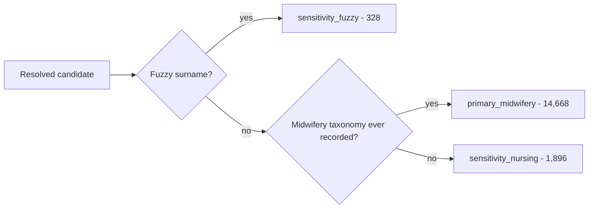

### Where the 22,309 go

Linkage, not geocoding, is the binding constraint. Every record that fails is
classified by *why*, and the two kinds of missingness are kept apart: no
plausible NPI exists, versus plausible NPIs exist but identity is ambiguous.

| Stage | n | % of roster |
|---|---:|---:|
| AMCB roster | 22,309 | 100.0 |
| **Primary linkage** | **14,668** | **65.7** |
| + nursing tier | 16,564 | 74.2 |
| + fuzzy tier | 16,892 | 75.7 |
| Quarantined | 3,091 | 13.9 |
| No candidate at all | 2,326 | 10.4 |
| **Primary + county** | **14,631** | **65.6** |

All 3,091 quarantined records have candidates; all 2,326 unmatched records have
none. That distinction is preserved in the artifact as `has_candidate`.

### Geography, once identity is settled

Coordinates and ZIP must describe the **same** address. Pairing coordinates
geocoded from one roster with ZIPs from another dropped validation agreement to
94.47%; rebuilt from a single address vintage it reaches 99.95%.


> All 17 cross-state conflicts are one address: **Fort Campbell, KY 42223** — a
> base that straddles the Kentucky–Tennessee line. They stay unresolved with both
> sources retained, rather than being special-cased, so the rule stays general.

### Completeness by evidence tier

Reported separately, never pooled: a county attached to a fuzzy-name match is not
the same evidence as one attached to a uniquely identified person.

| Tier | n | exact · frozen | exact · enhanced | best · enhanced |
|---|---:|---:|---:|---:|
| primary_midwifery | 14,668 | 98.1% | **98.9%** | **99.7%** |
| sensitivity_nursing | 1,896 | 32.2% | **98.5%** | **99.8%** |
| sensitivity_fuzzy | 328 | 47.9% | **98.8%** | **99.4%** |
| quarantined | 3,091 | — | — | — |
| unmatched | 2,326 | — | — | — |

Quarantined and unmatched rows carry zero analytic geography, asserted at build
time. The frozen column is the reference artifact; the enhanced column adds 1,484
newly geocoded addresses.

**The tier gap was ascertainment, not evidence.** Nursing-tier geography looked
far worse than primary's — 32.2% against 98.1%. Geocoding the 1,624 addresses
that had never been sent to a geocoder closed it almost entirely: nursing reaches
98.5%. The gap measured which addresses happened to be cached, not anything about
the linkage.

That separation matters for interpretation. **Linkage certainty differs by tier
and is the real inferential limitation** — primary rests on midwifery-taxonomy
confirmation, nursing on name evidence alone. **Geographic completeness,
conditional on having a link, is now ~99% everywhere.** The two should never be
reported as one number.

### What the guards caught

Every number above survived a check that could have refuted it. These fired:

| Defect | Effect if unfound |
|---|---|
| Middle initials fabricated from missing values | All 18,397 pairs falsely "agreed" |
| Point-in-polygon gated on `all(is.na())` | 10,225 coordinates never became counties |
| Staged cascade suppressed candidates | 90% of plausible pairs never generated |
| Coordinates and ZIPs from different rosters | Validation fell to 94.47% |
| Reused geocoder `run_id` | 147 addresses lost their attempt provenance |
| NPPES snapshots 2018–2025 silently skipped | Linkage 27.1 points lower |

Frozen linkage `b44bf2bc9254…` · frozen geography `9455138198e4…` · enhanced
geography `53bb087a59a4…` · NPPES snapshots 2007–2025 · CMS Doctors & Clinicians
2026-06 · TIGER 2023 counties. Geography figures here are the *enhanced* version;
the frozen artifact is unmodified and remains the reference. Every artifact
carries a manifest recording its inputs' SHA-256.

## Attribute layers: what we know about each midwife

Identity and geography answer *who* and *where*. Four further layers answer
*what kind of practice* — each keyed on the frozen linkage, each written as its
own artifact, none of them allowed to change cohort membership.

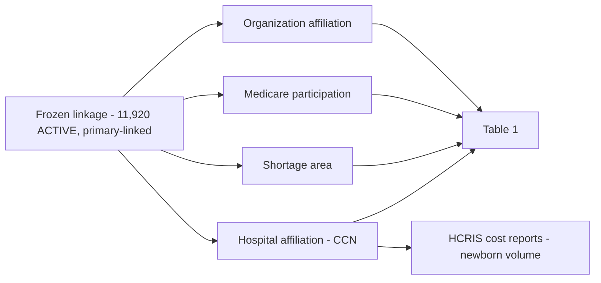

| Layer | Producer | Coverage | Key |
|---|---|---:|---|
| Medicare Part B / Part D, 2013–2023 | `match_medicare_partb_partd.R` | 19.5% / 47.1% | NPI |
| Primary-care shortage area | `assign_hpsa_status.R` | 98.4% geocoded | point-in-polygon |
| Hospital affiliation | `extract_dac_facility_affiliations.R` | 14.0% | CCN |
| Newborn volume at those hospitals | `extract_hcris_affiliated_hospitals.R` | 75.8% of linked CCNs | CCN |
| Organization affiliation | `link_practice_locations_to_org_npi.R` | 39.7% | phone / ZIP+4 / ZIP5 |
| — conservatively resolved | `resolve_org_ambiguity.R` | 46.3% | + taxonomy, cross-source |

### Absence is not zero, in four different sources

The same discipline recurs because the same mistake recurs. Each of these
sources is silent for reasons that have nothing to do with the quantity being
measured:

- **CMS suppresses** any provider-year below 11 beneficiaries, so a midwife
  absent from Part B billed *nothing or fewer than eleven patients*, and the two
  are indistinguishable.
- **The DAC lists only Medicare enrollees**, so absence means *not enrolled* or
  *enrolled without recorded privileges* — kept as two separate Table 1 levels,
  never collapsed into one "no".
- **CDC WONDER withholds** county cells under 10 births and publishes county
  natality only for counties of 100,000+. **2,657 of 3,235 counties** carry no
  CNM birth value; those births are unpublished, not absent.
- **HCRIS nursery lines** are reported by only 37.7% of hospitals. A hospital
  with no nursery line has not reported "no births".

Every one of these is a labelled level or an `NA`, never a `0`.

### Organization affiliation: what it took to get 39.7%

CMS exposes **both** practice locations for an individual NPI — the primary one
on the main NPPES file and any number of secondary ones on `pl_pfile`. Joining
both to the Type-2 (organization) NPIs registered at the *same* location turns
an address into a named hospital, FQHC, OB/GYN group or health system.

Using the current dissemination mattered: the August 2026 `pl_pfile` carries
1,241,922 secondary locations against 681,081 in the December 2022 file, lifting
cohort secondary locations from 2,687 to 5,303.

Three rules keep the number honest:

**Exact keys only, never proximity.** Locations join on telephone, ZIP+4 plus
street, or ZIP5 plus street. There is no nearest-facility fallback: practising
400 m from a hospital is not evidence of working there, and a distance rule
produces an affiliation that cannot be falsified.

**Ambiguity is reported, not resolved.** Medical office buildings hold many
organizations at one address. Where a key matches several, **no** organization
is assigned — 4,750 midwives sit in that state, as many as were resolved.
Taking the first, the largest, or the most medical-sounding would have pushed
this past 9,000 fabricated names.

**Shared infrastructure is not evidence.** A phone number maps to a median of
one organization nationally and 99% map to ≤6 — but the maximum is 880, a
switchboard. Keys above a threshold are discarded; without that guard one
midwife inherited 85 affiliations from a single hospital campus.

### A cautionary result: two implementations, 16.4% agreement

Two independent Open Payments → organization matchers agreed on the Type-2 NPI
for only **74 of 450** overlapping midwives. The cause was not normalization.
One queried the live NPPES API by city/state/ZIP with `limit=10`; the API
returns results **alphabetically**, so a ZIP holding 200+ organizations was
truncated to the alphabetically first ten and any organization sorting after
roughly "C" was unreachable. 68.4% of its assignments began with "A" or a digit,
against 6.9% for the independent resolver.

Rebuilt against the complete local Type-2 table
(`link_open_payments_type2_bulk.R`), agreement among cases where both methods
independently resolve rose to **72.2%** — on 72 cases, so promising rather than
settled. The remaining disagreements are mostly not matching failures at all:
for 11 of 20, the two pipelines had read *different* Open Payments addresses.

The general lesson is recorded because it will recur: **apparent uniqueness is
conditional on how much of the universe you loaded.** Incomplete coverage makes
a common name look *more* unique, not less.

## Maps

Built with [mufflyt/mysterymaps](https://github.com/mufflyt/mysterymaps) (`mysterymaps_map_base()`
for the leaflet base; state and county layers drawn against the same TIGER 2023 vintage the linkage
assigned counties from).

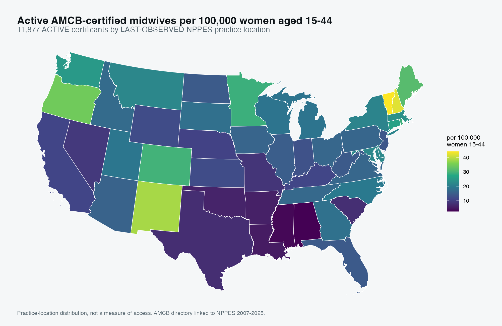

### Supply, before travel time enters the picture

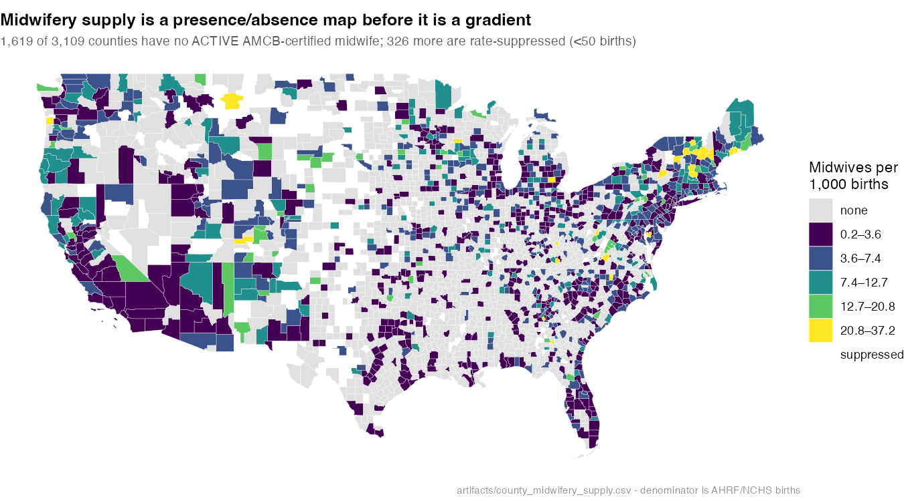

Midwives per 1,000 births is a **count over a denominator** — both complete — so
unlike anything drawn from isochrones it does not depend on coverage. Zero gets
its own colour deliberately: 1,619 of 3,109 CONUS counties have no ACTIVE
AMCB-certified midwife, and an equal-interval scale renders every one of them as
"low" rather than "none".

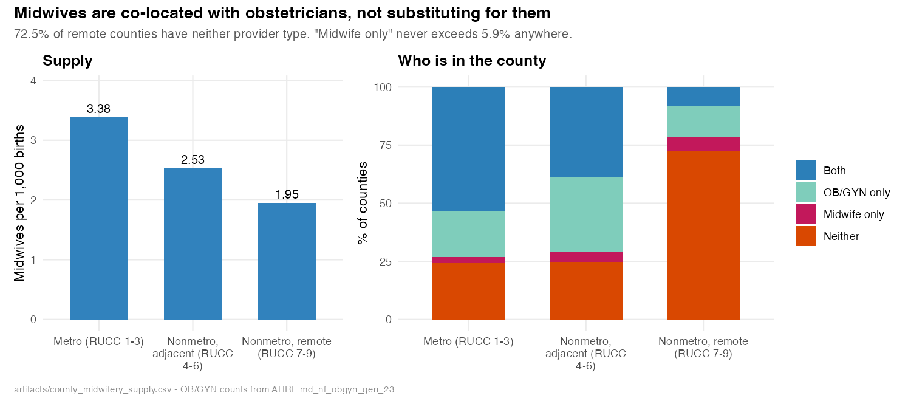

The gradient is monotone (3.38 → 2.53 → 1.95 per 1,000 births), but the
composition panel is the finding: **midwives are co-located with obstetricians,
not substituting for them.** "Midwife only" never exceeds 5.9% of counties in any
stratum and is *lowest* where obstetricians are scarcest. 72.5% of remote
counties have neither provider type.

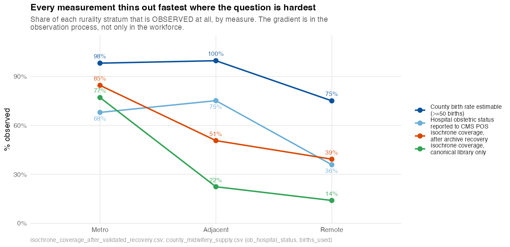

**The single most important caveat in this project.** Four independent
measurements, each thinning out fastest in the counties the study is about. The
gradient lives partly in the *observation process*, not only in the workforce —
which is why an uncorrected rural claim from any coverage- or reporting-based
measure is unsafe, and why the supply measure above is the one that survives.

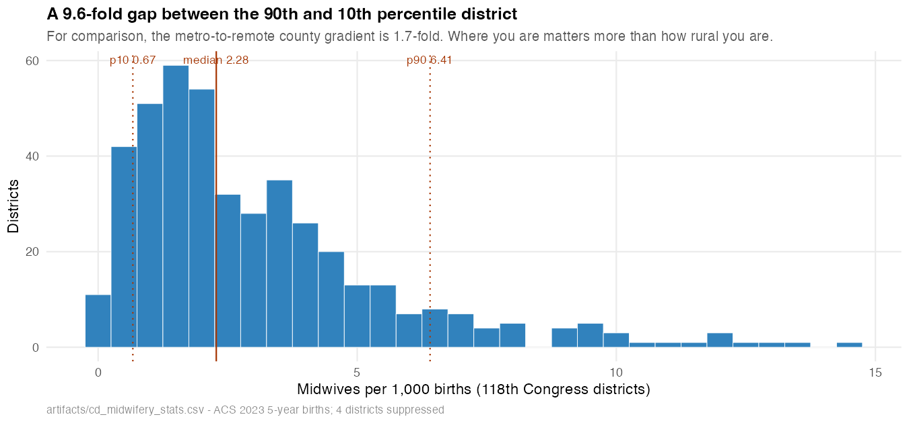

District variation dwarfs the rural gradient: a 9.6-fold gap between the 90th and
10th percentile district, against 1.7-fold metro-to-remote. Where you are matters
more than how rural you are.

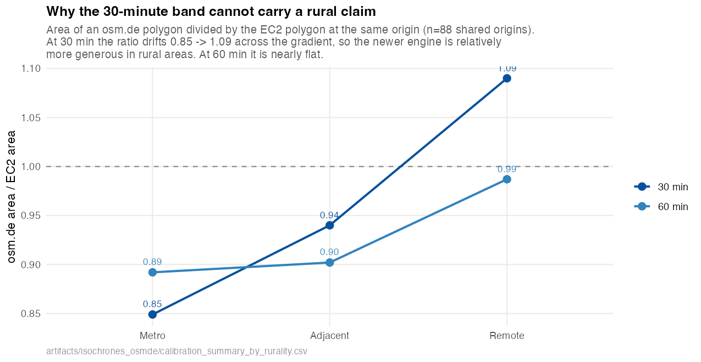

The 30/60-minute surfaces are assembled from two routing engines, and the split
falls along the urban/rural axis by construction. Calibration on 88 shared
origins shows the 30-minute area ratio drifting 0.85 → 1.09 across the gradient —
relatively *more* generous in rural areas — while 60 minutes is nearly flat.
**Do not read a rural gradient off the 30-minute band.**

Regenerate every figure above from committed artifacts:

```sh
Rscript make_readme_figures.R
```

All are aggregate. No figure plots an individual midwife: an isochrone or a dot
discloses a practice address, and jittering is not de-identification.

### Two filters, kept separate

`linkage_tier` answers *how sure are we this is the right NPI?* `AMCB status` answers *is this person
part of the current workforce?* Conflating them turns a confidently-linked deceased certificant into a
practising midwife. Of the 14,618 primary-tier links with geography:

| Status | n | % |
|---|---:|---:|
| **ACTIVE** | **11,877** | **81.2** |
| LAPSED | 2,020 | 13.8 |
| RETIRED | 579 | 4.0 |
| DECEASED | 93 | 0.6 |
| EMERITUS | 20 | 0.1 |
| DEACTIVATED | 16 | 0.1 |
| REVOKED | 8 | 0.1 |
| SURRENDERED | 5 | 0.0 |
| **Total** | **14,618** | 100 |

**Workforce rule: `status == "ACTIVE"`, nothing else.** RETIRED is "permanently retired from
practice"; LAPSED, REVOKED and SURRENDERED holders may not use the CNM/CM title. EMERITUS carries a
status AMCB's own definitions page does not document. DEACTIVATED usually means a CM↔CNM switch — 16
of 22 have an ACTIVE record under the same name so the person is still counted, and 6 are dropped.
Verified against three independent attributes, not just the bijection: 11,913 ACTIVE primary-linked
rows map to 11,913 distinct NPIs, and the 14 names appearing twice differ on **state, middle name and
certification date in all 14 cases** — 28 distinct people sharing 14 names, not duplicates.

### Denominator flow

| Stage | n | % of previous | % of roster |
|---|---:|---:|---:|
| Full AMCB roster | 22,309 | — | 100.0 |
| ACTIVE status | 15,285 | 68.5 | 68.5 |
| + primary NPI link | 11,913 | 77.9 | 53.4 |
| + `county_best` | **11,877** | 99.7 | 53.2 |
| + `county_exact` | 11,780 | 99.2 | 52.8 |

**The workforce-map denominator is the ACTIVE roster, not all 22,309 records: 11,877 of 15,285
ACTIVE certificants (77.7%) are mappable on primary evidence.** Once an ACTIVE person is
primary-linked, geography is essentially complete — 99.7% have `county_best`, 98.9% `county_exact`.
**The limiting step is identity linkage, not geocoding.** (The 53.2% column is the same rows against
the full historical roster, which mixes in lapsed, retired and deceased records; it is not the
workforce completeness figure.)

Primary linkage by status — geography cannot repair people who never linked: ACTIVE 77.9%,
RETIRED 45.6%, LAPSED 39.2%, DECEASED 18.6%.

### The maps

| Map | Cohort | Reading |
|---|---|---|
| [`active_state_rate.png`](docs/maps/active_state_rate.png) | ACTIVE | supply per 100k women 15–44 |
| [`active_county_counts.png`](docs/maps/active_county_counts.png) | ACTIVE | counts by county |
| [`roster_county_descriptive.png`](docs/maps/roster_county_descriptive.png) | **all statuses** | **descriptive only — not workforce** |
| [`active_midwives_by_state.csv`](docs/maps/active_midwives_by_state.csv) | ACTIVE | counts and rates |
| County leaflet | ACTIVE | rebuild with `Rscript map_midwife_geography.R` |
| Person-level points | ACTIVE | **internal QA only**, not committed |

### First valid workforce-distribution results

Supply per 100,000 women aged 15–44 spans a **19.9-fold range**, median 16.5:

| Highest | | Lowest | |
|---|---:|---|---:|
| AK | 50.5 | AL | 2.5 |
| VT | 44.2 | MS | 3.1 |
| NH | 42.2 | LA | 5.1 |
| NM | 38.4 | AR | 5.8 |
| OR | 34.5 | OK | 6.2 |

By raw count the order is different — CA 1,015, NY 971, FL 670 — because population drives counts.
California is 1st by count and mid-table by supply (11.0).

**County presence falls sharply with rurality**, and this is the finding the maps exist to show:

| | counties | with ≥1 active midwife | % | women 15–44 in a county with none |
|---|---:|---:|---:|---:|
| Metro (RUCC 1–3) | 1,252 | 707 | 56.5% | 7.4% |
| Nonmetro adjacent (4–6) | 670 | 294 | 43.9% | 44.5% |
| Nonmetro remote (7–9) | 1,311 | 188 | **14.3%** | **72.3%** |

Nationally, **9,988,174 women aged 15–44 (13.1%) live in a county with no linked active AMCB midwife**.
In remote rural counties that rises to 72.3%.

These figures supersede the earlier WA 30.8 / 1,262-county results, which mixed lapsed, retired and
deceased certificants into a workforce denominator and are withdrawn.

### What these maps are not

They show **last-observed NPPES practice location**, not confirmed current practice at that site.
They are **practice-location distribution, not access** — patients cross county lines, and 22% of
ACTIVE certificants have no linked location, so an empty county is not a county without midwifery
care. Travel-time isochrones would answer access — but see the next section: the existing isochrone
library cannot answer it nationally. Person-level point maps stay internal: jittering
is not de-identification, and in a rural county with one CNM the jitter is cosmetic.

## Isochrone reuse: a negative validation result

No isochrones were generated. The question was whether the project's existing library of 3,909
drive-time origins can be reused for midwives. An isochrone is a polygon around a *point* and is
agnostic to whose practice prompted it, so reuse is legitimate wherever a midwife falls within the
project's 5 km reuse radius of an existing origin.

**It does not reach far enough.** Of 11,792 ACTIVE primary-linked midwives with usable coordinates,
8,427 (71.5%) are represented; 3,365 (28.5%) are not. Where a match exists it is excellent — median
separation 0.23 km, 79.6% within 2 km, only 4.6% near the 5 km threshold. The problem is not proxy
quality. The problem is that representation is **spatially informative**:

| | midwives | represented | median km |
|---|---:|---:|---:|
| Metro (RUCC 1–3) | 10,639 | **77.1%** | 0.23 |
| Nonmetro adjacent (4–6) | 787 | **22.4%** | 0.20 |
| Nonmetro remote (7–9) | 336 | **14.0%** | 0.13 |

659 of the 1,179 counties with an ACTIVE primary-linked midwife have *zero* represented midwives.
Adjusted for state, the odds of representation are 0.068 in adjacent-rural and 0.040 in remote-rural
counties relative to metro (`artifacts/isochrone_representation_model.txt` — fit for bias
characterization only; its fitted values are **not** used as weights, and no
inverse-probability correction is applied. Reweighting represented midwives cannot reconstruct the
missing travel-time polygons of the unrepresented, and where representation is spatially informative
it would project urban road networks onto rural geography).

**Conclusion: the existing physician-centered isochrone library is dense enough to proxy most urban
midwife locations, but its rural coverage is differential, so it cannot support unbiased national or
rural midwifery travel-time estimates without additional isochrones.**

The 3,365 are stored as `not_represented_by_existing_isochrone_library`, never `no_access` — they are
midwives with *unmeasured exposure*, not midwives no one can reach.

### Represented-subset access (lower bound only)

Computed from the existing polygons for the 2,038 origins the matched midwives invoke, against
82,455 tracts holding 164.6M women (ACS 2023), binary at the population-weighted tract centroid:

| drive time | women with access | % |
|---|---:|---:|
| 30 min | 125,678,032 | 76.3% |
| 60 min | 150,274,665 | 91.3% |
| 120 min | 162,023,081 | 98.4% |
| 180 min | 163,870,791 | 99.5% |

This is **access to the subset of ACTIVE primary-linked midwives represented by the existing
isochrone library**. It is not an estimate of access to the full ACTIVE midwifery workforce, and the
rural rows of `artifacts/represented_subset_access_by_band_rucc.csv` (30-min: metro 86.2%, adjacent
17.8%, remote 5.2%) are depressed by library coverage, not only by workforce supply. They must not be
interpreted as workforce-access differences.

**Withdrawn:** the earlier claim that the rural gradient is "robust to both biases" predates this
coverage analysis and has not been tested against it.

## Existing-isochrone recovery search

Before generating anything, we searched for polygons we already possess elsewhere. No routing was
performed and the canonical 3,909-origin library was not modified. Sources previously rejected for
the temporal/subspecialty physician analysis were back in scope here: missing subspecialty labels
are irrelevant to whether a polygon is centred near a midwife.

| tier | result |
|---|---|
| S3 (`tyler-valhalla-tiles`) | `isochrone_archive/` ×2 releases, `staging/`, `supplemental_isochrones/`, `production_run/`. No `isochrone-releases/` prefix exists. |
| EC2 | **no instances and no volumes exist in the account** — nothing to search |
| External drive | `/Volumes/MufflySamsung/isochrone_archives/isochrones_archive/`, 16 artifacts |
| Dropbox | `isochrones_shared/` holds only a geocoding cache and state-board scrapes — **no isochrones** |

Two corrections to the inventory that motivated this search: the record counts are origin×band rows,
not origins. `provider_isochrones_25K.rds` holds **5,344 distinct locations**, not 27,457;
`provider_isochrones_NEW.rds` holds 4,093, not 19,653. `provider_isochrones_CORRUPTED.rds` cannot be
read at all — `readRDS` fails on the connection, so the name is accurate.

Across all sources: **11,592 distinct origin locations, 7,595 of them absent from the canonical
3,909.** On proximity alone this looked like a large win — 2,594 of the 3,365 unrepresented midwives
(77.1%) sit within 5 km of some archived origin.

**Polygon validation removed most of it.** Of the 1,072 origins examined, only 452 (42.2%) pass:

| failure | origins |
|---|---:|
| missing at least one of the 30/60/120/180 bands | 594 |
| centre falls outside its own 30-minute polygon | 220 |
| Russian-doll nesting violated | 39 |
| invalid geometry | 0 (58–410 per file repaired by `st_make_valid`) |

The centre-outside-own-30-minute check is the one that matters most: it catches a merge that paired a
centre coordinate with a different provider's polygon, which no amount of geometric tidiness would
reveal. A further 26 origins come only from `supplemental_isochrones/`, which has **no 180-minute
object in S3 at all**, and are counted as failing.

### Net result

| | midwives | canonical only | + validated recovery |
|---|---:|---:|---:|
| Metro (RUCC 1–3) | 10,639 | 77.1% | **84.6%** |
| Nonmetro adjacent (4–6) | 787 | 22.4% | **50.7%** |
| Nonmetro remote (7–9) | 336 | 14.0% | **39.3%** |
| **National** | 11,792 | **71.5%** | **80.9%** |

1,116 of the 3,365 (33.2%) are rescued from artifacts we already had, without a single routing call.
Rural coverage more than doubles. But it does not close the gap: **2,249 midwives still have no
usable existing polygon**, and coverage remains steeply rural-selective (84.6% metro vs 39.3% remote).
The recovery is a real improvement and not a solution — the differential-coverage objection to a
national or rural travel-time estimate still stands.

Recovered origins are published as a separate `historical_isochrone_recovery` artifact with
source-level provenance. Nothing has been merged into `artifacts/isochrones/`, and
`provider_isochrones.rds` was read as a *candidate* source only — never substituted for the
production library, which is the actual content of the 164→445 warning.


## Table 1

`Rscript build_table1_midwives.R` → [`docs/table1_midwives.md`](docs/table1_midwives.md)
and `artifacts/table1_midwives.csv`.

Characteristics of the **11,913** ACTIVE, primary-linked midwives: certification
(CNM 99.0% / CM 1.0%), sex as recorded in NPPES, ACOG district, rurality, years
since NPI enumeration, and years observed in NPPES. Long format
(`characteristic` / `n` / `percent` / `category`) following the isochrones
vignette `how-to-create-table-1.Rmd`.

Percentages use the **non-missing** denominator and unknowns get their own row,
so the table never implies more is known than is. Three naming choices are
deliberate:

* **"Sex recorded in NPPES", not gender.** NPPES calls the field
  `Provider Sex Code` (2025 layout) and `Provider Gender Code` (2022); it is
  administrative sex recorded at enumeration, not gender identity. `X` and `U`
  are recorded values and are shown as such rather than folded into unknown.
* **"Years observed in NPPES", not years active.** It is the span from first to
  last annual snapshot in which the NPI appears — a presence measure. An NPI
  persists after someone stops practising, and the panel starts in 2007, so
  earlier enumerations are left-censored.
* **Language is reported as unavailable.** No source this project holds collects
  it: not NPPES in either layout, not the CMS Doctors & Clinicians file, and not
  the Healthgrades scrape.

## Data sources

Nothing in this repository is scraped from behind a paywall or a login, and no
source publishes midwife locations — the geography is derived, which is what the
linkage section above is about.

| Source | Used for | Original data | Reproducible entry point |
|---|---|---|---|
| **AMCB Instant Verification** | the 22,309-name roster: certification number, status, dates | [ams.amcbmidwife.org](https://ams.amcbmidwife.org/amcbssa/f?p=AMCBSSA:17800) | `match_amcb_to_npi.R` |
| **NPPES** (NPI registry, 2007–2025 snapshots) | candidate NPIs, taxonomy, practice address | [download.cms.gov/nppes](https://download.cms.gov/nppes/NPI_Files.html) | `extract_nppes_midwives.R` |
| **CMS Doctors & Clinicians** (2026-06) | practice-address corroboration | [data.cms.gov](https://data.cms.gov/provider-data/topics/doctors-clinicians) | `extract_dac_midwives.R` |
| **AHRF 2024–2025** | county midwife and OB/GYN counts, births, birth outcomes, birthing rooms | [data.hrsa.gov/data/download](https://data.hrsa.gov/data/download) | `build_county_midwifery_supply.R` |
| **CMS Provider of Services** | hospitals and obstetric service (`OB_SRVC_CD`) by county | [data.cms.gov](https://data.cms.gov/provider-characteristics/hospitals-and-other-facilities/provider-of-services-file-hospital-non-hospital-facilities) | `R/13-geocode-ob-hospitals.R` |
| **ACS 5-year 2023** | population, women 15–50, births past 12 months, income | [api.census.gov](https://api.census.gov/data/2023/acs/acs5) | `R/01-build-county-base.R`, `build_cd_midwifery_stats.R` |
| **TIGER / Cartographic Boundary** | county, tract and congressional-district polygons | [census.gov/geographies](https://www.census.gov/geographies/mapping-files/time-series/geo/cartographic-boundary.html) | `build_cd_provider_counts.R` |
| **USDA RUCC 2023** | metro / nonmetro-adjacent / nonmetro-remote strata | [ers.usda.gov](https://www.ers.usda.gov/data-products/rural-urban-continuum-codes) | `R/01-build-county-base.R` |
| **CDC WONDER Natality** | CNM-attended births by county | [wonder.cdc.gov/natality.html](https://wonder.cdc.gov/natality.html) | `R/11-wonder-county-ingest.R` |
| **County Health Rankings 2025** | low birth weight, infant mortality, uninsured | [countyhealthrankings.org](https://www.countyhealthrankings.org/health-data) | `R/01-build-county-base.R` |
| **ACME accredited programs** | the 50-program sampling frame for training institution | [theacme.org](https://theacme.org/accredited-midwifery-education-programs/) | `discover_acme_repositories.py` |
| **University repositories** (OAI-PMH, CONTENTdm) | DNP/thesis authors → `midwifery_program` | 34 institutional repositories | `harvest_dnp_theses.py`, `link_theses_to_amcb.R` |
| **ABOG roster** (via `isochrones`) | general OB/GYN and subspecialist comparators | not public — board roster | `load_obstetric_providers.R` |
| **Valhalla isochrones** | 30/60-minute drive-time polygons | generated, not downloaded | `generate_osmde_isochrones.R` |

### Training institution, where it can be recovered

Neither AMCB nor NPPES publishes where a midwife trained, and the DAC carries a
midwifery school for only **14.3%** of the cohort. A student-authored DNP
project or thesis is deposited in the degree-granting university's repository,
so the institution is *structural* — it is which repository holds the record,
not a string parsed out of an affiliation.

Using ACME's 50 accredited programs as the sampling frame, 34 repositories
resolved (OAI-PMH for bepress and DSpace; CONTENTdm for Frontier Nursing
University, which runs neither) and **35,038 author-records** were harvested
across 25 institutions.

Two variables come out of it, and they are **not** the same thing:

| variable | n | what it means |
|---|---:|---|
| `midwifery_program` | **266** (1.2%) | initial CNM/CM education |
| `later_doctoral_institution` | 321 | a doctorate earned *after* certification |

That split is load-bearing. **43% of usable links are degrees earned after the
person was already a practising midwife** — median gap 7 years — and Frontier
alone contributes 280 of them. Recording those as "trained at Frontier" would
be false. The gap distribution also diagnoses program type: Bethel and Seattle
sit at a median of 0 years (entry-level), Frontier at 4 with a p90 of 19
(post-professional).

`midwifery_program` is Bethel 126, Frontier 108, Seattle 24, then single
digits — **88% from two schools**. Use it to fill gaps and corroborate other
sources, not to describe where midwives train; see
[`docs/TECHNICAL_APPENDIX_OAI_TRAINING_INSTITUTION.md`](docs/TECHNICAL_APPENDIX_OAI_TRAINING_INSTITUTION.md)
for the evidence tiers, the permutation control used to estimate precision, the
six harvesting defects that produced false-negative institution coverage, and
why geography was rejected as a corroborator.

### Access requirements

| What | Requirement |
|---|---|
| ACS via `api.census.gov` | **free API key** in `CENSUS_API_KEY` ([request](https://api.census.gov/data/key_signup.html)) |
| AHRF, POS, TIGER, RUCC, CHR, WONDER | none — direct download |
| NPPES monthly snapshots | none, but ~1 GB compressed each; kept outside the repo |
| ABOG roster and isochrone library | a checkout of `mufflyt/isochrones` (private) at `ISOCHRONES_HOME` |
| Archive isochrone recovery | external drive mounted at `/Volumes/MufflySamsung` |
| osm.de routing | none — public demo server, rate-limited, **disabled in the isochrones config** |

Two sources are deliberately **not** used: the AMCB primary-source verification
letter (a paid checkout, never fetched) and any purchased NPPES derivative.

### Expected files and transformations

Downloads land in `data/`, derived tables in `artifacts/`. Neither large input
files nor person-level rows are committed; both are gitignored and rebuildable.

| Expected file | Transformation | Produced by |
|---|---|---|
| `data/ahrf/AHRF2025.csv` | select 24 of 1,927 columns; rates via `mufflyaccess::safe_rate()` | manual download |
| `data/cms_pos_hospital.csv` | dedupe superseded providers; restrict to subtypes 01/11 | manual download |
| `data/county_base.csv` | ACS + RUCC + SVI + CHR joined on 5-digit FIPS | `R/01-build-county-base.R` |
| `data/rucc_2023.xlsx` | FIPS zero-padded; RUCC 1–3 / 4–6 / 7–9 collapsed | manual download |
| `artifacts/amcb_npi_linkage_FROZEN.csv` | ranked-class identity resolution → `linkage_tier` | `reconcile_linkage.R` |
| `artifacts/midwives_geography_FROZEN.csv` | geocode cascade → point-in-polygon → `county_exact` / `county_best` | `map_midwife_geography.R` |
| `artifacts/county_midwifery_supply.csv` | AHRF + POS + cohort counts → per-1,000-births rates | `build_county_midwifery_supply.R` |
| `artifacts/cd_midwifery_stats.csv` | providers assigned to CD118 polygons by point-in-polygon | `build_cd_midwifery_stats.R` |
| `artifacts/county_profiles/county_sentences.csv` | variety-sentence prose per county | `R/10-county-birth-profiles.R` |
| `docs/figures/*.png` | figures rebuilt from committed artifacts | `make_readme_figures.R` |

## Repository layout

```
midwifery/
├── R/                          numbered pipeline stages, run in order
│   ├── 01-build-county-base.R      ACS + RUCC + SVI + CHR -> data/county_base.csv
│   ├── 02-geocoding-completeness.R geocode coverage by stage
│   ├── 03-geography-hierarchy.R    county_exact / county_best hierarchy
│   ├── 04-diagnose-cross-state.R   coordinate-vs-ZIP state conflicts
│   ├── 05..09-*.R                  cohort flow, composition, name diagnostics
│   ├── 10-county-birth-profiles.R  variety-sentence prose per county
│   ├── 11-wonder-county-ingest.R   CDC WONDER CNM-attended births
│   ├── 12-district-profiles.R      congressional-district profiles
│   ├── 13/14-geocode-ob-*.R        obstetric hospitals from CMS POS
│   ├── lib/                    cross-repo dependencies and shared helpers
│   │   ├── isochrones_dep.R        path dependency on mufflyt/isochrones
│   │   ├── mysterymaps_dep.R       path dependency on mufflyt/mysterymaps
│   │   ├── ob_hospitals.R          POS -> obstetric hospitals by county
│   │   └── wonder_natality.R       WONDER query + parse
│   └── utils/
├── data/                       downloaded inputs (large files gitignored)
│   ├── ahrf/                       AHRF 2024-2025
│   ├── cd118/, cd119/              Census district boundaries
│   ├── wonder/                     WONDER extracts
│   └── county_base.csv             the county spine
├── artifacts/                  derived tables (person-level rows gitignored)
│   ├── county_profiles/            per-county prose and birth profiles
│   ├── district_profiles/
│   ├── iso_recovery/               archive-origin catalogs
│   ├── isochrones_osmde/           newly routed polygons (gitignored)
│   └── maps/                       rendered maps and unions (gitignored)
├── docs/
│   ├── figures/                    README figures, rebuilt from artifacts
│   ├── maps/                       static and leaflet map output
│   └── HALL_OF_SHAME.md            defects written here, and what each cost
├── tests/                      contract tests
│   ├── test_address_key_matching.py     exact address keys, adversarial
│   └── test_open_payments_type2_bulk.R  candidate universe, order invariance
├── qa/                         quality-assurance snapshots
├── vignettes/                  amcb-midwife-npi-matching.Rmd
├── logs/
└── *.R                         entry points (see Usage)
    ├── match_medicare_partb_partd.R      Part B / Part D participation
    ├── assign_hpsa_status.R              HRSA shortage-area status
    ├── extract_dac_cnm_education.R       CMS DAC: school, group, locations
    ├── extract_dac_facility_affiliations.R  NPI -> CCN -> hospital attributes
    ├── extract_hcris_affiliated_hospitals.R HCRIS newborn volume by CCN
    ├── load_natality_to_duckdb.R         WONDER natality into the warehouse
    ├── link_practice_locations_to_org_npi.R  primary + secondary -> Type-2 NPI
    ├── resolve_org_ambiguity.R           tiered, conservative org resolution
    ├── report_org_resolution_ppv.R       PPV per rule, Wilson intervals
    ├── link_open_payments_type2_bulk.R   bulk-table candidate universe
    ├── audit_python_org_selection.R      diagnostic: selection-defect audit
    ├── address_keys.py                   canonical address-key helpers
    └── build_table1_midwives.R           Table 1
```

This is a **pipeline repository, not an R package** — deliberately. There is no
`DESCRIPTION` and no `NAMESPACE`; `R/` holds ordered stages that execute on
`source()`, not exported functions. `R CMD check` does not apply. Reusable code
belongs in the packages instead, reached through the `R/lib/*_dep.R` path
dependencies.

## Model architecture

Three layers. Identity is settled before geography, and geography before any
access claim — so a failure upstream cannot be laundered into a downstream
number.

```
        ┌─────────────────────────────────────────────────────────────┐
        │  LAYER 1 — IDENTITY          who is this person?            │
        └─────────────────────────────────────────────────────────────┘
   AMCB roster 22,309                NPPES 2007-2025  443,623 NPIs
          │                                    │
          └──────────────┬─────────────────────┘
                         ▼
              candidate pairs  197,081
                         │
                         ▼
              ranked evidence class 1..4      ◄── taxonomy NEVER breaks a tie
                         │
            ┌────────────┼────────────┐
            ▼            ▼            ▼
      quarantined    unmatched    resolved 16,892
         3,091         2,326            │
                                        ▼
                              linkage_tier assigned
                     primary 14,668 · nursing 1,896 · fuzzy 328

        ┌─────────────────────────────────────────────────────────────┐
        │  LAYER 2 — GEOGRAPHY         where do they practise?        │
        └─────────────────────────────────────────────────────────────┘
              last-observed practice address (+ observation year)
                         │
              ┌──────────┴──────────┐
              ▼                     ▼
     geocode cascade          unique-ZIP county
   Census 86.9% ─► ArcGIS 9.2% ─► city centroid
              │                     │
              ▼                     │
     coordinate-vs-ZIP state check  │
              │  17 unresolved      │
              ▼                     ▼
     point-in-polygon TIGER 2023 ──► county_best  99.7%
              │
              ▼
        county_exact 98.9%

        ┌─────────────────────────────────────────────────────────────┐
        │  LAYER 3 — ACCESS            who can reach one, and where?  │
        └─────────────────────────────────────────────────────────────┘
                         │
        ┌────────────────┼────────────────────┐
        ▼                ▼                    ▼
  SUPPLY            COVERAGE             COMPOSITION
  count / births    isochrone reuse      midwife vs OB/GYN
  complete          @ 5 km, 30/60 min    AHRF general OB
        │                │                    │
        │                ▼                    │
        │        ┌───────────────┐            │
        │        │ COVERAGE GATE │            │
        │        └───────────────┘            │
        │   84.6% metro vs 39.3% remote       │
        │   rural-selective ► national and    │
        │   rural travel-time claims BLOCKED  │
        ▼                                     ▼
   county / CD / state rates            provider configuration
   SURVIVES the gate                    SURVIVES the gate
```

### Where a claim can die

Each gate below refuses rather than degrades, because a silently degraded number
is indistinguishable from a good one.

```
  claim ──► is it built on coverage?
              │yes                      │no
              ▼                         ▼
      is coverage rural-selective?   is the denominator complete?
              │yes         │no          │yes            │no
              ▼            ▼            ▼               ▼
        ┌──────────┐   proceed      proceed        suppress the cell
        │ BLOCKED  │                                (<50 births: 353
        └──────────┘                                 counties)

  ── other gates that fire ────────────────────────────────────────────
  assert_travel_time_eligible()   city-centroid coords ► ERROR, not filter
  assert_access_language()        "shortage" / "adequacy" ► ERROR
  stopifnot(length(union) == 1)   dissolved surface must be ONE feature
  polygon validation (6 checks)   bands, geometry, CRS, nesting, centre, TEST
  join_safety                     coverage / duplication bounds on every join
```

## Usage

    python3 scrape.py    # writes midwives.csv

No dependencies beyond the Python standard library.

## How it works

The directory is an Oracle APEX classic report that hard-caps any result set at
500 rows — paging past row 500 returns *"Invalid set of rows requested"*. The
per-discipline `Total : N` line, however, is exact even when the rows are
capped.

Only four search items are honoured by the report: certification, certification
number, last name and first name. Certification number matches by `INSTR`
(substring, no wildcards), which gives the partition used here:

* numbers prefixed `CNM`/`CM` — walk the prefix digit by digit; the prefix only
  occurs at the start, so a prefixed pattern is effectively anchored
* bare digit numbers — sweep every 3-digit substring, since any number with at
  least three digits contains one. The 2- and 1-digit sweeps run only if the
  running count still falls short

Each bucket under the cap is fetched in a single 500-row request and
de-duplicated on (certification, certification number). The scraper checks its
result against the reported total before writing.

Collected 2026-08-06: 22,309 records (183 Certified Midwives, 22,126 Certified
Nurse-Midwives), matching the directory's own totals exactly.

## Location data

AMCB does not publish city/state — those sit behind its paid primary-source
verification, linked per row as `purchase_product?p_related_cust_id=...`. The
scraper records that `customer_id` (present for ACTIVE certifications only) so
individual verifications can be purchased through AMCB's normal checkout; it
does not touch the purchase endpoint.

Geography instead comes from NPPES:

    python3 fetch_npi_candidates.py    # NPI Registry API -> nppes_candidates.csv
    Rscript match_nppes.R              # -> midwives_with_nppes.csv
    Rscript geocode_midwives.R         # -> midwives_geocoded.csv
    Rscript check_npi_deactivation.R   # -> midwives_status_check.csv

Candidates come from the live NPI Registry API keyed on surname, not from a
bulk dissemination file: the local March 2024 snapshot is two years stale and
simply lacks recently certified midwives. Querying by surname (rather than by
midwifery taxonomy) also returns CNMs enumerated under other taxonomies, and
returns each provider's former/maiden names, which matter in a cohort that is
~99% women.

Matching is built on the isochrones matching stack — `parse_physician_name_enhanced()`,
`calculate_similarities()` + `apply_scoring()`, `score_middle_name_match()`,
the nickname dictionary, `write_match_ledger()`, `validate_pipeline_output()`
and `log_exclusion()`. Set `ISOCHRONES_R` if that project lives elsewhere.
A deterministic exact pass runs first; only the residual pays for
Jaro-Winkler scoring.

Acceptance scales with clinical evidence, because a surname-blocked pool means
a perfect name match can still be the wrong person: 0.82 with a midwifery
taxonomy or CNM/CM credential, 0.88 with nursing/women's-health evidence, 0.95
and sole candidate with neither. Only `Accept` rows carry geography.

`credential_compatibility.R` documents why the project's credential gate is
re-implemented here (its enum is MD/DO/UNKNOWN, which either no-ops or
fails closed on a CNM) and why gender blocking is deliberately not used.

Known coverage gap: 106 first+last name combinations are common enough to
still hit the API's 200-row response cap, so their candidate lists are
truncated.

## Output columns

`certification, certification_number, status, certification_date,
expiration_date, last_name, first_name, middle_name, discipline, primary_source`
