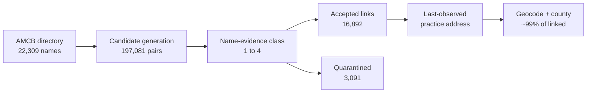

# midwifery

**[→ Interactive pipeline diagrams](https://claude.ai/code/artifact/9a541a9f-038f-458b-bb9d-d3b0120ca2cd)**
&nbsp;·&nbsp; [source](docs/pipeline.html)

Flowcharts of the whole chain — AMCB name to NPI to county — with the real counts at every stage
and the defects each guard caught. (Private link; visible to the repo owner.)

| Stage | Result |
|---|---|
| AMCB roster scraped | 22,309 certificants (reconciles to AMCB's own totals) |
| Primary linkage | 14,668 (65.7%) — midwifery taxonomy confirmed |
| Sensitivity tiers | +1,896 nursing, +328 fuzzy → 16,892 accepted (75.7%) |
| Quarantined | 3,091 — candidates exist but identity is ambiguous |
| Unmatched | 2,326 — no plausible NPI at all |
| County (enhanced) | 98.9% of primary links, ~99% in every tier |

Linkage certainty and geographic completeness are separate properties: **65.7% primary linkage is
the inferential limitation; the geography is essentially complete for anything linked.** Linkage
also varies sharply by certification status (82.3% ACTIVE vs 19.6% DECEASED), so the linked subset
is not a random sample of the roster.

Scraper for the [AMCB certification directory](https://ams.amcbmidwife.org/amcbssa/f?p=AMCBSSA:17800)
(American Midwifery Certification Board public primary-source verification listing).

> **New to this codebase?** Start with [ARCHITECTURE.md](ARCHITECTURE.md) for the
> end-to-end pipeline, per-file roles, environment variables, and how to run and
> test each stage. This README covers the scraping and matching rationale in
> depth.

## Maps

Built with [mufflyt/mysterymaps](https://github.com/mufflyt/mysterymaps) (`mysterymaps_map_base()`
for the leaflet base; state and county layers drawn against the same TIGER 2023 vintage the linkage
assigned counties from).

### Two filters, kept separate

`linkage_tier` answers *how sure are we this is the right NPI?* `AMCB status` answers *is this person
part of the current workforce?* Conflating them turns a confidently-linked deceased certificant into a
practising midwife. Of the 14,618 primary-tier links with geography:

| Status | n | % |
|---|---:|---:|
| **ACTIVE** | **11,877** | **81.2** |
| LAPSED | 2,020 | 13.8 |
| RETIRED | 579 | 4.0 |
| DECEASED | 93 | 0.6 |
| EMERITUS | 20 | 0.1 |
| DEACTIVATED | 16 | 0.1 |
| REVOKED | 8 | 0.1 |
| SURRENDERED | 5 | 0.0 |
| **Total** | **14,618** | 100 |

**Workforce rule: `status == "ACTIVE"`, nothing else.** RETIRED is "permanently retired from
practice"; LAPSED, REVOKED and SURRENDERED holders may not use the CNM/CM title. EMERITUS carries a
status AMCB's own definitions page does not document. DEACTIVATED usually means a CM↔CNM switch — 16
of 22 have an ACTIVE record under the same name so the person is still counted, and 6 are dropped.
Verified against three independent attributes, not just the bijection: 11,913 ACTIVE primary-linked
rows map to 11,913 distinct NPIs, and the 14 names appearing twice differ on **state, middle name and
certification date in all 14 cases** — 28 distinct people sharing 14 names, not duplicates.

### Denominator flow

| Stage | n | % of previous | % of roster |
|---|---:|---:|---:|
| Full AMCB roster | 22,309 | — | 100.0 |
| ACTIVE status | 15,285 | 68.5 | 68.5 |
| + primary NPI link | 11,913 | 77.9 | 53.4 |
| + `county_best` | **11,877** | 99.7 | 53.2 |
| + `county_exact` | 11,780 | 99.2 | 52.8 |

**The workforce-map denominator is the ACTIVE roster, not all 22,309 records: 11,877 of 15,285
ACTIVE certificants (77.7%) are mappable on primary evidence.** Once an ACTIVE person is
primary-linked, geography is essentially complete — 99.7% have `county_best`, 98.9% `county_exact`.
**The limiting step is identity linkage, not geocoding.** (The 53.2% column is the same rows against
the full historical roster, which mixes in lapsed, retired and deceased records; it is not the
workforce completeness figure.)

Primary linkage by status — geography cannot repair people who never linked: ACTIVE 77.9%,
RETIRED 45.6%, LAPSED 39.2%, DECEASED 18.6%.

### The maps

| Map | Cohort | Reading |
|---|---|---|
| [`active_state_rate.png`](docs/maps/active_state_rate.png) | ACTIVE | supply per 100k women 15–44 |
| [`active_county_counts.png`](docs/maps/active_county_counts.png) | ACTIVE | counts by county |
| [`roster_county_descriptive.png`](docs/maps/roster_county_descriptive.png) | **all statuses** | **descriptive only — not workforce** |
| [`active_midwives_by_state.csv`](docs/maps/active_midwives_by_state.csv) | ACTIVE | counts and rates |
| County leaflet | ACTIVE | rebuild with `Rscript map_midwife_geography.R` |
| Person-level points | ACTIVE | **internal QA only**, not committed |

### First valid workforce-distribution results

Supply per 100,000 women aged 15–44 spans a **19.9-fold range**, median 16.5:

| Highest | | Lowest | |
|---|---:|---|---:|
| AK | 50.5 | AL | 2.5 |
| VT | 44.2 | MS | 3.1 |
| NH | 42.2 | LA | 5.1 |
| NM | 38.4 | AR | 5.8 |
| OR | 34.5 | OK | 6.2 |

By raw count the order is different — CA 1,015, NY 971, FL 670 — because population drives counts.
California is 1st by count and mid-table by supply (11.0).

**County presence falls sharply with rurality**, and this is the finding the maps exist to show:

| | counties | with ≥1 active midwife | % | women 15–44 in a county with none |
|---|---:|---:|---:|---:|
| Metro (RUCC 1–3) | 1,252 | 707 | 56.5% | 7.4% |
| Nonmetro adjacent (4–6) | 670 | 294 | 43.9% | 44.5% |
| Nonmetro remote (7–9) | 1,311 | 188 | **14.3%** | **72.3%** |

Nationally, **9,988,174 women aged 15–44 (13.1%) live in a county with no linked active AMCB midwife**.
In remote rural counties that rises to 72.3%.

These figures supersede the earlier WA 30.8 / 1,262-county results, which mixed lapsed, retired and
deceased certificants into a workforce denominator and are withdrawn.

### What these maps are not

They show **last-observed NPPES practice location**, not confirmed current practice at that site.
They are **practice-location distribution, not access** — patients cross county lines, and 22% of
ACTIVE certificants have no linked location, so an empty county is not a county without midwifery
care. Travel-time isochrones would answer access — but see the next section: the existing isochrone
library cannot answer it nationally. Person-level point maps stay internal: jittering
is not de-identification, and in a rural county with one CNM the jitter is cosmetic.

## Isochrone reuse: a negative validation result

No isochrones were generated. The question was whether the project's existing library of 3,909
drive-time origins can be reused for midwives. An isochrone is a polygon around a *point* and is
agnostic to whose practice prompted it, so reuse is legitimate wherever a midwife falls within the
project's 5 km reuse radius of an existing origin.

**It does not reach far enough.** Of 11,792 ACTIVE primary-linked midwives with usable coordinates,
8,427 (71.5%) are represented; 3,365 (28.5%) are not. Where a match exists it is excellent — median
separation 0.23 km, 79.6% within 2 km, only 4.6% near the 5 km threshold. The problem is not proxy
quality. The problem is that representation is **spatially informative**:

| | midwives | represented | median km |
|---|---:|---:|---:|
| Metro (RUCC 1–3) | 10,639 | **77.1%** | 0.23 |
| Nonmetro adjacent (4–6) | 787 | **22.4%** | 0.20 |
| Nonmetro remote (7–9) | 336 | **14.0%** | 0.13 |

659 of the 1,179 counties with an ACTIVE primary-linked midwife have *zero* represented midwives.
Adjusted for state, the odds of representation are 0.068 in adjacent-rural and 0.040 in remote-rural
counties relative to metro (`artifacts/isochrone_representation_model.txt` — fit for bias
characterization only; its fitted values are **not** used as weights, and no
inverse-probability correction is applied. Reweighting represented midwives cannot reconstruct the
missing travel-time polygons of the unrepresented, and where representation is spatially informative
it would project urban road networks onto rural geography).

**Conclusion: the existing physician-centered isochrone library is dense enough to proxy most urban
midwife locations, but its rural coverage is differential, so it cannot support unbiased national or
rural midwifery travel-time estimates without additional isochrones.**

The 3,365 are stored as `not_represented_by_existing_isochrone_library`, never `no_access` — they are
midwives with *unmeasured exposure*, not midwives no one can reach.

### Represented-subset access (lower bound only)

Computed from the existing polygons for the 2,038 origins the matched midwives invoke, against
82,455 tracts holding 164.6M women (ACS 2023), binary at the population-weighted tract centroid:

| drive time | women with access | % |
|---|---:|---:|
| 30 min | 125,678,032 | 76.3% |
| 60 min | 150,274,665 | 91.3% |
| 120 min | 162,023,081 | 98.4% |
| 180 min | 163,870,791 | 99.5% |

This is **access to the subset of ACTIVE primary-linked midwives represented by the existing
isochrone library**. It is not an estimate of access to the full ACTIVE midwifery workforce, and the
rural rows of `artifacts/represented_subset_access_by_band_rucc.csv` (30-min: metro 86.2%, adjacent
17.8%, remote 5.2%) are depressed by library coverage, not only by workforce supply. They must not be
interpreted as workforce-access differences.

**Withdrawn:** the earlier claim that the rural gradient is "robust to both biases" predates this
coverage analysis and has not been tested against it.

## Usage

    python3 scrape.py    # writes midwives.csv

No dependencies beyond the Python standard library.

## How it works

The directory is an Oracle APEX classic report that hard-caps any result set at
500 rows — paging past row 500 returns *"Invalid set of rows requested"*. The
per-discipline `Total : N` line, however, is exact even when the rows are
capped.

Only four search items are honoured by the report: certification, certification
number, last name and first name. Certification number matches by `INSTR`
(substring, no wildcards), which gives the partition used here:

* numbers prefixed `CNM`/`CM` — walk the prefix digit by digit; the prefix only
  occurs at the start, so a prefixed pattern is effectively anchored
* bare digit numbers — sweep every 3-digit substring, since any number with at
  least three digits contains one. The 2- and 1-digit sweeps run only if the
  running count still falls short

Each bucket under the cap is fetched in a single 500-row request and
de-duplicated on (certification, certification number). The scraper checks its
result against the reported total before writing.

Collected 2026-08-06: 22,309 records (183 Certified Midwives, 22,126 Certified
Nurse-Midwives), matching the directory's own totals exactly.

## Location data

AMCB does not publish city/state — those sit behind its paid primary-source
verification, linked per row as `purchase_product?p_related_cust_id=...`. The
scraper records that `customer_id` (present for ACTIVE certifications only) so
individual verifications can be purchased through AMCB's normal checkout; it
does not touch the purchase endpoint.

Geography instead comes from NPPES:

    python3 fetch_npi_candidates.py    # NPI Registry API -> nppes_candidates.csv
    Rscript match_nppes.R              # -> midwives_with_nppes.csv
    Rscript geocode_midwives.R         # -> midwives_geocoded.csv
    Rscript check_npi_deactivation.R   # -> midwives_status_check.csv

Candidates come from the live NPI Registry API keyed on surname, not from a
bulk dissemination file: the local March 2024 snapshot is two years stale and
simply lacks recently certified midwives. Querying by surname (rather than by
midwifery taxonomy) also returns CNMs enumerated under other taxonomies, and
returns each provider's former/maiden names, which matter in a cohort that is
~99% women.

Matching is built on the isochrones matching stack — `parse_physician_name_enhanced()`,
`calculate_similarities()` + `apply_scoring()`, `score_middle_name_match()`,
the nickname dictionary, `write_match_ledger()`, `validate_pipeline_output()`
and `log_exclusion()`. Set `ISOCHRONES_R` if that project lives elsewhere.
A deterministic exact pass runs first; only the residual pays for
Jaro-Winkler scoring.

Acceptance scales with clinical evidence, because a surname-blocked pool means
a perfect name match can still be the wrong person: 0.82 with a midwifery
taxonomy or CNM/CM credential, 0.88 with nursing/women's-health evidence, 0.95
and sole candidate with neither. Only `Accept` rows carry geography.

`credential_compatibility.R` documents why the project's credential gate is
re-implemented here (its enum is MD/DO/UNKNOWN, which either no-ops or
fails closed on a CNM) and why gender blocking is deliberately not used.

Known coverage gap: 106 first+last name combinations are common enough to
still hit the API's 200-row response cap, so their candidate lists are
truncated.

## Output columns

`certification, certification_number, status, certification_date,
expiration_date, last_name, first_name, middle_name, discipline, primary_source`
