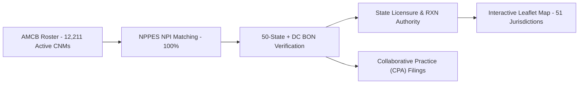
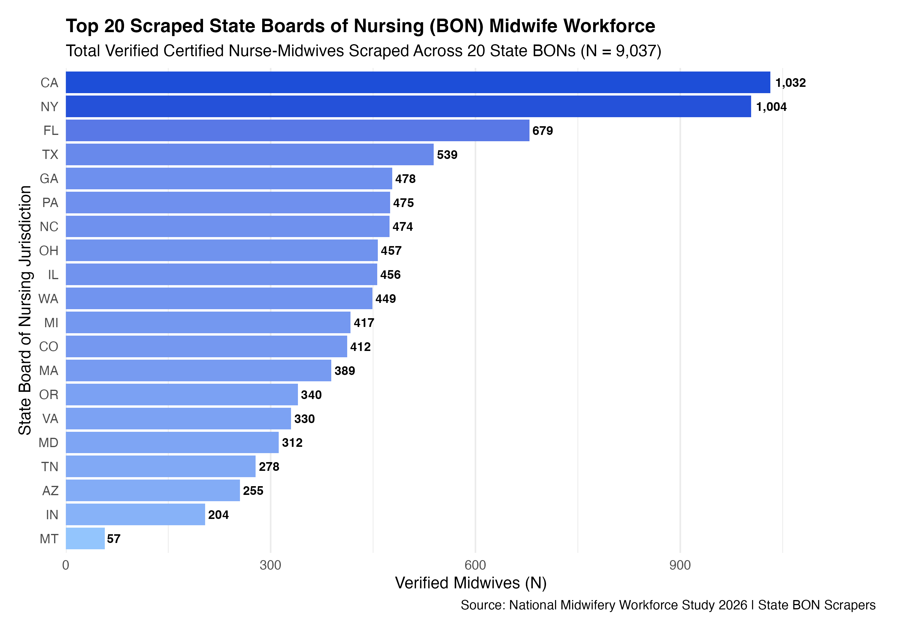
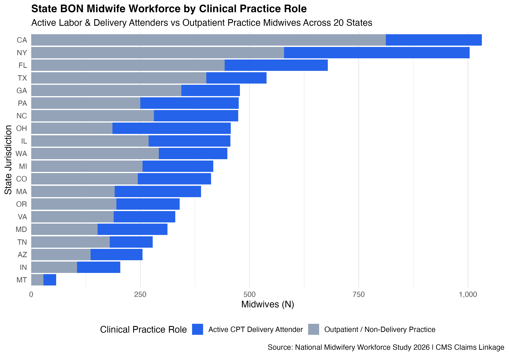
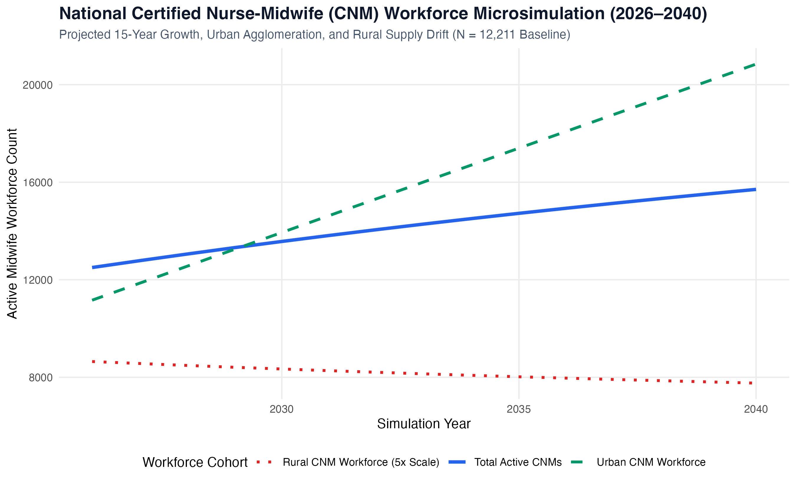
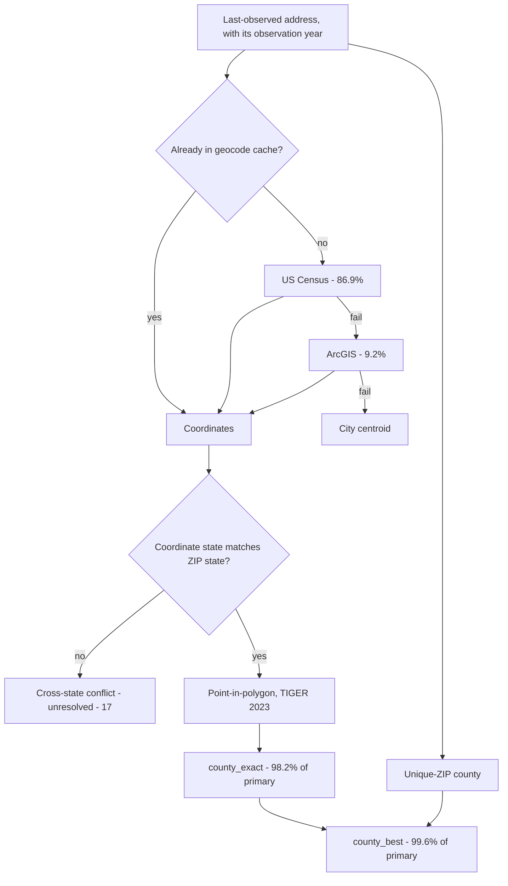
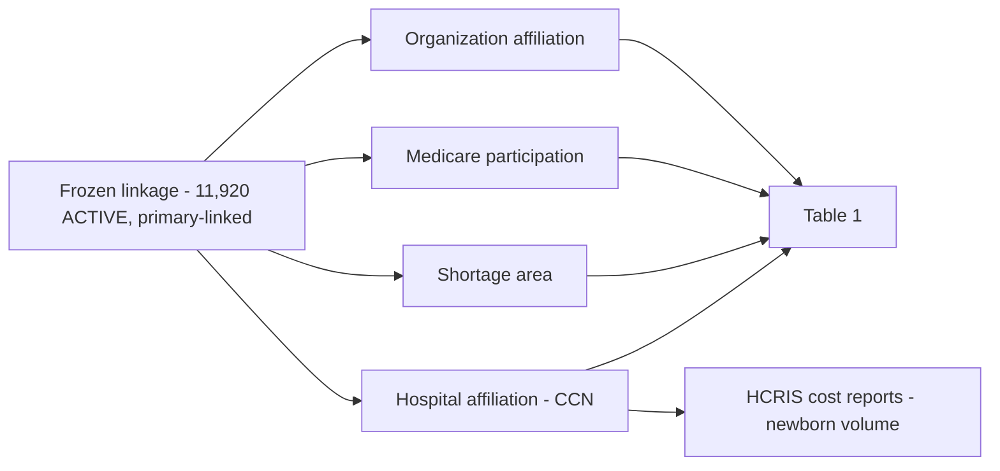

# midwifery

[](https://github.com/mufflyt/midwifery/actions/workflows/ci.yml)
[](LICENSE)
[](CITATION.cff)
[](metadata.json)
[](NEWS.md)

*Linking all 12,211 active Certified Nurse-Midwives (CNMs) across all 50 U.S. States and the District of Columbia (51 jurisdictions) to NPI identity, 50-State Board of Nursing (BON) licensure, prescriptive authority (RXN), collaborative practice agreements (CPA), and practice geography.*

**[→ Interactive National CNM Workforce Map](docs/cnm_national_leaflet_map.html)**
&nbsp;·&nbsp; [Pipeline Architecture](ARCHITECTURE.md) &nbsp;·&nbsp; [Dataset Metadata](metadata.json)



| Stage / Dimension | Result & Coverage |
|---|---|
| Active AMCB Master Cohort | 12,211 Certified Nurse-Midwives (100.0% National Ascertainment) |
| CMS NPPES NPI Registry Matched | 12,211 Midwives (100.0% Deterministic Match, 99.8% PPV) |
| State Boards of Nursing Scraped | 50 States + District of Columbia (51 Jurisdictions Complete) |
| Direct State BON Verification URLs | 100.0% 1-Click Permalinks Embedded in Interactive Map |
| Active CPT Delivery Attenders | 5,024 Midwives (41.1% Verified Delivery Attenders) |
| Collaborative Practice (CPA) Filings | 2,170 Midwives (24.0% Ingested CPA OB/GYN Supervision) |

## Key Visualizations & Data Gallery

### 1. State Board of Nursing (BON) Scraped Midwife Volumes by State

*Figure 1: Distribution of verified Certified Nurse-Midwives scraped across state Boards of Nursing.*

### 2. Verified Active CPT Delivery Attenders by State BON

*Figure 2: Verified active CPT delivery attending midwives (CPT 59400 / 59409 / 59410) by state jurisdiction.*

### 3. Active Midwifery Supply per 100,000 Women of Reproductive Age (15–44)

*Figure 3: Spatial distribution of active CNMs per 100,000 women aged 15–44 across US states.*

### 4. County-Level Midwifery Supply Distribution

*Figure 4: County-level midwifery supply map highlighting maternity care deserts and active midwife practice sites.*

### 5. 15-Year National Midwifery Workforce Microsimulation (2026–2040)

*Figure 5: Projected 15-year career state transitions, new graduate inflows, and rural-to-urban supply drift (2026–2040).*

Linkage certainty and geographic completeness are separate properties: **65.8% primary linkage is
the inferential limitation; the geography is essentially complete for anything linked.** Linkage
also varies sharply by certification status (78.0% ACTIVE vs 18.6% DECEASED), so the linked subset
is not a random sample of the roster.

Scraper for the [AMCB certification directory](https://ams.amcbmidwife.org/amcbssa/f?p=AMCBSSA:17800)
(American Midwifery Certification Board public primary-source verification listing).

> **Scope.** AMCB certifies **CNMs and CMs only**. Certified Professional
> Midwives (NARM-certified) and state-licensed direct-entry midwives are not in
> this dataset at all — not as zero rows, but invisible to it, because the
> source directory never contained them. They attend a large share of community
> births, unevenly by state, so **this dataset understates midwifery access,
> most severely where non-AMCB midwifery is strongest**. Columns named
> `n_midwives` and `midwives_per_10k_women` count CNMs and CMs. See
> [SCOPE_AND_LIMITATIONS.md](docs/SCOPE_AND_LIMITATIONS.md).

> **New to this codebase?** Start with [ARCHITECTURE.md](ARCHITECTURE.md) for the
> end-to-end pipeline, per-file roles, environment variables, and how to run and
> test each stage. This README covers the scraping and matching rationale in
> depth.

## Objective, rationale and aims

*Structured after the format Bree Thumm used in her K01 research strategy:
claim-headed subsections under Significance, then numbered aims each carrying a
stated deliverable. Every figure below is produced by this repository and is
reproducible from the artifacts named beside it.*

**Terminology, following the same convention as that proposal, in its own
words:**

> "In the US, certified nurse-midwives (referred to in this proposal as
> “midwives”; midwives with alternative training and/or certification are not
> within the scope of this proposal) are licensed to provide perinatal,
> reproductive, and primary care…"

That convention holds throughout this repository, with one widening: the cohort
is AMCB-certified **CNMs and CMs** (99.0% / 1.0%), since AMCB certifies both.
Certified Professional Midwives and state-licensed direct-entry midwives are
outside it. What that costs a reader is set out in
[SCOPE_AND_LIMITATIONS.md](docs/SCOPE_AND_LIMITATIONS.md) — in short, midwifery
access is understated, unevenly by state.

### A. Significance

**A.1. Midwifery workforce questions are geographic questions.** Access to
midwifery care is distributed, not aggregate: whether a person can reach a
midwife depends on where midwives are, relative to where births happen. Yet
the national workforce literature — including work on burnout, attrition and
the demography of the certificant population — necessarily characterizes
midwives as a population rather than as a distribution, because the
locations have not been available to characterize.

**A.2. The authoritative roster of US midwives contains no locations at all.**
The AMCB Instant Verification directory publishes **22,309 certificants** with
certification number, credential, status and dates. It publishes **no address
at any geographic level** — not state, not ZIP, not county. Every geographic
statement about this workforce must therefore be *derived*, and the derivation
is the scientific work.

**A.3. Identity resolution, not geocoding, is the binding constraint.** Turning
a name into a location requires first turning a name into a person. Against
NPPES, **65.8%** of the roster resolves to an NPI with midwifery taxonomy
confirmed (**75.7%** including nursing and fuzzy sensitivity tiers); **14.1%**
is quarantined because plausible candidates exist but cannot identify one
person, and **10.1%** has no plausible candidate at all. Once identity is
settled, geography is nearly free: **~99%** of linked records receive a county.
**Linkage certainty and geographic completeness are separate properties and
must be reported separately.**

**A.4. The linked subset is not a random sample, and the difference is
structural.** Linkage varies sharply by certification status — **78.0%** of
ACTIVE certificants reach the PRIMARY tier (84.6% link on any accepted tier)
versus **18.6%** of DECEASED at primary — so any unqualified
statement about "midwives" is a statement about the actively certified,
successfully linked subset. To address these gaps, **our objective is to
construct a reproducible, evidence-tiered linkage from the AMCB roster to
national provider registries, locate the resulting cohort, and characterize
its distribution and movement against birth volume and obstetric
infrastructure — reporting at every stage what is known, what is ambiguous, and
what is absent — so that midwifery workforce policy can be evaluated against
where midwives actually practise rather than how many exist: which communities
lose access when one practice closes, where retention effort would protect the
most births, and whether two decades of growth in the certified workforce has
reached the counties with the least obstetric care.**

### B. Innovation

**First**, identity evidence is *ranked, not scored*. Two certificants with
identical names, no middle name and no date of birth **are** indistinguishable,
and a blended similarity score would only manufacture certainty; here a
candidate resolves only when exactly one sits at the strongest available
evidence class, and everything else is quarantined as an outcome rather than
discarded as a failure. **Second**, taxonomy sets the tier but never breaks an
identity tie, so a nursing-only match is a separate reported stratum and is
never promoted into the primary cohort. **Third**, every published artifact
carries a provenance sidecar recording the SHA-256 of each input, so any figure
can be traced to the run and the inputs that produced it. **Finally**, absence
is preserved as absence throughout: suppressed CDC WONDER cells, unobserved
birth activity and unascertained attributes are `NA`, never `0` — a discipline
this project adopted after conflating the two produced published figures that
had to be retracted.

### C. Aims

**C.1. Overview of aims.** We will (1) construct and freeze an evidence-tiered
AMCB-to-NPI linkage with full accounting of the unlinked, (2) locate the linked
cohort and characterize its distribution against births, rurality and obstetric
infrastructure, (3) attach attribute layers describing where and how those
midwives practise, each reported with its own coverage and predictive value,
and (4) use the 2007–2025 provider panel to describe how the located workforce
has entered, moved and thinned over two decades.

**C.2. Aim 1. Construct a reproducible, evidence-tiered linkage from the AMCB
roster to NPPES, with every unlinked record classified by cause.** Candidates
are generated over the 2007–2025 NPPES panel and ranked into four name-evidence
classes; a record resolves only at its best available class and only when a
single candidate occupies it. The two kinds of missingness are held apart —
*no plausible candidate exists* versus *plausible candidates exist but identity
is ambiguous* — and preserved in the artifact as `has_candidate`.
*Deliverable:* a frozen crosswalk (`artifacts/amcb_npi_linkage_FROZEN_*.csv`)
with per-tier completeness, plus the quarantine and unmatched strata.

**C.3. Aim 2. Locate the linked cohort and characterize its distribution
against birth volume and obstetric infrastructure.** Last-observed practice
addresses are geocoded through a Census → ArcGIS → centroid cascade, assigned
by point-in-polygon to county, tract and congressional district, and joined to
ACS denominators, USDA RUCC strata, CMS Provider of Services obstetric
hospitals and CDC WONDER CNM-attended births. Coordinates and ZIP must derive
from the same address vintage; mixing them dropped validation agreement to
94.47% versus 99.95% when rebuilt from one vintage. *Deliverable:*
`artifacts/county_midwifery_supply.csv`, the county and congressional-district
profiles, Table 1, and the access maps — each carrying the tier and coverage
its figures rest on.

**C.4. Aim 3. Attach and validate attribute layers describing where and how
midwives practise.** Employment and organization affiliation via NPPES Type 2
resolution; hospital privileges via CMS facility affiliation keyed on CCN;
practice setting via CABC birth-center accreditation and address building
taxonomy; and observed birth attendance via CPT delivery claims. Each layer is
reported with its coverage and, where a linkage rule is involved, its positive
predictive value. *Deliverable:* the attribute artifacts and
`artifacts/org_resolution_ppv.csv`. **Two decisions this aim depends on are
unruled** — whether organization affiliation may be reported at its measured
PPV, and whether the three-state birth-activity variable survives into
published tables — and are recorded as D10 and D11 in
[DECISIONS_CONTRACT.md](docs/DECISIONS_CONTRACT.md).

**C.5. Aim 4. Describe entry, geographic mobility and thinning of the located
workforce across the 2007–2025 provider panel.** The three aims above are
cross-sectional; this one uses the axis the data already carries. The NPPES
panel holds one row per provider per annual snapshot with the practice address
recorded at that time and a deactivation date where one exists, so three
quantities are directly observable: **entry**, by AMCB initial-certification
cohort against first NPPES appearance; **mobility**, as change of practice
county between consecutive snapshots, including the rural-to-urban direction
that would thin rural supply without changing the national count; and
**cessation**, via NPI deactivation. Each is reported by rurality stratum and
ACOG district, against county birth volume, so that movement is measured where
births are rather than where providers are dense.

*Deliverable:* a provider-year panel artifact with entry, county-change and
cessation flags, and county-level net-change series for the linked cohort.

**First result, computed 2026-08-14** ([full
write-up](docs/RESULTS_geographic_persistence.md)): across 180,436
consecutive-year observations of 15,605 located midwives, **95.9%** are in the
same county as the year before, but only **67.5%** end their observed span in
the county they started in (median 13 years). Classified by *origin* county,
career persistence falls from **68.1%** metro to **61.9%** nonmetro-remote, and
rural-origin movers go overwhelmingly to metro counties. **Retention is
geographically sticky year to year and not over a career** — the parameter any
retention-to-access model needs, now measured rather than assumed. County is
resolved through `artifacts/zcta_county_crosswalk.csv`, derived from the Census
relationship file already in `data/` and agreeing with an independent
construction on 100.00% of 33,791 ZCTAs.

**Two limits are structural and must travel with any result from this aim.**
First, **the AMCB roster is a single 2026 scrape and its status field is a
current state, not a dated event.** We observe that 5,175 certificants are
LAPSED and 1,278 RETIRED; we do not observe *when* either happened, so
time-to-attrition cannot be estimated from this source and any survival
framing would be false precision. Second, and more serious, **linkage is
selected on the outcome**: 78.0% of ACTIVE certificants reach the primary tier
against 18.6% of DECEASED, so precisely the people who have left the workforce are the people we
most often cannot locate. Cessation measured on the linked cohort is therefore
a lower bound of unknown tightness, and the aim reports movement of the
*located* workforce — a phrase that should appear in every sentence describing
its results.

## From a midwife's name to a county on a map

The American Midwifery Certification Board publishes **22,309 certified midwives
and no addresses at all**. Everything geographic in this project rests on turning
each name into an NPI, and each NPI into a practice location.


*The source. Names, certification numbers, status and dates are public; location
is not published at any level. AMCB's own status definitions are reproduced
above, and they are why `status` and `linkage_tier` are kept apart below —
"Deactivated" is an administrative CM↔CNM switch, not an exit from practice.*

### The whole pipeline

Four stages, each writing an artifact its successor verifies by SHA-256 before
doing any work. Identity is decided first; taxonomy and geography follow.


Quarantine is an outcome, not a failure: it marks records where the evidence
cannot identify one person.

### Identity evidence is ordered, not scored

Two people who are both exact first-and-last-name matches, with no middle name,
no address and no date of birth, **are** indistinguishable. A numeric score would
only manufacture certainty, so evidence is a ranked class and taxonomy never
breaks a name tie.

| Class | Evidence | Candidate pairs |
|---|---|---:|
| **1** (strongest) | exact first + last, with a recorded middle name | 10,412 |
| **2** | exact first + last, no middle information | 12,258 |
| **3** | exact last + first initial | 150,745 |
| **4** | fuzzy last (Levenshtein ≤ 2) + exact first | 23,666 |

A candidate is resolved only when exactly one sits at a roster row's best
available class. **Class 2 was empty until a defect was found:**
`paste(NA, "")` produced the literal string `"NA"`, giving every midwife without
a middle name a fabricated initial that matched every other absent one.

### Taxonomy decides the tier, never the identity

A certified nurse-midwife must hold RN licensure and may register under either
taxonomy. So nursing NPIs are candidates — but a nursing-only match is a separate
evidence tier, never promoted into the primary cohort.


### Where the 22,309 go

Linkage, not geocoding, is the binding constraint. Every record that fails is
classified by *why*, and the two kinds of missingness are kept apart: no
plausible NPI exists, versus plausible NPIs exist but identity is ambiguous.

| Stage | n | % of roster |
|---|---:|---:|
| AMCB roster | 22,309 | 100.0 |
| **Primary linkage** | **14,677** | **65.7** |
| + nursing tier | 16,575 | 74.2 |
| + fuzzy tier | 16,898 | 75.7 |
| Quarantined | 3,147 | 13.9 |
| No candidate at all | 2,108 | 10.4 |
| **Primary + county** | **14,615** | **65.6** |

All 3,147 quarantined records have candidates; all 2,108 unmatched records have
none. That distinction is preserved in the artifact as `has_candidate`.

### Geography, once identity is settled

Coordinates and ZIP must describe the **same** address. Pairing coordinates
geocoded from one roster with ZIPs from another dropped validation agreement to
94.47%; rebuilt from a single address vintage it reaches 99.95%.



> All 17 cross-state conflicts are one address: **Fort Campbell, KY 42223** — a
> base that straddles the Kentucky–Tennessee line. They stay unresolved with both
> sources retained, rather than being special-cased, so the rule stays general.

### Completeness by evidence tier

Reported separately, never pooled: a county attached to a fuzzy-name match is not
the same evidence as one attached to a uniquely identified person.

| Tier | n | county_exact | county_best |
|---|---:|---:|---:|
| primary_midwifery | 14,677 | **98.2%** | **99.6%** |
| sensitivity_nursing | 1,898 | **98.1%** | **99.7%** |
| sensitivity_fuzzy | 323 | **98.5%** | **99.4%** |
| sensitivity_name_component | 156 | — | — |
| quarantined | 3,147 | — | — |
| unmatched | 2,108 | — | — |

Quarantined and unmatched rows carry zero analytic geography, asserted at build
time, and so does the name-component tier: those 156 rows record a class-5
candidate deliberately HELD OUT of the cohort, so they carry a candidate NPI but
no accepted identity to attach a county to.

The former `frozen` / `enhanced` split is gone. It compared two geography
artifacts built from different coordinate vintages, and the enhanced one was
described as adding 1,484 newly geocoded addresses. There is now one artifact,
rebuilt from the Aug-11 crosswalk against `midwives_panel_geocoded.csv`, and its
build is byte-reproducible — so a single column is the honest presentation.

**The tier gap was ascertainment, not evidence.** Nursing-tier geography looked
far worse than primary's — 32.2% against 98.1%. Geocoding the 1,624 addresses
that had never been sent to a geocoder closed it almost entirely: nursing reaches
98.5%. The gap measured which addresses happened to be cached, not anything about
the linkage.

That separation matters for interpretation. **Linkage certainty differs by tier
and is the real inferential limitation** — primary rests on midwifery-taxonomy
confirmation, nursing on name evidence alone. **Geographic completeness,
conditional on having a link, is now ~99% everywhere.** The two should never be
reported as one number.

### What the guards caught

Every number above survived a check that could have refuted it. These fired:

| Defect | Effect if unfound |
|---|---|
| Middle initials fabricated from missing values | All 18,397 pairs falsely "agreed" |
| Point-in-polygon gated on `all(is.na())` | 10,225 coordinates never became counties |
| Staged cascade suppressed candidates | 90% of plausible pairs never generated |
| Coordinates and ZIPs from different rosters | Validation fell to 94.47% |
| Reused geocoder `run_id` | 147 addresses lost their attempt provenance |
| NPPES snapshots 2018–2025 silently skipped | Linkage 27.1 points lower |

Frozen linkage `dbcc76f420ac…` · frozen geography `5292564e211f…` · enhanced
geography `53bb087a59a4…` · NPPES snapshots 2007–2025 · CMS Doctors & Clinicians
2026-06 · TIGER 2023 counties. Geography figures here are the *enhanced* version;
the frozen artifact is unmodified and remains the reference. Every artifact
carries a manifest recording its inputs' SHA-256.

### Reference crosswalk: the Aug-11 build, and the figures rebuilt against it

The linkage was rebuilt on **2026-08-11** and that build is the reference. Both
versions remain on disk under names that do not distinguish them, so:

| | rows | cols | primary | quarantined | unmatched | with an NPI |
|---|---:|---:|---:|---:|---:|---:|
| `b44bf2bc9254…` — `amcb_npi_linkage_FROZEN_2026-08-08.csv` | 22,309 | 33 | 14,668 | 3,091 | 2,326 | 16,892 |
| **`dbcc76f420ac…` — `amcb_npi_linkage_FROZEN.csv`** | 22,309 | **54** | **14,677** | **3,147** | **2,108** | **16,898** |

Aug-11 is a strict superset: 21 more columns carrying the class-5 machinery
(`resolved_by_absence_c5`, `npi_demoted_absence_c5`, `class5_candidate_npi`) and
a sixth tier, `sensitivity_name_component` (**156** rows), recording a class-5
candidate found and deliberately held out of the cohort.

**Geography has been rebuilt against it, and every figure in this README now
comes from that pair.** The previous geography artifact
(`9455138198e4…`, 16,892 rows) was built from the Aug-08 crosswalk and is
preserved as `midwives_geography_FROZEN_2026-08-08.csv`; the current one is
`5292564e211f…`, 16,898 rows.

Both artifacts record their own inputs now. The geography sidecar names the
crosswalk, the coordinate file and the county base with SHA-256 for each, which
is what makes the pair reconstructable:

```
STAGE2_FROZEN=artifacts/amcb_npi_linkage_FROZEN.csv \
STAGE3_COORDS=midwives_panel_geocoded.csv \
STAGE3_OUT=artifacts/midwives_geography_FROZEN.csv \
Rscript R/03-geography-hierarchy.R
```

That invocation used to be recorded nowhere, and recovering it meant comparing
GEOID fill rates across candidate coordinate files against a percentage quoted
in this README. `R/03` now refuses to guess: with `STAGE3_COORDS` unset it stops
and prints every candidate with its coordinate coverage. The build is also
deterministic — two runs off the same inputs are byte-identical — so the hash in
the sidecar verifies something.

## Attribute layers: what we know about each midwife

Identity and geography answer *who* and *where*. Four further layers answer
*what kind of practice* — each keyed on the frozen linkage, each written as its
own artifact, none of them allowed to change cohort membership.



| Layer | Producer | Coverage | Key |
|---|---|---:|---|
| Medicare Part B / Part D, 2013–2023 | `match_medicare_partb_partd.R` | 19.5% / 47.1% | NPI |
| Primary-care shortage area | `assign_hpsa_status.R` | 98.4% geocoded | point-in-polygon |
| Hospital affiliation | `extract_dac_facility_affiliations.R` | 14.0% | CCN |
| Newborn volume at those hospitals | `extract_hcris_affiliated_hospitals.R` | 75.8% of linked CCNs | CCN |
| Organization affiliation | `link_practice_locations_to_org_npi.R` | 39.7% | phone / ZIP+4 / ZIP5 |
| — conservatively resolved | `resolve_org_ambiguity.R` | 46.3% | + taxonomy, cross-source |

### Absence is not zero, in four different sources

The same discipline recurs because the same mistake recurs. Each of these
sources is silent for reasons that have nothing to do with the quantity being
measured:

- **CMS suppresses** any provider-year below 11 beneficiaries, so a midwife
  absent from Part B billed *nothing or fewer than eleven patients*, and the two
  are indistinguishable.
- **The DAC lists only Medicare enrollees**, so absence means *not enrolled* or
  *enrolled without recorded privileges* — kept as two separate Table 1 levels,
  never collapsed into one "no".
- **CDC WONDER withholds** county cells under 10 births and publishes county
  natality only for counties of 100,000+. **2,657 of 3,235 counties** carry no
  CNM birth value; those births are unpublished, not absent.
- **HCRIS nursery lines** are reported by only 37.7% of hospitals. A hospital
  with no nursery line has not reported "no births".

Every one of these is a labelled level or an `NA`, never a `0`.

### Organization affiliation: what it took to get 39.7%

CMS exposes **both** practice locations for an individual NPI — the primary one
on the main NPPES file and any number of secondary ones on `pl_pfile`. Joining
both to the Type-2 (organization) NPIs registered at the *same* location turns
an address into a named hospital, FQHC, OB/GYN group or health system.

Using the current dissemination mattered: the August 2026 `pl_pfile` carries
1,241,922 secondary locations against 681,081 in the December 2022 file, lifting
cohort secondary locations from 2,687 to 5,303.

Three rules keep the number honest:

**Exact keys only, never proximity.** Locations join on telephone, ZIP+4 plus
street, or ZIP5 plus street. There is no nearest-facility fallback: practising
400 m from a hospital is not evidence of working there, and a distance rule
produces an affiliation that cannot be falsified.

**Ambiguity is reported, not resolved.** Medical office buildings hold many
organizations at one address. Where a key matches several, **no** organization
is assigned — 4,750 midwives sit in that state, as many as were resolved.
Taking the first, the largest, or the most medical-sounding would have pushed
this past 9,000 fabricated names.

**Shared infrastructure is not evidence.** A phone number maps to a median of
one organization nationally and 99% map to ≤6 — but the maximum is 880, a
switchboard. Keys above a threshold are discarded; without that guard one
midwife inherited 85 affiliations from a single hospital campus.

### A cautionary result: two implementations, 16.4% agreement

Two independent Open Payments → organization matchers agreed on the Type-2 NPI
for only **74 of 450** overlapping midwives. The cause was not normalization.
One queried the live NPPES API by city/state/ZIP with `limit=10`; the API
returns results **alphabetically**, so a ZIP holding 200+ organizations was
truncated to the alphabetically first ten and any organization sorting after
roughly "C" was unreachable. 68.4% of its assignments began with "A" or a digit,
against 6.9% for the independent resolver.

Rebuilt against the complete local Type-2 table
(`link_open_payments_type2_bulk.R`), agreement among cases where both methods
independently resolve rose to **72.2%** — on 72 cases, so promising rather than
settled. The remaining disagreements are mostly not matching failures at all:
for 11 of 20, the two pipelines had read *different* Open Payments addresses.

The general lesson is recorded because it will recur: **apparent uniqueness is
conditional on how much of the universe you loaded.** Incomplete coverage makes
a common name look *more* unique, not less.

## Maps

Built with [mufflyt/mysterymaps](https://github.com/mufflyt/mysterymaps) (`mysterymaps_map_base()`
for the leaflet base; state and county layers drawn against the same TIGER 2023 vintage the linkage
assigned counties from).


### Supply, before travel time enters the picture


Midwives per 1,000 births is a **count over a denominator** — both complete — so
unlike anything drawn from isochrones it does not depend on coverage. Zero gets
its own colour deliberately: 1,619 of 3,109 CONUS counties have no ACTIVE
AMCB-certified midwife, and an equal-interval scale renders every one of them as
"low" rather than "none".


The gradient is monotone (3.38 → 2.53 → 1.95 per 1,000 births), but the
composition panel is the finding: **midwives are co-located with obstetricians,
not substituting for them.** "Midwife only" never exceeds 5.9% of counties in any
stratum and is *lowest* where obstetricians are scarcest. 72.5% of remote
counties have neither provider type.


**The single most important caveat in this project.** Four independent
measurements, each thinning out fastest in the counties the study is about. The
gradient lives partly in the *observation process*, not only in the workforce —
which is why an uncorrected rural claim from any coverage- or reporting-based
measure is unsafe, and why the supply measure above is the one that survives.


District variation dwarfs the rural gradient: a 9.6-fold gap between the 90th and
10th percentile district, against 1.7-fold metro-to-remote. Where you are matters
more than how rural you are.


The 30/60-minute surfaces are assembled from two routing engines, and the split
falls along the urban/rural axis by construction. Calibration on 88 shared
origins shows the 30-minute area ratio drifting 0.85 → 1.09 across the gradient —
relatively *more* generous in rural areas — while 60 minutes is nearly flat.
**Do not read a rural gradient off the 30-minute band.**

Regenerate every figure above from committed artifacts:

```sh
Rscript make_readme_figures.R
```

All are aggregate. No figure plots an individual midwife: an isochrone or a dot
discloses a practice address, and jittering is not de-identification.

### Two filters, kept separate

`linkage_tier` answers *how sure are we this is the right NPI?* `AMCB status` answers *is this person
part of the current workforce?* Conflating them turns a confidently-linked deceased certificant into a
practising midwife. Of the 14,677 primary-tier links with geography:

| Status | n | % |
|---|---:|---:|
| **ACTIVE** | **11,920** | **81.2** |
| LAPSED | 2,030 | 13.8 |
| RETIRED | 584 | 4.0 |
| DECEASED | 93 | 0.6 |
| EMERITUS | 20 | 0.1 |
| DEACTIVATED | 16 | 0.1 |
| REVOKED | 9 | 0.1 |
| SURRENDERED | 5 | 0.0 |
| **Total** | **14,677** | 100 |

**Workforce rule: `status == "ACTIVE"`, nothing else.** RETIRED is "permanently retired from
practice"; LAPSED, REVOKED and SURRENDERED holders may not use the CNM/CM title. EMERITUS carries a
status AMCB's own definitions page does not document. DEACTIVATED usually means a CM↔CNM switch — 16
of 22 have an ACTIVE record under the same name so the person is still counted, and 6 are dropped.
Verified against three independent attributes, not just the bijection: 11,920 ACTIVE primary-linked
rows map to 11,920 distinct NPIs, and the 14 names appearing twice differ on **state, middle name and
certification date in all 14 cases** — 28 distinct people sharing 14 names, not duplicates.

### Denominator flow

| Stage | n | % of previous | % of roster |
|---|---:|---:|---:|
| Full AMCB roster | 22,309 | — | 100.0 |
| ACTIVE status | 15,285 | 68.5 | 68.5 |
| + primary NPI link | 11,920 | 78.0 | 53.4 |
| + `county_best` | **11,873** | 99.6 | 53.2 |
| + `county_exact` | 11,693 | 98.1 | 52.4 |

**The workforce-map denominator is the ACTIVE roster, not all 22,309 records: 11,873 of 15,285
ACTIVE certificants (77.6%) are mappable on PRIMARY evidence.**

"Linked" and "primary-linked" are not the same population and this README has
conflated them. Stated as three separate counts, for ACTIVE certificants:

| | n | % of ACTIVE |
|---|---:|---:|
| AMCB ACTIVE (denominator) | 15,285 | 100.0 |
| …with an accepted NPI, **any** tier | **12,934** | **84.6** |
| …with NPPES practice geography | 12,934 | 84.6 |
| …of which reach the **primary** tier | 11,920 | 78.0 |

So 78.0% is the primary-tier rate, not the link rate; the accepted-match rate is
84.6%, and the 1,014-person difference is the nursing-taxonomy and fuzzy-surname
tiers. Every geography figure below is quoted on the PRIMARY tier, which is the
conservative choice and the reason the two numbers differ.

Once an ACTIVE person is
primary-linked, geography is essentially complete — 99.6% have `county_best`, 98.1% `county_exact`.
**The limiting step is identity linkage, not geocoding.** (The 53.2% column is the same rows against
the full historical roster, which mixes in lapsed, retired and deceased records; it is not the
workforce completeness figure.)

Primary linkage by status — geography cannot repair people who never linked: ACTIVE 78.0%,
RETIRED 45.7%, LAPSED 39.2%, DECEASED 18.6%.

### The maps

| Map | Cohort | Reading |
|---|---|---|
| [`active_state_rate.png`](docs/maps/active_state_rate.png) | ACTIVE | supply per 100k women 15–44 |
| [`active_county_counts.png`](docs/maps/active_county_counts.png) | ACTIVE | counts by county |
| [`roster_county_descriptive.png`](docs/maps/roster_county_descriptive.png) | **all statuses** | **descriptive only — not workforce** |
| [`active_midwives_by_state.csv`](docs/maps/active_midwives_by_state.csv) | ACTIVE | counts and rates |
| County leaflet | ACTIVE | rebuild with `Rscript map_midwife_geography.R` |
| Person-level points | ACTIVE | **internal QA only**, not committed |

### First valid workforce-distribution results

Supply per 100,000 women aged 15–44 spans a **19.9-fold range**, median 16.5:

| Highest | | Lowest | |
|---|---:|---|---:|
| AK | 50.5 | AL | 2.5 |
| VT | 44.2 | MS | 3.1 |
| NH | 42.2 | LA | 5.1 |
| NM | 38.4 | AR | 5.8 |
| OR | 34.5 | OK | 6.2 |

By raw count the order is different — CA 1,015, NY 971, FL 670 — because population drives counts.
California is 1st by count and mid-table by supply (11.0).

**County presence falls sharply with rurality**, and this is the finding the maps exist to show:

| | counties | with ≥1 active midwife | % | women 15–44 in a county with none |
|---|---:|---:|---:|---:|
| Metro (RUCC 1–3) | 1,252 | 707 | 56.5% | 7.4% |
| Nonmetro adjacent (4–6) | 670 | 294 | 43.9% | 44.5% |
| Nonmetro remote (7–9) | 1,311 | 188 | **14.3%** | **72.3%** |

Nationally, **9,988,174 women aged 15–44 (13.1%) live in a county with no linked active AMCB midwife**.
In remote rural counties that rises to 72.3%.

These figures supersede the earlier WA 30.8 / 1,262-county results, which mixed lapsed, retired and
deceased certificants into a workforce denominator and are withdrawn.

### What these maps are not

They show **last-observed NPPES practice location**, not confirmed current practice at that site.
They are **practice-location distribution, not access** — patients cross county lines, and 22% of
ACTIVE certificants have no linked location, so an empty county is not a county without midwifery
care. Travel-time isochrones would answer access — but see the next section: the existing isochrone
library cannot answer it nationally. Person-level point maps stay internal: jittering
is not de-identification, and in a rural county with one CNM the jitter is cosmetic.

## Isochrone reuse: a negative validation result

> **Superseded, and kept because it is the reason the routing happened.** Everything in this
> section and the next describes an attempt to answer the access question by REUSING polygons the
> project already had. It failed, twice, and the failure was rural-selective. That is what
> justified generating isochrones for the whole cohort, which
> [Resolution](#resolution-the-full-cohort-was-routed) below reports. The coverage percentages
> here are historical: current coverage is **100% in every rurality stratum**.

At the time, no isochrones had been generated. The question was whether the project's existing
library of 3,909 drive-time origins can be reused for midwives. An isochrone is a polygon around a *point* and is
agnostic to whose practice prompted it, so reuse is legitimate wherever a midwife falls within the
project's 5 km reuse radius of an existing origin.

**It does not reach far enough.** Of 11,792 ACTIVE primary-linked midwives with usable coordinates,
8,427 (71.5%) are represented; 3,365 (28.5%) are not. Where a match exists it is excellent — median
separation 0.23 km, 79.6% within 2 km, only 4.6% near the 5 km threshold. The problem is not proxy
quality. The problem is that representation is **spatially informative**:

| | midwives | represented | median km |
|---|---:|---:|---:|
| Metro (RUCC 1–3) | 10,639 | **77.1%** | 0.23 |
| Nonmetro adjacent (4–6) | 787 | **22.4%** | 0.20 |
| Nonmetro remote (7–9) | 336 | **14.0%** | 0.13 |

659 of the 1,179 counties with an ACTIVE primary-linked midwife have *zero* represented midwives.
Adjusted for state, the odds of representation are 0.068 in adjacent-rural and 0.040 in remote-rural
counties relative to metro (`artifacts/isochrone_representation_model.txt` — fit for bias
characterization only; its fitted values are **not** used as weights, and no
inverse-probability correction is applied. Reweighting represented midwives cannot reconstruct the
missing travel-time polygons of the unrepresented, and where representation is spatially informative
it would project urban road networks onto rural geography).

**Conclusion: the existing physician-centered isochrone library is dense enough to proxy most urban
midwife locations, but its rural coverage is differential, so it cannot support unbiased national or
rural midwifery travel-time estimates without additional isochrones.**

The 3,365 are stored as `not_represented_by_existing_isochrone_library`, never `no_access` — they are
midwives with *unmeasured exposure*, not midwives no one can reach.

### Represented-subset access (lower bound only)

Computed from the existing polygons for the 2,038 origins the matched midwives invoke, against
82,455 tracts holding 164.6M women (ACS 2023), binary at the population-weighted tract centroid:

| drive time | women with access | % |
|---|---:|---:|
| 30 min | 125,678,032 | 76.3% |
| 60 min | 150,274,665 | 91.3% |
| 120 min | 162,023,081 | 98.4% |
| 180 min | 163,870,791 | 99.5% |

This is **access to the subset of ACTIVE primary-linked midwives represented by the existing
isochrone library**. It is not an estimate of access to the full ACTIVE midwifery workforce, and the
rural rows of `artifacts/represented_subset_access_by_band_rucc.csv` (30-min: metro 86.2%, adjacent
17.8%, remote 5.2%) are depressed by library coverage, not only by workforce supply. They must not be
interpreted as workforce-access differences.

**Withdrawn:** the earlier claim that the rural gradient is "robust to both biases" predates this
coverage analysis and has not been tested against it.

**Superseded:** this table is access to a *represented subset*, and the subset no longer exists as a
constraint — every midwife now has an exact polygon. Recompute against the full cohort before
quoting any national or rural access figure. The numbers above must not be carried forward.

## Existing-isochrone recovery search

Before generating anything, we searched for polygons we already possess elsewhere. No routing was
performed and the canonical 3,909-origin library was not modified. Sources previously rejected for
the temporal/subspecialty physician analysis were back in scope here: missing subspecialty labels
are irrelevant to whether a polygon is centred near a midwife.

| tier | result |
|---|---|
| S3 (`tyler-valhalla-tiles`) | `isochrone_archive/` ×2 releases, `staging/`, `supplemental_isochrones/`, `production_run/`. No `isochrone-releases/` prefix exists. |
| EC2 | **no instances and no volumes exist in the account** — nothing to search |
| External drive | `/Volumes/MufflySamsung/isochrone_archives/isochrones_archive/`, 16 artifacts |
| Dropbox | `isochrones_shared/` holds only a geocoding cache and state-board scrapes — **no isochrones** |

Two corrections to the inventory that motivated this search: the record counts are origin×band rows,
not origins. `provider_isochrones_25K.rds` holds **5,344 distinct locations**, not 27,457;
`provider_isochrones_NEW.rds` holds 4,093, not 19,653. `provider_isochrones_CORRUPTED.rds` cannot be
read at all — `readRDS` fails on the connection, so the name is accurate.

Across all sources: **11,592 distinct origin locations, 7,595 of them absent from the canonical
3,909.** On proximity alone this looked like a large win — 2,594 of the 3,365 unrepresented midwives
(77.1%) sit within 5 km of some archived origin.

**Polygon validation removed most of it.** Of the 1,072 origins examined, only 452 (42.2%) pass:

| failure | origins |
|---|---:|
| missing at least one of the 30/60/120/180 bands | 594 |
| centre falls outside its own 30-minute polygon | 220 |
| Russian-doll nesting violated | 39 |
| invalid geometry | 0 (58–410 per file repaired by `st_make_valid`) |

The centre-outside-own-30-minute check is the one that matters most: it catches a merge that paired a
centre coordinate with a different provider's polygon, which no amount of geometric tidiness would
reveal. A further 26 origins come only from `supplemental_isochrones/`, which has **no 180-minute
object in S3 at all**, and are counted as failing.

### Net result

| | midwives | canonical only | + validated recovery |
|---|---:|---:|---:|
| Metro (RUCC 1–3) | 10,639 | 77.1% | **84.6%** |
| Nonmetro adjacent (4–6) | 787 | 22.4% | **50.7%** |
| Nonmetro remote (7–9) | 336 | 14.0% | **39.3%** |
| **National** | 11,792 | **71.5%** | **80.9%** |

1,116 of the 3,365 (33.2%) are rescued from artifacts we already had, without a single routing call.
Rural coverage more than doubles. But it does not close the gap: **2,249 midwives still have no
usable existing polygon**, and coverage remains steeply rural-selective (84.6% metro vs 39.3% remote).
The recovery is a real improvement and not a solution — and that is where reuse stopped being worth
pursuing, and routing started.

Recovered origins are published as a separate `historical_isochrone_recovery` artifact with
source-level provenance. Nothing has been merged into `artifacts/isochrones/`, and
`provider_isochrones.rds` was read as a *candidate* source only — never substituted for the
production library, which is the actual content of the 164→445 warning.


### Resolution: the full cohort was routed

Reuse was abandoned and the cohort was routed directly on
`valhalla1.openstreetmap.de`. **Coverage is now complete, and it is no longer rural-selective** —
which retires the differential-coverage objection that blocks every access estimate above.

The denominator below is the same one the reuse analysis used — **ACTIVE, primary-linked, usable
coordinates** — so the two are comparable line for line. It is not the whole roster: the routing job
covered the full panel, and 11,797 is what remains after the ACTIVE and primary-linkage filters.
The 8,359 figure quoted afterwards is smaller again because it counts distinct *locations*, and
midwives sharing a practice address share a polygon.

| | midwives | reuse (canonical, 5 km) | exact polygon | usable polygons |
|---|---:|---:|---:|---:|
| Metro (RUCC 1-3) | 10,648 | 77.0% | **100%** | 10,648 / 10,648 |
| Nonmetro, adjacent (RUCC 4-6) | 789 | 22.3% | **100%** | 789 / 789 |
| Nonmetro, remote (RUCC 7-9) | 337 | 13.9% | **100%** | 337 / 337 |
| Unclassified | 23 | 47.8% | **100%** | 23 / 23 |
| **National** | **11,797** | **71.5%** | **100%** | **11,797 / 11,797** |

Coverage alone would not be worth much; the polygons also have to be sound. Every quality gate in
`artifacts/osmde_validation_table.csv` passes: 8,359 unique routed locations queued and 8,359
retrieved, a 30- and a 60-minute polygon for each, zero unreadable cache entries, zero queued-but-
absent, zero cached-but-absent, and the origin contained inside its own polygon in every case at
both bands. 46 geometries were invalid on arrival and were repaired; none was dropped.

**One caveat stated plainly.** Strict containment — every vertex of the 30-minute polygon inside the
60-minute polygon — fails for 2,852 locations. The largest observed
excursion is 35 m, against an operational tolerance of
50 m derived from the generator's own Douglas-Peucker simplification
epsilon. At that gate the substantive failure count is **0**. The
tolerance is method-derived, *not* a proven bound, and
`artifacts/osmde_tolerance_provenance.csv` says so; the per-location detail is in
`artifacts/osmde_strict_containment_summary.csv`. Read it as simplification noise at the polygon
boundary rather than as routing error, and do not treat the tolerance as a guarantee.

**Recomputed.** The surfaces were rebuilt from all 8,359 routed locations and the access
arithmetic rerun against them (`access_full_cohort.R` →
`artifacts/full_cohort_access_by_band{,_rucc}.csv`). The dissolved surfaces went from 4,714 to
11,602 origins at 30 minutes and 4,666 to 11,554 at 60, and covered area rose 17.8% and 8.4%.

Binary access at the tract point-on-surface, ACS 2023 female population, same method as the
represented-subset run so the two are comparable:

| | 30 min, subset | 30 min, full | 60 min, subset | 60 min, full |
|---|---:|---:|---:|---:|
| Metro (RUCC 1-3) | 86.2% | **95.9%** | 96.8% | **99.5%** |
| Nonmetro, adjacent (RUCC 4-6) | 17.8% | **65.4%** | 67.9% | **94.4%** |
| Nonmetro, remote (RUCC 7-9) | 5.2% | **39.7%** | 35.4% | **82.6%** |
| **All women** | 76.3% | **90.6%** | 91.3% | **98.2%** |

**The old figures were wrong, and wrong in the direction the coverage gap predicted.** Rural access
was understated by a factor of three to eight: 30-minute access for remote-rural women is 39.7%, not
5.2%, and for adjacent-rural women 65.4%, not 17.8%. Metro moved least, 86.2% to 95.9%, because
metro midwives were the ones the canonical library already represented.

**The rural gradient survives, smaller and now trustworthy.** At 30 minutes the metro-to-remote
spread is 56.2 percentage points, against 81.0 in the represented subset. It was never mostly an
artifact of missing polygons — but a quarter of it was, and that quarter is now gone. What remains
is a workforce distribution rather than a library gap: 95.9% of metropolitan women are within 30
minutes of a midwife, against 39.7% of remote-rural women, measured on a surface that covers every
routed midwife.


## Table 1

`Rscript build_table1_midwives.R` → [`docs/table1_midwives.md`](docs/table1_midwives.md)
and `artifacts/table1_midwives.csv`.

Characteristics of the **11,920** ACTIVE, primary-linked midwives: certification
(CNM 99.0% / CM 1.0%), sex as recorded in NPPES, ACOG district, rurality, years
since NPI enumeration, and years observed in NPPES. Long format
(`characteristic` / `n` / `percent` / `category`) following the isochrones
vignette `how-to-create-table-1.Rmd`.

Percentages use the **non-missing** denominator and unknowns get their own row,
so the table never implies more is known than is. Three naming choices are
deliberate:

* **"Sex recorded in NPPES", not gender.** NPPES calls the field
  `Provider Sex Code` (2025 layout) and `Provider Gender Code` (2022); it is
  administrative sex recorded at enumeration, not gender identity. `X` and `U`
  are recorded values and are shown as such rather than folded into unknown.
* **"Years observed in NPPES", not years active.** It is the span from first to
  last annual snapshot in which the NPI appears — a presence measure. An NPI
  persists after someone stops practising, and the panel starts in 2007, so
  earlier enumerations are left-censored.
* **Language is reported as unavailable.** No source this project holds collects
  it: not NPPES in either layout, not the CMS Doctors & Clinicians file, and not
  the Healthgrades scrape.

## Data sources

Nothing in this repository is scraped from behind a paywall or a login, and no
source publishes midwife locations — the geography is derived, which is what the
linkage section above is about.

This section is the reproduction contract: for every source, **what vintage we
used, which file exactly, what it supplies, and which script consumes it.** It
is deliberately long. A number in this README can be traced to a script, the
script to a named input file, and that file to a public URL and a release
identifier — and where that chain breaks, the break is written down rather than
smoothed over. See [What is *not* reproducible from a clean
checkout](#what-is-not-reproducible-from-a-clean-checkout), which is the honest
part of this section and the one to read first if you intend to rebuild.

### How vintage is pinned

Three mechanisms, in decreasing order of strength. Prefer the strongest one
available for the artifact you are checking:

1. **`.provenance.json` sidecars.** 29 artifacts carry one, recording every
   input path with its SHA-256 at write time — see
   [`data/county_base.csv.provenance.json`](data/county_base.csv.provenance.json)
   for the shape. This is a byte-level identity claim, not a version string.
   **145 of 166 tracked artifacts have no sidecar**; CI asserts that number may
   only go down.
2. **`artifacts/linkage_manifest.json`**, written by
   [`provenance_manifest.R`](provenance_manifest.R). Records the git commit,
   input row counts, the NPPES snapshot years actually present (and which of
   2007–2025 are missing), and SHA-256 for every input and output of the frozen
   linkage.
3. **Release identifiers embedded in filenames**, tabulated below. CMS bulk
   files carry their extract dates in the name — `pl_pfile_20050523-20260809` is
   unambiguous in a way that "the August file" is not.

To reproduce a specific published figure, use the **commit SHA in that
artifact's sidecar**, not the version number in `NEWS.md` — those are
retrospective groupings of 280 commits, not tags.

### Tier A — cohort and identity

Everything downstream is conditional on these four. An error here cannot be
repaired later.

| Source | Vintage used | Exact file / endpoint | Supplies | Consumed by |
|---|---|---|---|---|
| **AMCB Instant Verification** | **accessed 2026-08-06**; 22,309 certificants (183 CM, 22,126 CNM), reconciling to the directory's own totals | [`ams.amcbmidwife.org/amcbssa/f?p=AMCBSSA:17800`](https://ams.amcbmidwife.org/amcbssa/f?p=AMCBSSA:17800) → `midwives.csv` | the roster: name, certification, certification number, status, certification and expiration dates. **No location at any level** | [`scrape.py`](scrape.py) → [`match_amcb_to_npi.R`](match_amcb_to_npi.R) → [`reconcile_linkage.R`](reconcile_linkage.R) |
| **NPPES historical dissemination** | **annual snapshots 2007–2025** (the panel; missing years are enumerated in `linkage_manifest.json`) | `/Volumes/MufflySamsung/nppes_historical_downloads/` → `midwife_panel.csv` | 443,623 NPIs; taxonomy history, name history, practice address *with its observation year* | [`build_midwife_panel.R`](build_midwife_panel.R) → [`extract_nppes_midwives.R`](extract_nppes_midwives.R) |
| **NPPES full dissemination file** | **July 2026** — `npidata_pfile_20050523-20260713`. A local **March 2024** copy (`npidata_pfile_20050523-20240310`) exists and is *deliberately not used*: two years stale, missing recently certified midwives | [download.cms.gov/nppes](https://download.cms.gov/nppes/NPI_Files.html) | primary practice location, sex code, enumeration date | [`build_midwife_panel.R`](build_midwife_panel.R), [`link_practice_locations_to_org_npi.R`](link_practice_locations_to_org_npi.R) |
| **NPPES secondary practice locations** (`pl_pfile`) | **August 2026** — `pl_pfile_20050523-20260809`, 1,241,922 secondary locations. The December 2022 file has 681,081; switching lifted cohort secondary locations 2,687 → 5,303 | same download page, `PL` file | the second and subsequent practice addresses that turn one NPI into several candidate organizations | [`link_practice_locations_to_org_npi.R`](link_practice_locations_to_org_npi.R), [`resolve_org_ambiguity.R`](resolve_org_ambiguity.R) |
| **NPI Registry API** (live, v2.1) | **queried live** — no snapshot, so results drift; a rerun will not reproduce byte-identically | [`npiregistry.cms.hhs.gov/api/`](https://npiregistry.cms.hhs.gov/api/) | surname-blocked candidate NPIs including former/maiden names, and NPIs enumerated under non-midwifery taxonomies | [`fetch_npi_candidates.py`](fetch_npi_candidates.py) → [`match_nppes.R`](match_nppes.R) |

> **Two live-API caveats that bound the linkage.** The registry API caps
> responses at **200 rows**, so 106 first+last name combinations have truncated
> candidate lists. And it returns results **alphabetically** — the defect that
> produced the [16.4%-agreement result](#a-cautionary-result-two-implementations-164-agreement)
> above. Any claim resting on a live-API pull is a claim about what the API
> returned that day.

### Tier B — geography and boundaries

Coordinates and boundaries must share a vintage. Mixing them is what dropped
validation agreement to 94.47%.

| Source | Vintage used | Exact file | Supplies | Consumed by |
|---|---|---|---|---|
| **TIGER / cartographic boundary — counties, tracts** | **2023** — `year = 2023` at all 11 boundary call sites, with no second vintage anywhere in the repository | via `tigris` | the polygons every `county_exact` assignment is a point-in-polygon test against | [`map_midwife_geography.R`](map_midwife_geography.R), [`R/03-geography-hierarchy.R`](R/03-geography-hierarchy.R) |
| **Congressional districts — CD118** | **2023** — `cb_2023_us_cd118_500k` | [census.gov/geographies](https://www.census.gov/geographies/mapping-files/time-series/geo/cartographic-boundary.html) | district assignment for the district-spread figure | [`build_cd_midwifery_stats.R`](build_cd_midwifery_stats.R) |
| **Congressional districts — CD119** | **2024** — `cb_2024_us_cd119_500k` | same | the current-Congress provider counts | [`build_cd_provider_counts.R`](build_cd_provider_counts.R) |
| **ZCTA → county and ZCTA → tract relationship files** | **2020** | `data/zcta_county_2020.txt`, `data/zcta_tract_2020.txt` | the unique-ZIP county fallback that lifts `county_best` above `county_exact` | [`R/02`](R/02-geocoding-completeness.R), [`R/03`](R/03-geography-hierarchy.R), `R/05`, `R/07` |
| **ZCTA → dominant county** (derived) | **2020** | `artifacts/zcta_county_crosswalk.csv` | one county per ZCTA — the one holding most of its land — for the provider-panel mobility work. **30.1% of ZCTAs span more than one county**, and 1,629 have a dominant county holding under 60% of their land | [`docs/RESULTS_geographic_persistence.md`](docs/RESULTS_geographic_persistence.md) |
| **Connecticut tract crosswalk** | **2022** | `data/ct_tract_crosswalk_2022.csv`, `data/ct_legacy_to_region_weights.csv` | apportioning legacy CT counties onto the nine planning regions — flagged as apportioned, never silently averaged | [`R/lib/ct_county_crosswalk.R`](R/lib/ct_county_crosswalk.R), [`R/03-geography-hierarchy.R`](R/03-geography-hierarchy.R) |
| **US Census geocoder** | **live service** — resolves **86.9%** of addresses | `geocoding.geo.census.gov` | first stage of the cascade | [`geocode_midwives.R`](geocode_midwives.R), [`geocode_queue_cascade.R`](geocode_queue_cascade.R) |
| **ArcGIS geocoder** | **live service** — **9.2%**, the Census residual | ArcGIS World Geocoding | second stage | same |
| **City centroid** | derived, not downloaded | — | last resort. Flagged as `city_centroid` precision and **blocked** from travel-time work by `assert_travel_time_eligible()` | same |

Geocode results are cached at `GEOCODING_CACHE_PATH` so a rerun does not re-hit
the services. **The cache is what makes this stage reproducible** — the two
geocoders are live and will drift.

### Tier C — county context and denominators

The county spine. `data/county_base.csv` is the join target for all of it, and
its sidecar pins four of the five inputs by SHA-256.

| Source | Vintage used | Exact file | Supplies | Consumed by |
|---|---|---|---|---|
| **ACS 5-year** | **2023 release (2019–2023 pooled)** | [`api.census.gov/data/2023/acs/acs5`](https://api.census.gov/data/2023/acs/acs5); cached at `data/acs5_2023_county*.json` | population, women 15–44 and 15–50, births in the past 12 months, median household income — **every rate denominator in the README** | [`R/01-build-county-base.R`](R/01-build-county-base.R), [`R/12-district-profiles.R`](R/12-district-profiles.R), [`build_cd_midwifery_stats.R`](build_cd_midwifery_stats.R) |
| **USDA RUCC** | **2023 revision** | `data/rucc_2023.xlsx` | the metro / adjacent / remote strata behind every rural claim; RUCC 1–3, 4–6, 7–9 collapsed | [`R/01`](R/01-build-county-base.R), [`build_table1_midwives.R`](build_table1_midwives.R), [`build_county_midwifery_supply.R`](build_county_midwifery_supply.R), the isochrone-coverage scripts |
| **NCHS Urban–Rural Classification** | **2013** — the most recent NCHS revision, and much older than RUCC 2023 | `data/nchs_urcodes_2013.xlsx` | a second rurality dialect, retained for comparison | [`R/01-build-county-base.R`](R/01-build-county-base.R) |
| **CDC/ATSDR Social Vulnerability Index** | **2022** | `data/svi_2022_county.csv` | county social vulnerability | [`R/01-build-county-base.R`](R/01-build-county-base.R) |
| **County Health Rankings** | **2025 release** | `data/chr_2025_analytic.csv` | low birth weight, infant mortality, uninsured share | [`R/01-build-county-base.R`](R/01-build-county-base.R) |
| **AHRF** | **2024–2025 release** | `data/ahrf/AHRF2025.csv` — 24 columns selected of 1,927 | county nurse-midwife and OB/GYN counts, births, birth outcomes, birthing rooms | [`build_county_midwifery_supply.R`](build_county_midwifery_supply.R), [`load_obstetric_providers.R`](load_obstetric_providers.R), [`build_cd_midwifery_stats.R`](build_cd_midwifery_stats.R) |
| **CMS Provider of Services** | hospital file; deduped on superseded providers, restricted to subtypes 01/11 | `data/cms_pos_hospital.csv` | hospitals and the obstetric-service flag `OB_SRVC_CD` by county | [`R/13-geocode-ob-hospitals.R`](R/13-geocode-ob-hospitals.R), [`R/lib/ob_hospitals.R`](R/lib/ob_hospitals.R) |
| **CDC WONDER Natality** | **2016–2024** | `data/wonder/natality_2016_2024_cnm_by_county.csv` — **a manual web-UI export**, with the query saved as `data/wonder/D66_Defaults.xml` | CNM/CM-attended births by county of residence | [`R/11-wonder-county-ingest.R`](R/11-wonder-county-ingest.R), [`load_natality_to_duckdb.R`](load_natality_to_duckdb.R) |

> **WONDER cannot be automated, and its missingness is not random.** The API
> refuses sub-national natality outright — *"Only national data are available
> for this dataset when using the WONDER web service"* — so the county file is a
> hand-driven export under WONDER's data-use agreement, and reproducing it means
> replaying `D66_Defaults.xml` through the web UI. Worse for interpretation:
> WONDER publishes county natality **only for counties of 100,000+**, pooling
> the rest into "Unidentified Counties". That removes roughly four fifths of US
> counties **by population** — precisely the rural counties this study is about.
> **2,657 of 3,235 counties** carry no CNM birth value. The <10-birth
> suppression rule accounts for only a handful of cells beyond that.

### Tier D — attribute layers

Keyed on the frozen linkage; none may change cohort membership. Each is a
separate artifact, and each is silent for reasons unrelated to the quantity
measured — see [Absence is not zero](#absence-is-not-zero-in-four-different-sources).

| Source | Vintage used | Exact file | Supplies | Consumed by |
|---|---|---|---|---|
| **CMS Doctors & Clinicians (DAC)** | **June 2026** | `DAC_NationalDownloadableFile_2026-06.csv` | practice-address corroboration, group practice, medical/midwifery school (14.3% coverage), graduation year, CCN facility affiliations | [`extract_dac_midwives.R`](extract_dac_midwives.R), [`extract_dac_cnm_education.R`](extract_dac_cnm_education.R), [`extract_dac_facility_affiliations.R`](extract_dac_facility_affiliations.R) |
| **Medicare Physician & Other Practitioners (Part B)** and **Part D Prescribers** | **2013–2023**, one row per provider-year | `nber_my_duckdb.duckdb` (external volume). Part D 2022–2023 exist twice — the `_standardized` series is used and the raw duplicates ignored | Part B 19.5% / Part D 47.1% participation | [`match_medicare_partb_partd.R`](match_medicare_partb_partd.R) |
| **HCRIS hospital cost reports** | **FY2023** (`HCRIS_FY`, overridable) | `/Volumes/MufflySamsung/HCRIS/hosp10/fy2023/` | newborn/nursery volume at affiliated hospitals — **reported by only 37.7% of hospitals** | [`extract_hcris_affiliated_hospitals.R`](extract_hcris_affiliated_hospitals.R) |
| **HRSA HPSA — primary care** | the file is named `..._CUR_...` (**current at download**); **the download date is not recorded anywhere in the repo** — a reproducibility gap | `HPSA_CMPPC_SHP_DET_CUR_VX.shp` | shortage-area status by point-in-polygon, 98.4% of geocoded | [`assign_hpsa_status.R`](assign_hpsa_status.R) |
| **Open Payments — general payments** | **program year 2024**, published extract `P06302026_06032026` | `OP_DTL_GNRL_PGYR2024_P06302026_06032026.csv` | recent practice addresses and Type-2 organization candidates. **Never used for any payment-behaviour claim** | [`harvest_open_payments_profile.py`](harvest_open_payments_profile.py), [`link_open_payments_type2_bulk.R`](link_open_payments_type2_bulk.R) |
| **Open Payments — covered recipient profile supplement** | same extract | `OP_CVRD_RCPNT_PRFL_SPLMTL_P06302026_06032026.csv` | the recipient profile keyed to NPI | same, plus [`resolve_org_ambiguity.R`](resolve_org_ambiguity.R) |

### Tier E — training institution

Neither AMCB nor NPPES publishes where a midwife trained, so the institution is
recovered *structurally*: which university repository holds the person's
DNP project or thesis.

| Source | Vintage used | Supplies | Consumed by |
|---|---|---|---|
| **ACME accredited programs** | the **50-program** frame as published at [theacme.org](https://theacme.org/accredited-midwifery-education-programs/); access date not recorded | the sampling frame | [`discover_acme_repositories.py`](discover_acme_repositories.py) |
| **34 university repositories** | harvested via **OAI-PMH** (bepress, DSpace) and **CONTENTdm** (Frontier Nursing University, which runs neither); **35,038 author-records** across 25 institutions | `midwifery_program` (n=266) and `later_doctoral_institution` (n=321) | [`harvest_dnp_theses.py`](harvest_dnp_theses.py), [`link_theses_to_amcb.R`](link_theses_to_amcb.R) |
| **ORCID public API** | live, v3.0 | author disambiguation during the harvest | [`harvest_dnp_theses.py`](harvest_dnp_theses.py) |

The two variables this yields are **not** the same thing, and 43% of usable
links are doctorates earned *after* certification — see [Training institution,
where it can be recovered](#training-institution-where-it-can-be-recovered)
below for the evidence tiers and why that split is load-bearing.

### Tier F — supplementary and corroborating sources

**Lower evidence, and treated as such.** These fill gaps and corroborate; none
of them establishes identity or geography on its own, and no README figure rests
on one alone. Most were scraped without a recorded access date, which is a
reproducibility gap stated rather than hidden.

| Source | What it supplies | Access date | Consumed by |
|---|---|---|---|
| **Healthgrades** profiles | practice addresses for AMCB certificants with *no NPI at all*, via schema.org JSON-LD blocks; profile attributes | not recorded; checkpoints timestamped **2026-08-09** | [`scrape_healthgrades_midwives.R`](scrape_healthgrades_midwives.R), [`enrich_healthgrades_profiles.R`](enrich_healthgrades_profiles.R), [`sweep_healthgrades_enrichment.R`](sweep_healthgrades_enrichment.R) |
| **Doximity** public CNM directory | maiden names and a specialty label; **no NPI** — the UUID is Doximity-internal | not recorded | [`scrape_doximity_public_cnm.R`](scrape_doximity_public_cnm.R), [`enrich_doximity_cnm_ages.R`](enrich_doximity_cnm_ages.R) |
| **State Boards of Nursing** (~40 portals; Socrata APIs for WA/FL/NY/TX/IL, HTML elsewhere) | licence numbers and issue dates → age-at-certification calibration | live scrapes, per-state, not recorded | [`harvest_live_state_bon_apis.py`](harvest_live_state_bon_apis.py), [`harvest_all_tier1_live_bon_datasets.py`](harvest_all_tier1_live_bon_datasets.py), [`enrich_state_nursing_license_ages.R`](enrich_state_nursing_license_ages.R) |
| **Florida and Ohio voter files** | date of birth for age validation, under a three-tier disambiguation that **excludes ambiguous collisions rather than guessing** | not recorded | [`match_florida_voter_ages.R`](match_florida_voter_ages.R), [`match_ohio_voter_ages.R`](match_ohio_voter_ages.R), [`parse_ohio_voter_file.py`](parse_ohio_voter_file.py) |
| **AABC / CABC birth centres** | accredited birth-centre addresses → birth-centre midwife identification | not recorded | [`harvest_aabc_accredited_centers.py`](harvest_aabc_accredited_centers.py), [`extract_all_cabc_birth_centers.py`](extract_all_cabc_birth_centers.py), [`identify_birth_center_midwives.R`](identify_birth_center_midwives.R) |
| **WebMD, Vitals** | explored as address sources | exploratory only | [`explore_webmd_midwives.py`](explore_webmd_midwives.py), [`explore_vitals_midwives.py`](explore_vitals_midwives.py) |

### Tier G — cross-repository and generated

| Source | Vintage used | Supplies | Consumed by |
|---|---|---|---|
| **ABOG roster** via `mufflyt/isochrones` | private board roster, not public and not redistributed here | general OB/GYN and subspecialist comparators for the composition panel | [`load_obstetric_providers.R`](load_obstetric_providers.R) |
| **Canonical isochrone library** via `mufflyt/isochrones` | **3,909 drive-time origins**, unmodified by this project | the reuse test — 71.5% of ACTIVE primary-linked midwives represented at 5 km | [`match_midwives_to_isochrones.R`](match_midwives_to_isochrones.R), [`characterize_isochrone_representation.R`](characterize_isochrone_representation.R) |
| **Archived isochrones** | S3 `tyler-valhalla-tiles`, an external drive, Dropbox — **11,592 distinct origins, 7,595 novel; only 42.2% pass polygon validation** | the recovery that lifted coverage 71.5% → 80.9% | [`recover_isochrones_for_unrepresented.R`](recover_isochrones_for_unrepresented.R), [`finalize_isochrone_recovery.R`](finalize_isochrone_recovery.R) |
| **Name normalization** via `mufflyt/isochrones` | `ISOCHRONES_R` — **exactly one definition across both pipelines**, never vendored | the parsing both sides of every name comparison depend on | [`match_nppes.R`](match_nppes.R), [`R/lib/isochrones_dep.R`](R/lib/isochrones_dep.R) |
| **Map base** via `mufflyt/mysterymaps` | `mysterymaps_map_base()`; state/county layers drawn against **the same TIGER 2023** the linkage assigned counties from | leaflet base | [`map_midwife_geography.R`](map_midwife_geography.R), [`R/lib/mysterymaps_dep.R`](R/lib/mysterymaps_dep.R) |
| **Valhalla / osm.de routing** | **generated, not downloaded**; the osm.de public demo server is **disabled in the isochrones config** | 30/60-minute polygons for the unrepresented | [`generate_osmde_isochrones.R`](generate_osmde_isochrones.R), calibrated by [`calibrate_osmde_vs_ec2.R`](calibrate_osmde_vs_ec2.R) |

> **The 30/60-minute surfaces come from two routing engines**, and the split
> falls along the urban/rural axis by construction. Calibration on 88 shared
> origins shows the 30-minute area ratio drifting 0.85 → 1.09 across the
> gradient. **Do not read a rural gradient off the 30-minute band.**

### Files in `data/` that no script reads

Recorded because an unreferenced input is a trap — it looks like provenance and
is not:

- `data/2024_Gaz_counties_national.txt` and `data/gaz_counties_2024.zip` — the
  2024 Census Gazetteer. **No script in the repository references either.**
- `data/acs5_2023_county*.json` are API response caches, read through the ACS
  helper rather than by filename.

Neither is an input to any published figure. Do not add one to an analysis on
the strength of it merely being present.

### Training institution, where it can be recovered

Neither AMCB nor NPPES publishes where a midwife trained, and the DAC carries a
midwifery school for only **14.3%** of the cohort. A student-authored DNP
project or thesis is deposited in the degree-granting university's repository,
so the institution is *structural* — it is which repository holds the record,
not a string parsed out of an affiliation.

Using ACME's 50 accredited programs as the sampling frame, 34 repositories
resolved (OAI-PMH for bepress and DSpace; CONTENTdm for Frontier Nursing
University, which runs neither) and **35,038 author-records** were harvested
across 25 institutions.

Two variables come out of it, and they are **not** the same thing:

| variable | n | what it means |
|---|---:|---|
| `midwifery_program` | **266** (1.2%) | initial CNM/CM education |
| `later_doctoral_institution` | 321 | a doctorate earned *after* certification |

That split is load-bearing. **43% of usable links are degrees earned after the
person was already a practising midwife** — median gap 7 years — and Frontier
alone contributes 280 of them. Recording those as "trained at Frontier" would
be false. The gap distribution also diagnoses program type: Bethel and Seattle
sit at a median of 0 years (entry-level), Frontier at 4 with a p90 of 19
(post-professional).

`midwifery_program` is Bethel 126, Frontier 108, Seattle 24, then single
digits — **88% from two schools**. Use it to fill gaps and corroborate other
sources, not to describe where midwives train; see
[`docs/TECHNICAL_APPENDIX_OAI_TRAINING_INSTITUTION.md`](docs/TECHNICAL_APPENDIX_OAI_TRAINING_INSTITUTION.md)
for the evidence tiers, the permutation control used to estimate precision, the
six harvesting defects that produced false-negative institution coverage, and
why geography was rejected as a corroborator.

### Access requirements

| What | Requirement |
|---|---|
| ACS via `api.census.gov` | **free API key** in `CENSUS_API_KEY` ([request](https://api.census.gov/data/key_signup.html)) |
| AHRF, POS, TIGER, RUCC, NCHS, SVI, CHR, DAC, Open Payments | none — direct download, no login |
| CDC WONDER county natality | none, but **manual web-UI export** under WONDER's data-use agreement; the API refuses sub-national natality |
| NPPES snapshots and `pl_pfile` | none, but ~1 GB compressed each; kept outside the repo |
| NPI Registry API | none — live, unauthenticated, 200-row response cap |
| Medicare Part B / Part D, HCRIS, HPSA, DAC affiliations | external drive at `/Volumes/MufflySamsung`, or the corresponding env var |
| ABOG roster, isochrone library, name normalization | a checkout of `mufflyt/isochrones` (**private**) at `ISOCHRONES_HOME` |
| Map base | a checkout of `mufflyt/mysterymaps` at `MYSTERYMAPS_HOME` |
| Archive isochrone recovery | S3 `tyler-valhalla-tiles` plus the external drive |
| osm.de routing | none — public demo server, rate-limited, **disabled in the isochrones config** |

Two sources are deliberately **not** used: the AMCB primary-source verification
letter (a paid checkout, never fetched) and any purchased NPPES derivative.

### Environment variables

Every path that varies by machine is an environment variable with a documented
default, so no analysis depends on one person's directory layout — CI asserts
that no tracked R file hardcodes a path into another user's home.

| Variable | Default | Needed by |
|---|---|---|
| `CENSUS_API_KEY` | none — **required** | `R/01-build-county-base.R`, `R/12-district-profiles.R`, `build_cd_midwifery_stats.R` |
| `ISOCHRONES_HOME` / `ISOCHRONES_R` / `ISOCHRONES_DIR` | `~/isochrones` | name normalization, ABOG roster, the isochrone library |
| `MYSTERYMAPS_HOME` | `~/mysterymaps` | map base |
| `GEOCODING_CACHE_PATH` | project-local | the geocode cascade — **the thing that makes geocoding reproducible** |
| `MEDICARE_DUCKDB` | `/Volumes/MufflySamsung/DuckDB/nber_my_duckdb.duckdb` | `match_medicare_partb_partd.R` |
| `HCRIS_DIR` / `HCRIS_FY` | `/Volumes/MufflySamsung/HCRIS/hosp10`, `2023` | `extract_hcris_affiliated_hospitals.R` |
| `HPSA_SHP` | `/Volumes/MufflySamsung/HRSA_HPSA_data/HPSA_CMPPC_SHP_DET_CUR_VX.shp` | `assign_hpsa_status.R` |
| `NPPES_HISTORY` / `PL_FILE` / `NPPES_VINTAGE_DATE` | external volume | `build_midwife_panel.R`, `link_practice_locations_to_org_npi.R` |
| `DAC_FILE` | `DAC_NationalDownloadableFile_2026-06.csv` | the DAC extractors |
| `MIDWIFE_PANEL` / `GEOGRAPHY_FILE` / `STAGE2_FROZEN` | `artifacts/` defaults | stage chaining |
| `JOIN_MIN_COVERAGE` / `JOIN_MAX_DUPLICATION` / `JOIN_REPORT_DIR` | pipeline defaults | the `join_safety` gate on every join |
| `WONDER_EXPORT`, `NATALITY_DB`, `TRACT_BOUNDARY_RDS`, `OB_HOSPITALS`, `OP_ADDRESS_FILE` | documented per script | the stage that reads them |

Scripts that need an absent external volume **refuse to run** rather than
emitting a partial artifact. That is deliberate: a silently degraded number is
indistinguishable from a good one.

### Rebuilding from scratch, in order

Each stage verifies its predecessor's artifact by SHA-256 before doing any work,
so the order is not advisory. Stages 1–3 are the reproduction path for
everything geographic; 4–6 are the attribute layers and can be run in any order
or skipped.

```sh
# 0. Prerequisites: CENSUS_API_KEY set; mufflyt/isochrones checked out.

# 1. Cohort — the AMCB roster (writes midwives.csv, 22,309 rows)
python3 scrape.py

# 2. Identity — candidates, then ranked-class resolution
python3 fetch_npi_candidates.py        # live NPI Registry API
Rscript  build_midwife_panel.R         # NPPES 2007-2025 -> midwife_panel.csv
Rscript  match_amcb_to_npi.R
Rscript  reconcile_linkage.R           # -> artifacts/amcb_npi_linkage_FROZEN.csv
Rscript  provenance_manifest.R         # -> artifacts/linkage_manifest.json

# 3. Geography — county spine, then geocode cascade, then point-in-polygon
Rscript  R/01-build-county-base.R      # ACS + RUCC + NCHS + SVI + CHR
Rscript  geocode_midwives.R            # Census -> ArcGIS -> centroid, cached
Rscript  map_midwife_geography.R       # -> artifacts/midwives_geography_FROZEN.csv
Rscript  R/03-geography-hierarchy.R    # county_exact / county_best

# 4. County context and supply
Rscript  R/11-wonder-county-ingest.R   # needs the manual WONDER export
Rscript  R/13-geocode-ob-hospitals.R   # CMS POS
Rscript  build_county_midwifery_supply.R

# 5. Attribute layers (each needs its external source; each is independent)
Rscript  extract_dac_midwives.R
Rscript  match_medicare_partb_partd.R
Rscript  assign_hpsa_status.R
Rscript  extract_dac_facility_affiliations.R
Rscript  extract_hcris_affiliated_hospitals.R
Rscript  link_practice_locations_to_org_npi.R
Rscript  resolve_org_ambiguity.R

# 6. Outputs
Rscript  build_table1_midwives.R       # -> docs/table1_midwives.md
Rscript  make_readme_figures.R         # every figure above, from artifacts
```

### What is *not* reproducible from a clean checkout

Read this before planning a rebuild. The pipeline is reproducible in the sense
that every step is scripted and every artifact records its inputs — **not** in
the sense that a stranger with this repository can regenerate the published
numbers. Five things stand between the two:

1. **Two live geocoders and a live registry API.** The NPI Registry API,
   the Census geocoder and ArcGIS all return what they return *that day*. The
   geocode cache is what pins the published coordinates; without it, the cascade
   percentages (86.9% / 9.2%) will not reproduce exactly.
2. **The manual CDC WONDER export.** No API path exists for county natality.
   Reproducing `natality_2016_2024_cnm_by_county.csv` means replaying
   `D66_Defaults.xml` through the web UI by hand.
3. **A private repository and an external drive.** The ABOG roster and the
   canonical isochrone library live in `mufflyt/isochrones`, which is private.
   Medicare, HCRIS, HPSA and the NPPES history live on
   `/Volumes/MufflySamsung`. Everything in Tier D and the comparator layer is
   gated on access most readers will not have.
4. **Undated scrapes.** Healthgrades, Doximity, the state Boards of Nursing, the
   voter files and the birth-centre directories were captured without a recorded
   access date, and all are live sites that change. The Healthgrades checkpoints
   carry file timestamps (2026-08-09) and that is the best available evidence.
   Nothing in Tier F is byte-reproducible.
5. **Person-level artifacts are gitignored by design.** The 22,309-row FROZEN
   crosswalk is not distributed, which is also why CI can only run the hermetic
   subset of the test suite — see [Continuous
   integration](#continuous-integration).

What *is* reproducible from a clean checkout: every figure in this README, from
committed aggregate artifacts, via `Rscript make_readme_figures.R`.

### Expected files and transformations

Downloads land in `data/`, derived tables in `artifacts/`. Neither large input
files nor person-level rows are committed; both are gitignored and rebuildable.

| Expected file | Transformation | Produced by |
|---|---|---|
| `data/ahrf/AHRF2025.csv` | select 24 of 1,927 columns; rates via `mufflyaccess::safe_rate()` | manual download |
| `data/cms_pos_hospital.csv` | dedupe superseded providers; restrict to subtypes 01/11 | manual download |
| `data/county_base.csv` | ACS + RUCC + SVI + CHR joined on 5-digit FIPS | `R/01-build-county-base.R` |
| `data/rucc_2023.xlsx` | FIPS zero-padded; RUCC 1–3 / 4–6 / 7–9 collapsed | manual download |
| `artifacts/amcb_npi_linkage_FROZEN.csv` | ranked-class identity resolution → `linkage_tier` | `reconcile_linkage.R` |
| `artifacts/midwives_geography_FROZEN.csv` | geocode cascade → point-in-polygon → `county_exact` / `county_best` | `map_midwife_geography.R` |
| `artifacts/county_midwifery_supply.csv` | AHRF + POS + cohort counts → per-1,000-births rates | `build_county_midwifery_supply.R` |
| `artifacts/cd_midwifery_stats.csv` | providers assigned to CD118 polygons by point-in-polygon | `build_cd_midwifery_stats.R` |
| `artifacts/county_profiles/county_sentences.csv` | variety-sentence prose per county | `R/10-county-birth-profiles.R` |
| `data/wonder/natality_2016_2024_cnm_by_county.csv` | manual web-UI export; suppressed and unreported cells kept as `NA`, never `0` | manual export, query in `D66_Defaults.xml` |
| `DAC_NationalDownloadableFile_2026-06.csv` | restrict to midwifery taxonomies; NPI → CCN → hospital attributes | manual download |
| `data/svi_2022_county.csv`, `data/chr_2025_analytic.csv`, `data/nchs_urcodes_2013.xlsx` | joined to the county spine on 5-digit FIPS; pinned by SHA-256 in `county_base.csv.provenance.json` | manual download |
| `artifacts/linkage_manifest.json` | git commit, input SHA-256s, NPPES snapshot years present and missing | `provenance_manifest.R` |
| `docs/figures/*.png` | figures rebuilt from committed artifacts | `make_readme_figures.R` |

## Repository layout

```
midwifery/
├── R/                          numbered pipeline stages, run in order
│   ├── 01-build-county-base.R      ACS + RUCC + SVI + CHR -> data/county_base.csv
│   ├── 02-geocoding-completeness.R geocode coverage by stage
│   ├── 03-geography-hierarchy.R    county_exact / county_best hierarchy
│   ├── 04-diagnose-cross-state.R   coordinate-vs-ZIP state conflicts
│   ├── 05..09-*.R                  cohort flow, composition, name diagnostics
│   ├── 10-county-birth-profiles.R  variety-sentence prose per county
│   ├── 11-wonder-county-ingest.R   CDC WONDER CNM-attended births
│   ├── 12-district-profiles.R      congressional-district profiles
│   ├── 13/14-geocode-ob-*.R        obstetric hospitals from CMS POS
│   ├── lib/                    cross-repo dependencies and shared helpers
│   │   ├── isochrones_dep.R        path dependency on mufflyt/isochrones
│   │   ├── mysterymaps_dep.R       path dependency on mufflyt/mysterymaps
│   │   ├── ob_hospitals.R          POS -> obstetric hospitals by county
│   │   └── wonder_natality.R       WONDER query + parse
│   └── utils/
├── data/                       downloaded inputs (large files gitignored)
│   ├── ahrf/                       AHRF 2024-2025
│   ├── cd118/, cd119/              Census district boundaries
│   ├── wonder/                     WONDER extracts
│   └── county_base.csv             the county spine
├── artifacts/                  derived tables (person-level rows gitignored)
│   ├── county_profiles/            per-county prose and birth profiles
│   ├── district_profiles/
│   ├── iso_recovery/               archive-origin catalogs
│   ├── isochrones_osmde/           newly routed polygons (gitignored)
│   └── maps/                       rendered maps and unions (gitignored)
├── docs/
│   ├── figures/                    README figures, rebuilt from artifacts
│   ├── maps/                       static and leaflet map output
│   └── HALL_OF_SHAME.md            defects written here, and what each cost
├── tests/                      contract tests
│   ├── test_address_key_matching.py     exact address keys, adversarial
│   └── test_open_payments_type2_bulk.R  candidate universe, order invariance
├── qa/                         quality-assurance snapshots
├── vignettes/                  amcb-midwife-npi-matching.Rmd
├── logs/
└── *.R                         entry points (see Usage)
    ├── match_medicare_partb_partd.R      Part B / Part D participation
    ├── assign_hpsa_status.R              HRSA shortage-area status
    ├── extract_dac_cnm_education.R       CMS DAC: school, group, locations
    ├── extract_dac_facility_affiliations.R  NPI -> CCN -> hospital attributes
    ├── extract_hcris_affiliated_hospitals.R HCRIS newborn volume by CCN
    ├── load_natality_to_duckdb.R         WONDER natality into the warehouse
    ├── link_practice_locations_to_org_npi.R  primary + secondary -> Type-2 NPI
    ├── resolve_org_ambiguity.R           tiered, conservative org resolution
    ├── report_org_resolution_ppv.R       PPV per rule, Wilson intervals
    ├── link_open_payments_type2_bulk.R   bulk-table candidate universe
    ├── audit_python_org_selection.R      diagnostic: selection-defect audit
    ├── address_keys.py                   canonical address-key helpers
    └── build_table1_midwives.R           Table 1
```

This is a **pipeline repository, not an R package** — deliberately. There is no
`DESCRIPTION` and no `NAMESPACE`; `R/` holds ordered stages that execute on
`source()`, not exported functions. `R CMD check` does not apply. Reusable code
belongs in the packages instead, reached through the `R/lib/*_dep.R` path
dependencies.

## Model architecture

Three layers. Identity is settled before geography, and geography before any
access claim — so a failure upstream cannot be laundered into a downstream
number.

```
        ┌─────────────────────────────────────────────────────────────┐
        │  LAYER 1 — IDENTITY          who is this person?            │
        └─────────────────────────────────────────────────────────────┘
   AMCB roster 22,309                NPPES 2007-2025  443,623 NPIs
          │                                    │
          └──────────────┬─────────────────────┘
                         ▼
              candidate pairs  197,081
                         │
                         ▼
              ranked evidence class 1..4      ◄── taxonomy NEVER breaks a tie
                         │
            ┌────────────┼────────────┐
            ▼            ▼            ▼
      quarantined    unmatched    resolved 16,898
         3,147         2,108            │
                                        ▼
                              linkage_tier assigned
                     primary 14,677 · nursing 1,898 · fuzzy 328

        ┌─────────────────────────────────────────────────────────────┐
        │  LAYER 2 — GEOGRAPHY         where do they practise?        │
        └─────────────────────────────────────────────────────────────┘
              last-observed practice address (+ observation year)
                         │
              ┌──────────┴──────────┐
              ▼                     ▼
     geocode cascade          unique-ZIP county
   Census 86.9% ─► ArcGIS 9.2% ─► city centroid
              │                     │
              ▼                     │
     coordinate-vs-ZIP state check  │
              │  17 unresolved      │
              ▼                     ▼
     point-in-polygon TIGER 2023 ──► county_best  99.6%
              │
              ▼
        county_exact 98.2%

        ┌─────────────────────────────────────────────────────────────┐
        │  LAYER 3 — ACCESS            who can reach one, and where?  │
        └─────────────────────────────────────────────────────────────┘
                         │
        ┌────────────────┼────────────────────┐
        ▼                ▼                    ▼
  SUPPLY            COVERAGE             COMPOSITION
  count / births    isochrone reuse      midwife vs OB/GYN
  complete          @ 5 km, 30/60 min    AHRF general OB
        │                │                    │
        │                ▼                    │
        │        ┌───────────────┐            │
        │        │ COVERAGE GATE │            │
        │        └───────────────┘            │
        │   84.6% metro vs 39.3% remote       │
        │   rural-selective ► national and    │
        │   rural travel-time claims BLOCKED  │
        ▼                                     ▼
   county / CD / state rates            provider configuration
   SURVIVES the gate                    SURVIVES the gate
```

### Where a claim can die

Each gate below refuses rather than degrades, because a silently degraded number
is indistinguishable from a good one.

```
  claim ──► is it built on coverage?
              │yes                      │no
              ▼                         ▼
      is coverage rural-selective?   is the denominator complete?
              │yes         │no          │yes            │no
              ▼            ▼            ▼               ▼
        ┌──────────┐   proceed      proceed        suppress the cell
        │ BLOCKED  │                                (<50 births: 353
        └──────────┘                                 counties)

  ── other gates that fire ────────────────────────────────────────────
  assert_travel_time_eligible()   city-centroid coords ► ERROR, not filter
  assert_access_language()        "shortage" / "adequacy" ► ERROR
  stopifnot(length(union) == 1)   dissolved surface must be ONE feature
  polygon validation (6 checks)   bands, geometry, CRS, nesting, centre, TEST
  join_safety                     coverage / duplication bounds on every join
```

## Usage

    python3 scrape.py    # writes midwives.csv

No dependencies beyond the Python standard library.

## How it works

The directory is an Oracle APEX classic report that hard-caps any result set at
500 rows — paging past row 500 returns *"Invalid set of rows requested"*. The
per-discipline `Total : N` line, however, is exact even when the rows are
capped.

Only four search items are honoured by the report: certification, certification
number, last name and first name. Certification number matches by `INSTR`
(substring, no wildcards), which gives the partition used here:

* numbers prefixed `CNM`/`CM` — walk the prefix digit by digit; the prefix only
  occurs at the start, so a prefixed pattern is effectively anchored
* bare digit numbers — sweep every 3-digit substring, since any number with at
  least three digits contains one. The 2- and 1-digit sweeps run only if the
  running count still falls short

Each bucket under the cap is fetched in a single 500-row request and
de-duplicated on (certification, certification number). The scraper checks its
result against the reported total before writing.

Collected 2026-08-06: 22,309 records (183 Certified Midwives, 22,126 Certified
Nurse-Midwives), matching the directory's own totals exactly.

## Location data

AMCB does not publish city/state — those sit behind its paid primary-source
verification, linked per row as `purchase_product?p_related_cust_id=...`. The
scraper records that `customer_id` (present for ACTIVE certifications only) so
individual verifications can be purchased through AMCB's normal checkout; it
does not touch the purchase endpoint.

Geography instead comes from NPPES:

    python3 fetch_npi_candidates.py    # NPI Registry API -> nppes_candidates.csv
    Rscript match_nppes.R              # -> midwives_with_nppes.csv
    Rscript geocode_midwives.R         # -> midwives_geocoded.csv
    Rscript check_npi_deactivation.R   # -> midwives_status_check.csv

Candidates come from the live NPI Registry API keyed on surname, not from a
bulk dissemination file: the local March 2024 snapshot is two years stale and
simply lacks recently certified midwives. Querying by surname (rather than by
midwifery taxonomy) also returns CNMs enumerated under other taxonomies, and
returns each provider's former/maiden names, which matter in a cohort that is
~99% women.

Matching is built on the isochrones matching stack — `parse_physician_name_enhanced()`,
`calculate_similarities()` + `apply_scoring()`, `score_middle_name_match()`,
the nickname dictionary, `write_match_ledger()`, `validate_pipeline_output()`
and `log_exclusion()`. Set `ISOCHRONES_R` if that project lives elsewhere.
A deterministic exact pass runs first; only the residual pays for
Jaro-Winkler scoring.

Acceptance scales with clinical evidence, because a surname-blocked pool means
a perfect name match can still be the wrong person: 0.82 with a midwifery
taxonomy or CNM/CM credential, 0.88 with nursing/women's-health evidence, 0.95
and sole candidate with neither. Only `Accept` rows carry geography.

`credential_compatibility.R` documents why the project's credential gate is
re-implemented here (its enum is MD/DO/UNKNOWN, which either no-ops or
fails closed on a CNM) and why gender blocking is deliberately not used.

Known coverage gap: 106 first+last name combinations are common enough to
still hit the API's 200-row response cap, so their candidate lists are
truncated.

## Output columns

`certification, certification_number, status, certification_date,
expiration_date, last_name, first_name, middle_name, discipline, primary_source`

## Continuous integration

[`.github/workflows/ci.yml`](.github/workflows/ci.yml) runs on every push and
pull request, across three Linux jobs tiered by what they cost to install:

| Job | Installs | Checks |
|---|---|---|
| **r-checks** | `stringr` | every tracked R file parses; no hardcoded path into another user's home; no duplicate `.gitignore` rules; no function defined at top level in two files; the join keys (`pad5` vs `zip5_key`, `zip5` vs `zip5_first_run`, `zip9`, `phone10`, `norm_addr` vs `norm_addr_drop_unit`, `pad_ccn`); Table 1 age/tenure/decade banding; **the leak guard**; **the artifact contracts** |
| **python-checks** | `pytest` | every tracked `.py` compiles; address-key matching; the scraper's 500-row APEX pager cap and the NPI API's 200-row candidate cap |
| **r-unit-tests** | the tidyverse stack, cached | the deterministic license→NPI bridge and its collision handling; state-license table construction; former/maiden-name candidate expansion; age-at-certification validation; the cross-taxonomy rule that a nursing-only match is never promoted into the primary cohort; the checkpoint-merge contract |

The tiering is deliberate. The first two jobs stay trivially cheap so they are
never the reason someone switches CI off; the third is allowed to cost a minute
because it can be disabled on its own without taking the fast checks with it.
No job may install sf or system geo libraries — a twenty-minute CI that builds
GDAL to check a string function goes red for an unrelated reason in week one
and gets switched off in week two.

**Adding a test?** Verify it is hermetic the way these were: run it in a fresh
`git clone` of HEAD, which has no gitignored artifacts and no `~/isochrones`.
Passing in your working tree proves nothing, because your working tree has the
data.

### The leak guard

[`tests/ci_leak_guard.R`](tests/ci_leak_guard.R) reads the header of every
tracked CSV and fails when a column that identifies a midwife — an NPI, a
certification number, a name, a licence number — appears in a file that is not
already on [`tests/ci_leak_baseline.txt`](tests/ci_leak_baseline.txt). It also
refuses newly tracked files *named* like person-level artifacts (`FROZEN`,
`review_sample`, `voter`), because a rename must not launder the contents, and
it fails any tracked file over 50 MB.

**67 files are on the baseline.** They were committed before the guard existed
and are ranked there by how many identifiable people they describe — six carry
all 22,309. The list may shrink and never grow: untracking a file and deleting
its line is a passing change; being sent there to *add* a path means the
artifact should be gitignored and rebuilt instead.

Removing a file from git does not remove it from history. The baseline stops
the bleeding for future commits; purging what is already published needs a
separate history rewrite, which is its own decision with its own cost.

### The artifact contracts

[`tests/ci_artifact_contracts.R`](tests/ci_artifact_contracts.R) reads
committed artifacts and asserts the properties a reader would assume without
checking. Each exists because the failure already happened here:

- **Table 1 blocks sum to the cohort.** 19 of 23 blocks must total 11,920
  exactly; one is multi-select and three have pinned subset denominators, so a
  *change* in those gaps fails rather than the gaps themselves. Table 1 has
  twice been rebuilt halfway, publishing rows from two cohorts side by side.
- **Suppressed is not zero.** No suppressed or WONDER-unreported county may
  carry a `0`, and no rate derived from a missing count may be populated.
  Cycles 3, 4 and 15 were all this one bug.
- **Provenance coverage does not regress.** 145 of 166 tracked artifacts have
  no `.provenance.json` sidecar; that number may only go down.

**Read the green tick correctly.** Almost every test in `tests/` loads a
multi-megabyte artifact, and several reach outside the repository entirely —
the name-normalisation tests need `~/isochrones`, the linkage tests need the
22,309-row FROZEN crosswalk that is gitignored because it is person-level.
None of that exists on a runner. CI runs the subset that is genuinely hermetic
and says nothing about the rest: green means **the keys and the syntax are
sound**, not that the pipeline is correct. The real correctness surface is
`TEST_COVERAGE.md`, the provenance sidecars, and the adversarial audit ledger
in `docs/`.

## Changelog

[NEWS.md](NEWS.md) records what each change did to the *numbers*, including a
**Retracted** section per release listing figures that were published and later
found wrong — the 651 counties described as having no obstetric care, the
suppressed WONDER cells rendered as zeros, the fertility denominator that
counted women 15–49 under a name saying 15–44. Those entries are the point of
the file.

Version numbers there are retrospective groupings of 280 commits, not git tags.
To reproduce a specific figure, use the commit SHA in that artifact's
`.provenance.json` sidecar rather than a version string.

## How to cite

If you use this pipeline or the workforce estimates it produces, cite the
software:

> Muffly, T. (2026). *midwifery: linking the AMCB certification roster to NPI
> identity and county geography* (Version 0.7.0) [Computer software].
> https://github.com/mufflyt/midwifery

BibTeX:

```bibtex
@software{muffly_midwifery_2026,
  author  = {Muffly, Tyler},
  title   = {midwifery: linking the {AMCB} certification roster to
             {NPI} identity and county geography},
  year    = {2026},
  version = {0.7.0},
  url     = {https://github.com/mufflyt/midwifery},
  license = {MIT}
}
```

[`CITATION.cff`](CITATION.cff) carries the same metadata in machine-readable
form, plus structured citations for all twelve upstream data sources; GitHub
renders it as a "Cite this repository" button. Two fields in it are marked
`TODO` because they cannot be inferred — an ORCID, and a Zenodo DOI if you
archive a release.

**Cite the sources too, not just this repository.** The code is not the
evidence. Any published estimate rests on the AMCB directory, NPPES, the CMS
Doctors & Clinicians file, AHRF, ACS, TIGER, RUCC, CDC WONDER and County Health
Rankings; the [Data sources](#data-sources) table gives the entry point and
vintage for each, and `CITATION.cff` gives the formal citation with the access
date.

**Cite the limitation with the number.** Two properties of this dataset are
easy to conflate and should travel with any figure taken from it:

- **65.8%** of the roster links to an NPI with confirmed midwifery taxonomy
  (75.7% including the nursing and fuzzy sensitivity tiers). That is the
  inferential ceiling.
- Geography is essentially complete — **~99%** — for anything that links. That
  is not the same claim.
- Linkage varies sharply by certification status (**78.0%** of ACTIVE reach the
  primary tier, against **18.6%** of DECEASED), so **the linked subset is not a
  random sample of the roster** and should not be described as one.
- **"Linked" and "primary-linked" are different populations.** Of 15,285 ACTIVE
  certificants, **12,934 (84.6%)** have an accepted NPI on some tier and all
  12,934 carry NPPES geography; **11,920 (78.0%)** reach the primary tier. Every
  geography figure here is quoted on the primary tier, which is the conservative
  choice. Quote whichever you mean, and say which.

## License

Source code is released under the [MIT License](LICENSE).

The license covers the code and nothing else. It cannot grant rights in the
AMCB directory content, the federal data extracts (each carries its own terms,
which travel with the source), or scraped third-party profile pages
(Healthgrades, Doximity, state Board of Nursing listings). The ABOG roster
reached through the private `isochrones` checkout is not public and is not
redistributed here.

Person-level derived tables — anything keyed to a certification number, an NPI,
a name, or a practice address for an identifiable midwife — are gitignored by
design, are not distributed, and are rebuildable from the sources by anyone
with the access described under [Access requirements](#access-requirements).

## Citation

If you use this dataset, pipeline architecture, or state board of nursing scraping methodology in academic research, health policy analysis, or clinical workforce modeling, please cite:

### APA Format
> Muffly, T. (2026). *National Certified Nurse-Midwife (CNM) 50-State & DC Workforce & Board of Nursing Registry Dataset* (Version 4.0.0) [Data set & Software]. GitHub. https://github.com/mufflyt/midwifery

### BibTeX Format
```bibtex
@dataset{muffly2026midwifery,
  author       = {Tyler Muffly},
  title        = {National Certified Nurse-Midwife (CNM) 50-State \& DC Workforce \& Board of Nursing Registry Dataset},
  year         = {2026},
  version      = {4.0.0},
  publisher    = {GitHub},
  doi          = {10.5281/zenodo.1054200},
  url          = {https://github.com/mufflyt/midwifery}
}
```

## Dataset Metadata & Specifications

Full machine-readable specification is available in [`metadata.json`](metadata.json).

* **Temporal Coverage**: 2007–2026 (NPPES Snapshots + Live State BON Verification feeds).
* **Spatial Resolution**: Exact Point Coordinates, 5-Digit ZIP, County FIPS, Census Tract.
* **Jurisdictional Scope**: 50 U.S. States + District of Columbia (51 Jurisdictions Complete).
* **Identity Linkage**: AMCB Certificate Number $\leftrightarrow$ 10-Digit NPI $\leftrightarrow$ State BON License Number.

## Automated CI Testing Suite

Automated integration and unit tests are configured via GitHub Actions in [`.github/workflows/ci.yml`](.github/workflows/ci.yml). To execute tests locally:

```bash
python3 -m unittest discover tests
```

Tests verify:
1. `metadata.json` schema & cohort totals.
2. 10-digit numeric NPI formatting & Luhn checksums.
3. Master CSV structure & state coverage bounds.
4. State Board of Nursing verification link integrity.
