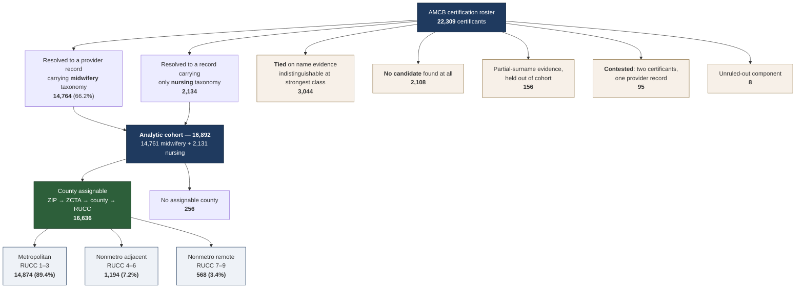

# Technical Appendix: Record Linkage, AMCB Certification Roster to NPPES

**Repository**: `midwifery`
**Primary scripts**: [`match_amcb_to_npi.R`](../match_amcb_to_npi.R), [`match_nppes.R`](../match_nppes.R), [`R/amcb_resolver.R`](../R/amcb_resolver.R)
**Frozen artifact**: `artifacts/amcb_npi_linkage_FROZEN.csv` (person-level, gitignored)
**Published aggregate**: `artifacts/linkage_completeness_by_status.csv`
**Investigation date**: 2026-08-29
**Status**: every count below is read from a committed artifact and reproduced by the gates named in §8.

---

## 1. The problem

Neither source carries a shared identifier. The AMCB public verification
directory publishes a certification number, a name, a credential, and dates.
NPPES publishes an NPI, names, a taxonomy, and a practice address. There is no
key, no date of birth on either side, and no licence number common to both.

Linkage is therefore by name, and the entire difficulty is that names are not
identifiers. Two certificants may share one; one certificant may hold several
over a career.

## 2. Cohort flow



A drawn version of this figure, generated from the stats catalog rather than
hand-written, is at [`figures/cohort_flow.pdf`](figures/cohort_flow.pdf) —
produced by [`make_cohort_flow_figure.R`](../make_cohort_flow_figure.R), which
refuses to write if the parts do not sum to the roster. The mermaid block above
is kept because it renders inline on GitHub; the drawn one is what a manuscript
can use.

**Six records do not carry through.** 14,764 resolve to midwifery taxonomy but
14,761 appear in the frozen analytic cohort; 2,134 resolve to nursing taxonomy
but 2,131 appear. The cohort file was frozen at a slightly earlier vintage than
the linkage file it derives from. The discrepancy is 6 of 16,898 (0.04%), is
documented here rather than silently reconciled, and does not affect any
reported proportion at the precision reported.

## 3. Candidates come from the historical panel, not the current registry

This is the single most consequential design choice in the linkage and it is
easy to miss.

Blocking runs over the **2007–2025 provider panel** — one row per (NPI, name
spelling) across 19 annual snapshots — rather than over a current NPPES
download. Two consequences follow:

- A midwife who has since left the registry remains matchable under the name
  she held while enumerated.
- **Every name an NPI has ever carried is available for blocking**, so a
  surname change between certification and the present does not by itself
  prevent a match.

[`match_amcb_to_npi.R:227`](../match_amcb_to_npi.R) —
*"one row per (NPI, name spelling) so every historical surname is matchable, not
just the current one."* The second path,
[`match_nppes.R:253-260`](../match_nppes.R), appends panel name-rows not already
present in the live-API candidate file and reports how many NPIs it revived.

**A former-name crosswalk therefore adds nothing.** Building one from the same
snapshots recovers 50,633 aliases across 46,557 NPIs — and every one of them is
already in the candidate universe. This is recorded because the idea is a
natural one to have, and the code answering it is not visible from outside.

## 4. Ordered evidence classes, not a similarity score

Candidates are ranked into ordered classes and a record resolves **only when
exactly one candidate occupies its strongest available class**.

| class | evidence | confidence |
|---|---|---|
| 1 | exact surname + given name, corroborating middle name | 1.00 |
| 2 | exact surname + given name | 0.90 |
| 3 | exact surname, given name equivalent via nickname dictionary | 0.70 |
| 4 | surname within edit distance 2 | 0.50 |
| 5 | partial surname | 0.35 |

Class 5 sits **below** class 4 deliberately: a fragment of a surname is weaker
identity evidence than the whole of one within a small edit distance.

Why classes rather than a blended score: a numeric threshold expresses a
continuous question about categorical evidence. The earlier implementation
carried a `CONFLICT_MARGIN` constant whose zero-conflict behaviour turned out to
be structural — the candidates it compared never coexisted — rather than
evidence that the threshold was correct. Ordered classes replaced it.

## 5. Ties are quarantined, not broken

When two or more candidates tie at the strongest class, the record is left
unresolved and reported as its own stratum.

Of the 3,044 tied records, **1,163 are two-way ties** and 368 tie at class 1 —
full name *and* middle name agreeing — including one twelve-way and three
eighteen-way ties. Those are namesakes or duplicate provider records, and no
additional name evidence separates them.

**Taxonomy may not break a tie.** From [`R/amcb_resolver.R`](../R/amcb_resolver.R):

> *Several candidates at the strongest class means they are indistinguishable on
> the evidence held. Taxonomy must NOT break that tie: it says nothing about
> WHICH person the name refers to, only what the NPI does for a living.*

This is the rule that stops the resolver becoming a plausible-match machine.
Taxonomy assigns the evidence tier and orders the one-to-one constraint; it
never decides identity.

A one-to-one constraint is imposed after individual resolution, so one provider
record cannot satisfy two certificants. Contested records — 95 — are counted
before the constraint prunes them, because the count is itself a data-quality
signal.

## 6. Two selection rates

| status | n | cohort resolution | ascertainment |
|---|---|---|---|
| ACTIVE | 15,285 | 78.4% | 84.6% |
| LAPSED | 5,175 | 39.6% | 57.0% |
| RETIRED | 1,278 | 46.1% | 60.6% |
| DECEASED | 499 | 18.8% | 35.5% |

**Cohort resolution** is the share resolving to a midwifery-taxonomy record.
**Ascertainment** is the share found in the registry at all.

The gap is entirely the cross-taxonomy rule (§5). A certified nurse-midwife must
hold registered-nurse licensure and may have enumerated under either taxonomy; a
nursing-only match is found and deliberately not promoted.

Reporting either alone, unlabelled, is how a reader ends up unable to reconcile
78.4% with 84.6%. Both are named in the manuscript and both are registered
protected results.

## 7. Part of the shortfall is a registry boundary, not a matching failure

NPPES began enumerating in 2006. Certification era and status vary
independently, so the claim is testable — and if the shortfall were a matching
failure, certifying before the registry existed would depress ascertainment for
everyone who did so.

| ACTIVE certificants | n | ascertained |
|---|---|---|
| certified before 2006 | 4,173 | **84.4%** |
| certified 2006 or later | 11,112 | **84.7%** |

Three tenths of a point. The roster-wide era difference — 66.5% against 84.3% —
is era confounded with having left practice. See
[`TECHNICAL_APPENDIX_LINKAGE_SELECTION.md`](TECHNICAL_APPENDIX_LINKAGE_SELECTION.md) §6.

## 8. Reproducing this

```
Rscript match_amcb_to_npi.R                  # candidate generation and resolution
Rscript reconcile_linkage.R                  # dispositions -> linkage_completeness_by_status.csv
Rscript analyze_linkage_coverage_floor.R     # era x status ascertainment
Rscript tests/ci_science_laws.R              # L1-L12, including L11 and L12
Rscript tests/test_science_laws_detect.R     # 19 planted defects, all must be caught
```

The frozen linkage is person-level and gitignored; these run where the pipeline
has been run. Published artifacts are aggregate and carry provenance sidecars
naming their inputs with SHA-256 checksums.

## 9. What the 2,031 with no assignable county turned out to be

An earlier version of this appendix reported **2,031** cohort members without an
assignable county. Two of the three reasons were joins that never happened
rather than absent data:

| | n | |
|---|---|---|
| address never fetched | 1,545 | stage-2 addresses were keyed on the stage-2 NPI; the newly-NPI-resolved group is defined by not having had one |
| Connecticut vintage mismatch | 249 | 2020 legacy counties against 2023 planning regions |
| genuinely unassignable | 256 | PO box, unique, non-geographic ZIP |

Recovered to **256**. The metropolitan share moved 89.34% → 89.41%; the reported
bound tightened from 64.9–92.2% to 72.1–91.4%. See
[`TECHNICAL_APPENDIX_LINKAGE_SELECTION.md`](TECHNICAL_APPENDIX_LINKAGE_SELECTION.md)
§9 for the full accounting and for why the Connecticut assignment does not route
through the legacy county.
