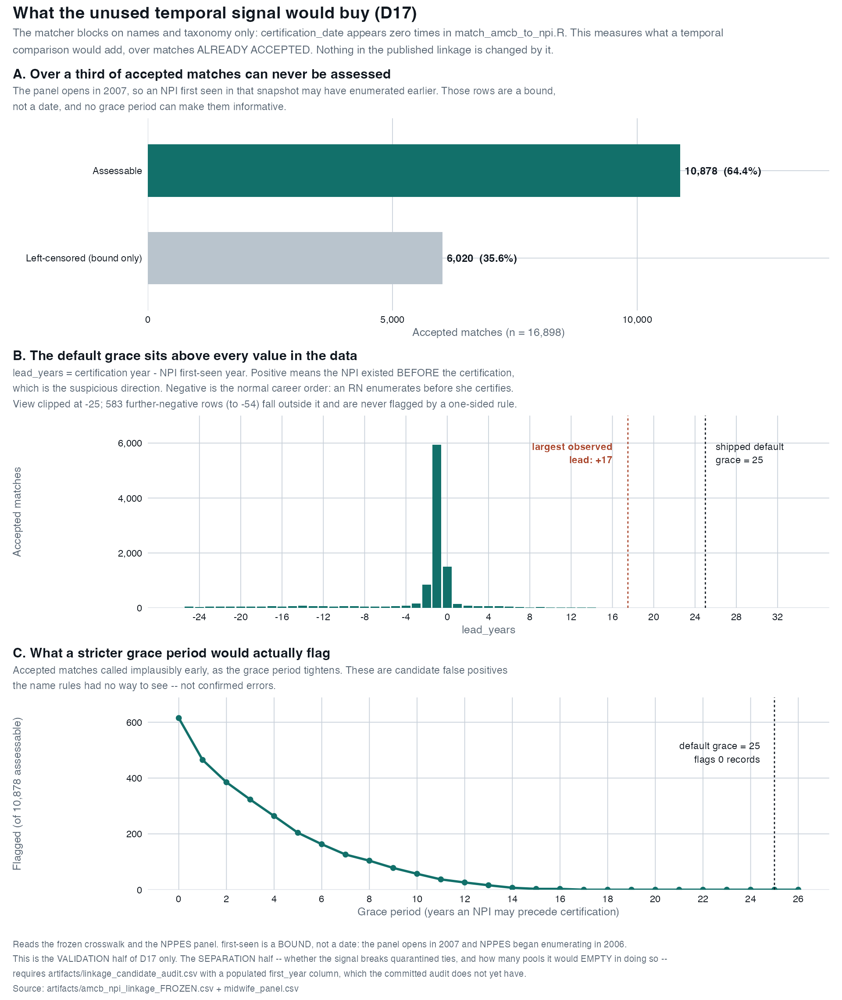

# Technical appendix: the temporal plausibility measurement (D17)

**Status:** measurement only. Nothing in the published linkage is changed by
anything described here.
**Scripts:** `analyze_temporal_plausibility.R`, `make_temporal_plausibility_figure.R`
**Mechanism:** `amcb_temporal_separation()` in `R/amcb_resolver.R` (implemented, off)
**Decision:** [`docs/DECISIONS_CONTRACT.md` D17](DECISIONS_CONTRACT.md) — **RULING: none**

---

## What question this answers

`match_amcb_to_npi.R` blocks on names and taxonomy and nothing else:
`certification_date` appears **zero** times in it. Yet the AMCB roster carries a
certification date and the NPPES panel carries the year each NPI was first seen,
so a temporal comparison has always been available and has never been made.

D17 asks whether that comparison may be used to separate candidates tied at the
strongest evidence class, and at what grace period. The question splits in two,
and the two halves must not be run together:

| Half | Question | Status |
|---|---|---|
| **Validation** | Among matches already accepted, how many pair a certificant with an NPI first seen implausibly early? | **Measured — see below** |
| **Separation** | Among records quarantined as tied, in how many does the signal leave exactly one survivor? | **Not computable yet** |

Only the validation half is reported here. The separation half is what the
ruling actually turns on, and it cannot be computed from the committed
artifacts — see [Why the separation half is missing](#why-the-separation-half-is-missing).

---

## The quantity

```
lead_years = cert_year - first_seen_year
```

**Positive means the NPI existed *before* the certification** — the direction
that would be suspicious, because an NPI that did not exist until long after a
certificant qualified is weak evidence against that pairing.

Negative is the *normal* career order and carries no signal at all: a registered
nurse enumerates for an NPI years before she certifies as a midwife. This is why
the rule is one-sided and why the shipped default grace is generous.

---

## Results

Run against the frozen crosswalk (22,309 roster rows; 16,898 with an accepted
NPI) and the NPPES panel (4,291,397 rows).

### Censoring first — over a third can never be assessed

| Population | n | % of accepted |
|---|---:|---:|
| Assessable (uncensored, both years present) | 10,878 | 64.4% |
| Left-censored (bound only) | 6,020 | 35.6% |
| **Accepted matches** | **16,898** | **100%** |

The panel opens in **2007** and NPPES began enumerating in **2006**, so an NPI
first seen in the earliest snapshot may have enumerated before it. Those rows
are a *bound*, not a date. No grace period makes them informative, and any
statement of the form "the temporal signal clears N% of the cohort" must be read
against a denominator of 10,878, never 16,898.

### The distribution, and why the default flags nothing

Among the 10,878 assessable matches:

| statistic | value |
|---|---:|
| min | −54 |
| 1st quartile | −2 |
| median | −1 |
| mean | −4.0 |
| 3rd quartile | −1 |
| **max** | **+17** |

**The largest observed lead is +17 years. The shipped default is
`grace = 25`.** The default sits above every value in the data, so at its own
default the measurement cannot flag a single record no matter what the data
said. That is not a finding about midwives; it is a property of the parameter.

### Grace sweep

| grace | flagged | % of 10,878 assessable |
|---:|---:|---:|
| 25 (default) | 0 | 0.00% |
| 20 | 0 | 0.00% |
| 15 | 3 | 0.03% |
| 12 | 26 | 0.24% |
| 10 | 57 | 0.52% |
| 8 | 104 | 0.96% |
| 6 | 163 | 1.50% |
| 5 | 204 | 1.88% |
| 4 | 264 | 2.43% |
| 3 | 323 | 2.97% |
| 2 | 385 | 3.54% |
| 1 | 465 | 4.27% |
| 0 | 615 | 5.65% |

Backing data: `artifacts/temporal_plausibility_grace_sweep.csv` (aggregate,
publishable, provenance-tracked).



**Read the sweep as a ceiling, not a yield.** A flagged record is a *candidate*
false positive that the name rules had no way to see. It is not a confirmed
error, and this measurement does not adjudicate any of them.

---

## Why the separation half is missing

`analyze_temporal_plausibility.R` computes separation only when
`artifacts/linkage_candidate_audit.csv` carries a usable `first_year` column.
The committed audit has **198,922 rows with `first_year` 100% `NA`** — it
predates the column being populated. The script says so and declines to
estimate:

> The candidate audit predates the populated first_year column and carries no
> usable years. Rerun match_amcb_to_npi.R.

That refusal is correct behaviour and should not be worked around. Without
per-candidate rows the honest answer is "not computable here", not a guess.

**To fill it in:** rerun `match_amcb_to_npi.R` on the machine holding the
person-level inputs, then rerun `analyze_temporal_plausibility.R`.

### What the separation half must report

D17 turns on a quantity the validation half cannot supply, because **a rule that
separates some pools empties others**:

- pools the signal **would separate** (tied → resolved) — a gain;
- pools where **every candidate is ruled out** (tied → *no candidate*) — a loss,
  and one a reader cannot distinguish from absence from the registry;
- pools **blocked by censoring**, which must not be counted as separated.

Net recovery is separations **minus** emptied pools, and *the sign of that is
not known in advance*. Reporting separations alone would overstate the case for
adopting the rule.

`amcb_temporal_separation()` already refuses to call a pool separated when its
lone survivor survived only because its year was unusable — the first version of
that function did exactly that, which is the middle-name veto's manufactured
uniqueness in a new costume. `tests/test_temporal_separation.R` T3 and T5 exist
to keep it out.

---

## A defect found while producing these numbers

The first run of `analyze_temporal_plausibility.R` reported **100.0% "not
assessable"** across all 16,898 accepted matches — and exited 0.

The cause was the date parser:

```r
cert_year <- function(v) suppressWarnings(as.integer(substr(as.character(v), 1, 4)))
```

`certification_date` in the frozen crosswalk is **`MM/YYYY`** (`"06/2015"`), not
ISO. `substr(v, 1, 4)` yields `"06/2"`, and `as.integer("06/2")` is `NA` — for
**all 22,309 rows**, silently, under `suppressWarnings`. Every accepted match
then fell through the first branch of the verdict `case_when()` to "not
assessable", the script wrote its summary artifact, and it returned success.

This is the same failure class as the DuckDB volume defect fixed in #157: **a
run that reports success having measured nothing.** A zero is not obviously
wrong the way a crash is.

The fix takes the four-digit year wherever it sits, so an ISO-dated vintage
parses too, and preserves vector length so the join cannot silently shift:

```r
cert_year <- function(v) {
  s <- as.character(v)
  pos <- regexpr("(19|20)[0-9]{2}", s)
  out <- rep(NA_integer_, length(s))
  out[pos > 0] <- as.integer(regmatches(s, pos))
  out
}
```

Verified: 0 → 22,309 rows parsed, year range 1971–2026.

**The artifact written by the broken run was overwritten by the corrected run.**
Any reading of `artifacts/temporal_plausibility_summary.csv` taken before this
fix reported 100% "not assessable" and should be discarded.

---

## Reproducing

```sh
# Both inputs are person-level and gitignored.
Rscript analyze_temporal_plausibility.R
Rscript analyze_temporal_plausibility.R --grace=5     # sensitivity
Rscript make_temporal_plausibility_figure.R
```

| Output | Committed? | Contents |
|---|---|---|
| `artifacts/temporal_plausibility_summary.csv` | yes | counts by evidence class × verdict |
| `artifacts/temporal_plausibility_grace_sweep.csv` | yes | the sweep table above |
| `docs/figures/temporal_plausibility.{pdf,png,svg}` | yes | the figure above |
| `qa/temporal_implausible_accepted.csv` | **no** — gitignored | person-level flagged rows, written only when the grace period flags something |

---

## What this does not license

- It does **not** rule on D17. The ruling is `none`, and the separation half is
  unmeasured.
- It does **not** identify false positives. A flagged pairing is a candidate for
  review, not an error.
- It does **not** support "the linkage is temporally validated". 35.6% of
  accepted matches are censored and were never assessed at all.
