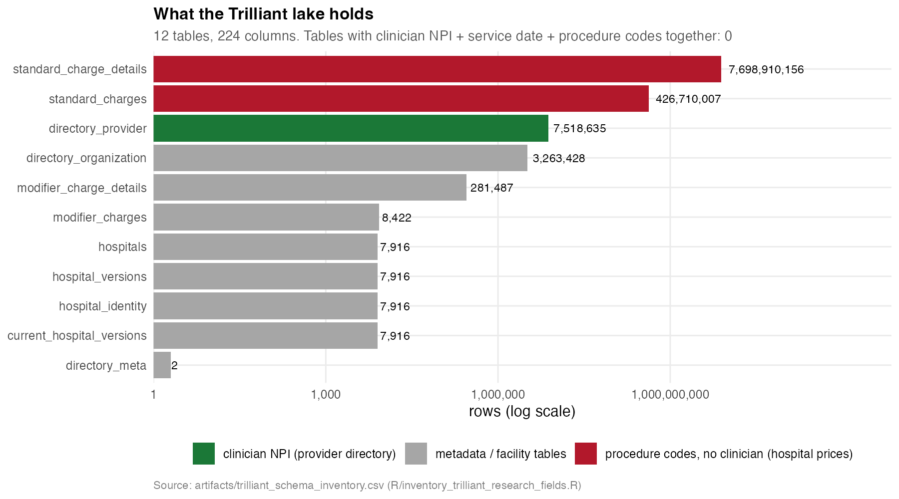
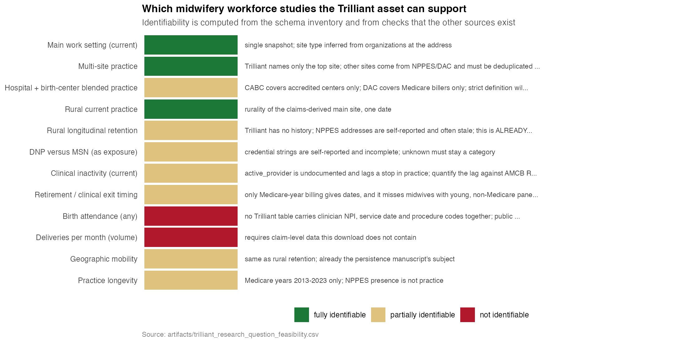
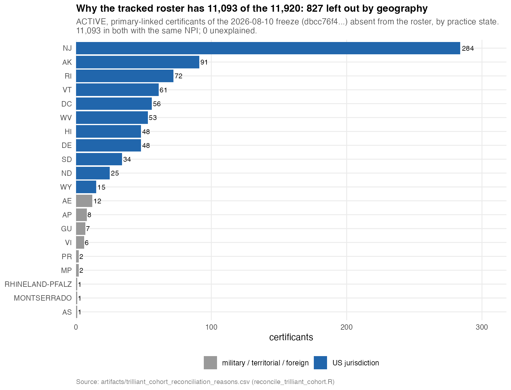
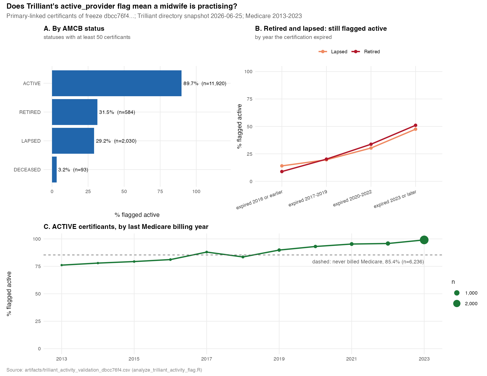

# Technical appendix: the Trilliant claims directory — where midwives work

This appendix documents what the Trilliant data asset contains and which
questions it can answer. It covers the three cohort populations the analyses
keep apart, how the `active_provider` flag was tested, and how work sites,
facility types, geography and practice topology are built. Every number is
taken from a committed artifact named beside it. Where a result needs the
current cohort freeze and has not yet been produced, it says so instead of
quoting a number from elsewhere.

Scripts, in the order they run:

| Script | Writes | Tracked? |
|---|---|---|
| [`R/inventory_trilliant_research_fields.R`](../R/inventory_trilliant_research_fields.R) | `artifacts/trilliant_schema_inventory.csv`, `artifacts/trilliant_research_question_feasibility.csv` | yes (aggregate) |
| [`reconcile_trilliant_cohort.R`](../reconcile_trilliant_cohort.R) | `artifacts/trilliant_cohort_reconciliation_reasons.csv`; person-level `trilliant_cohort_reconciliation.csv`, `trilliant_cohort_transitions.csv` | reasons only |
| [`analyze_trilliant_activity_flag.R`](../analyze_trilliant_activity_flag.R) | `artifacts/trilliant_activity_validation_<freeze sha8>.csv` | yes (aggregate) |
| [`build_trilliant_work_sites.R`](../build_trilliant_work_sites.R) | `artifacts/midwife_work_setting_summary.csv`; person-level `midwife_work_sites_long.csv`, `midwife_distinct_work_sites.csv`, `midwife_work_sites_summary.csv`, `midwife_work_sites_excluded_non_workplace.csv` | summary only |
| [`enrich_trilliant_demographics.R`](../enrich_trilliant_demographics.R) | `artifacts/trilliant_demographics_validation_<freeze sha8>.csv`; person-level `trilliant_demographics.csv` | checks only |
| [`make_trilliant_figures.R`](../make_trilliant_figures.R) | `docs/figures/trilliant_*.png` | yes |

Libraries: [`R/lib/cohort_definitions.R`](../R/lib/cohort_definitions.R),
[`R/lib/work_site_topology.R`](../R/lib/work_site_topology.R),
[`R/lib/data_vault.R`](../R/lib/data_vault.R),
[`R/lib/trilliant_demographics.R`](../R/lib/trilliant_demographics.R). Their tests:
`tests/test_cohort_definitions.R`, `tests/test_work_site_topology.R`,
`tests/test_data_vault.R`, `tests/test_trilliant_demographics.R`.

---

## 1. The asset

The Trilliant download is a DuckLake of U.S. hospital machine-readable price
files, bundled with two provider-directory tables. It lives on the external
volume at `hpt_prices/trilliant/20260721/lake`. The directory tables are a
single snapshot, labelled `20260625` in `directory_meta`.



From `artifacts/trilliant_schema_inventory.csv`:

- **`directory_provider`** — 7,518,635 individual NPIs. This is the only table
  with a clinician NPI. It carries `active_provider`, patient-panel composition
  (age bands, percent female), the number of practice sites, the organization
  that bills for the provider, and one named practice site ("practice 1") with
  its address, coordinates, county and share of visits.
- **`directory_organization`** — 3,263,428 organization NPIs, each with a type,
  a taxonomy, an address, a county and a geocode. There is no link from a
  provider to an organization NPI; the two meet only at a street address.
- **`standard_charges` / `standard_charge_details`** — 426,710,007 and
  7,698,910,156 rows of hospital prices. They carry CPT, HCPCS, DRG and ICD
  codes but no clinician, and their only dates are file run dates.

The directory is the "basic tier". It names only a provider's top practice
site, although `provider_practices_total` counts all of them.

**Licensing.** Trilliant's data are licensed. Nothing person-level from them is
tracked. The schema inventory is metadata: table and column names, types,
counts, and category values such as organization types.

## 2. What it can and cannot support



`artifacts/trilliant_research_question_feasibility.csv` marks twelve research
questions. The identifiability columns are computed from the inventory and
from checks that the other sources exist, not asserted:

- **Fully identifiable:** current main work setting, multi-site practice,
  current rurality.
- **Partially identifiable:** hospital + birth-center blended practice (CABC
  covers accredited centers only; DAC covers Medicare billers only), DNP versus
  MSN as an exposure, current clinical inactivity, exit timing, practice
  longevity, rural retention and mobility.
- **Not identifiable:** birth attendance and deliveries per month. No table
  holds a clinician NPI, a service date and procedure codes together.

Public Medicare Part B has no substitute for delivery attendance either.
`artifacts/medicare_delivery_code_observability.csv` records zero rows for any
global or delivery-only obstetric code, for any provider, in 2013–2023.

**Rural retention is already a paper.** `manuscript/midwife_persistence.qmd`
measures it from NPPES address snapshots. Trilliant adds a check of that
paper's end point, not a second retention study (section 6.4).

## 3. Three populations, defined once

One number had been standing in for three different questions.
`R/lib/cohort_definitions.R` separates them:

| Function | Population | Rule |
|---|---|---|
| `canonical_active_primary()` | who is in the study | AMCB status ACTIVE, `linkage_tier == "primary_midwifery"`, an NPI, in the freeze the tracked manifest describes (`verify_linkage_freeze()` refuses any other file) |
| `board_validation_eligible()` | who a state board could confirm | canonical members practising in a state whose board was genuinely queried: **WA, CO, TX** |
| `cms_dac_observed()` | who CMS can see | canonical members whose NPI appears in CMS Doctors & Clinicians; taken from the canonical cohort, never from a board subset |

A certificant carrying two different NPIs stops the build rather than being
resolved by row order.

Board coverage never restricts the CMS subset. A New Jersey midwife that CMS
observes is in the CMS analysis even though no New Jersey board was queried
(test T14).

### 3.1 The 11,920 and the 11,093



`reconcile_trilliant_cohort.R` compared, person by person, the 11,920 ACTIVE,
primary-linked certificants of the 2026-08-10 freeze (sha256 `dbcc76f4…`) with
the 11,093-row `artifacts/tracked_roster_active_primary_linked.csv`:

- 11,093 are in both, with the same NPI.
- 787 practise in the 11 jurisdictions the roster never covered.
- 40 have military, territorial or foreign addresses.
- None are unexplained, and none has a differing NPI.

The roster's 40-state scope is the state list of the fabricated
board "scrape" it replaced (NEWS, [Unreleased] 2026-09-13). It is not board
coverage and not a sampling decision. Nothing may be restricted by it.

### 3.2 The canonical cohort is neither

The current freeze is the 22,357-row roster from run
`reconcile_ab_20260910T193000_issue172` (sha256 `1a7bd6a8…`). Its registered
ACTIVE, primary-linked count is **12,171** (`tests/ci_science_laws.R`,
`LAW_COHORTS`; `artifacts/table1_provenance.csv`). According to the freeze
manifest, the change from 11,920 has three sources:
- the 2026-09-02 AMCB re-scrape
- the NPI candidate window extended through 2026
- the surname-hyphen fix, which produced the step from 12,129 to 12,171

`cohort_transition_reasons()` gives every certificant exactly one reason for
being in one cohort and not the other. `reconcile_trilliant_cohort.R` runs it
when `CURRENT_FROZEN_CSV` names the verified file. That per-person breakdown
has not yet been run, because the current freeze was not on the machine that
wrote this appendix.

## 4. Does `active_provider` mean a midwife is practising?

Nothing in the lake defines the flag. Patient-panel fields are populated only
when it is TRUE, which suggests it comes from claims.
`analyze_trilliant_activity_flag.R` tests it three ways. The run committed so
far is against the 2026-08-10 freeze
(`artifacts/trilliant_activity_validation_dbcc76f4.csv`); the file name carries
the freeze hash, so a run on the current freeze writes a separate file.



- **By AMCB status**, among primary-linked certificants flagged active:
  - ACTIVE 89.7% (10,696 of 11,920)
  - RETIRED 31.5% (184 of 584)
  - LAPSED 29.2% (592 of 2,030)
  - DECEASED 3.2% (3 of 93)
- **Lag after leaving.** Retired certificants still flagged active, by the
  year their certification expired:
  - expired 2016 or earlier: 8.9%
  - 2017–2019: 20.2%
  - 2020–2022: 33.8%
  - 2023 or later: 51.0%
  
  Lapsed certificants follow the same pattern, from 14.1% to 47.5%.
- **Recency of Medicare billing** (ACTIVE certificants), flagged active:
  - last billed 2013: 76.1%
  - last billed 2023: 99.1%
  - never billed Medicare, or under 11 beneficiaries every year: 85.4%

**Reading.** The flag separates the groups well and tracks billing recency,
but it keeps "active" for years after a stop in practice.

- **Inactive** is strong evidence of not practising.
- **Active** overstates practice among recent leavers. Pair it with recent
  billing or a patient-panel check, and never treat it alone as retirement or
  exit.
- **Two deceased certificants** whose certifications expired in 2016 or
  earlier are still flagged active. They are probable identity mis-links, and
  are worth adjudicating.

The Medicare figures use the Part B and Part D year tables in the warehouse. A
midwife absent from a year billed nothing, or fewer than 11 beneficiaries;
`match_medicare_partb_partd.R` explains why those cases can't be told apart.

## 5. Work sites

`build_trilliant_work_sites.R` (R/duckplyr) produces one row per midwife × site
× source:

| Source | Contributes |
|---|---|
| Trilliant `directory_provider` | claims-derived main site, visit share, number of sites, billing organization |
| NPPES primary and secondary practice locations | self-reported addresses |
| CMS DAC facility affiliation | hospitals where the midwife billed Medicare (not formal privileges) |
| CABC | accredited birth centers matched to the midwife |
| resolved employer organizations | who pays the midwife — **employers are never counted as work sites** |

### 5.1 What kind of place a site is

A site's type is decided in this order: first what the site calls itself (a
lab or pathology name, a birth-center name without a hospital in the building,
a hospital or medical-center name, an FQHC name). Next, the Trilliant
organization its name matches at the same street address, with a Jaro-Winkler
score of at least 0.80, clinical classes only. Last, what the building holds:
any hospital organization, a birth-center organization, an FQHC.

Two data problems are handled in code, not by hand:
- **Similar names.** Practices register in-house lab and pharmacy NPIs under
  their own names, so a name match to a lab NPI never relabels a clinical site.
- **Self-reported addresses.** An unnamed NPPES address is never excluded just
  because a lab shares the building.

**Not workplaces.** Labs, pathology practices, pharmacies, DME suppliers,
ambulance and imaging are where a midwife's *orders* were filled, so Trilliant
attributes them from ordering claims. They go to
`midwife_work_sites_excluded_non_workplace.csv`, where each exclusion can be
audited.

### 5.2 Hospital CCN and price files

A hospital site gets its CMS Certification Number from four kinds of evidence,
tried best first:
1. the NPI of the organization its name matched
2. the NPI of any hospital organization in the building
3. its street address against CMS's hospital lists
4. a Jaro-Winkler name match of at least 0.92 in the same city

Two defects are corrected along the way:
- **Dropped leading zeros.** The CMS enrollment file publishes 934 of its
  9,161 CCNs without the leading zero, for example Denver Health `060011` as
  `60011`. `pad_ccn()` restores it. Reproduce with `duckdb -c "SELECT count(*)
  FILTER (WHERE length(\"CCN\")=5) FROM read_csv('…/Hospital_Enrollments_2026.07.31.csv',
  all_varchar=true, encoding='latin-1')"`.
- **NPIs filed at the wrong hospital.** Trilliant's organization directory
  files some NPIs at a same-named hospital's address in another state.
  Community Hospital in Tallassee, AL appears at Community Hospital's address
  in Grand Junction, CO. A candidate CCN whose hospital is in a different state
  from the site is rejected.

Among the remaining candidates, a main hospital's CCN (last four digits
0001–0879 or 1300–1399) is preferred over a psych or swing-bed unit such as
`34S143`. The CCN then links to the hospital's price-transparency file through
the `hpt_prices` crosswalk.

## 6. Geography and topology

### 6.1 Coordinates

Only the Trilliant claims site arrives with coordinates. Every other address
takes the median geocode of the Trilliant organizations at the same
normalized street and ZIP. A DAC hospital is first placed at its CMS address,
and a CABC center at its listed address. `coordinate_basis` records which.

### 6.2 County and rurality

`match_county()` turns Trilliant's county name into a GEOID. It tries
successively looser keys, stopping at the first unique hit in the state:
1. the full ACS name, which keeps "city", so Richmond city (51760) ≠ Richmond
   County (51159)
2. the name without "County", "Parish", "Borough", "Census Area",
   "Municipality", "City and Borough" or "Planning Region"
3. the name plus " city", for Salem city, VA
4. the name with spaces removed, for LaSalle and LaPorte

Before matching, accents, "Saint", "Sainte" and Trilliant's Connecticut
abbreviations ("CT", "VLY", "NW") are normalized. An ambiguous or unknown name
is NA, never a guess. Any site without a name match falls back to the
repository's ZIP → dominant-county crosswalk (`zip_county_dominant()`), with
Connecticut ZIPs rescued to their 2022 planning region when that crosswalk is
present.

Rurality is RUCC 2023 from `data/county_base.csv`, banded by `band_rurality()`
into `RURALITY_LABELS_COHORT`: Metro (1–3), Nonmetro adjacent (4–6), Nonmetro
remote (7–9). These are the bands the cohort papers use.

### 6.3 Distinct physical sites

`assign_site_ids()` treats two rows as one place when they share coordinates
to four decimal places (about 11 m) or the same normalized street and ZIP. The
link is transitive, and the IDs don't depend on row order.
`topology_by_midwife()` then reports, per midwife:
- the number of distinct sites
- the setting combination
- the largest distance between two sites
- the number of counties
- whether all sites share a rurality band ("mixed" if not)

The distinct-site count is "sites observed", not workplaces. NPPES secondary
locations can list every office of a group practice.

### 6.4 Blended hospital + birth-center practice

`blended_practice()` defines two levels:
- **Strict** needs evidence beyond a name. For the hospital: a CMS DAC
  affiliation, or the Trilliant claims site resolved to a hospital CCN. For the
  birth center: CABC accreditation, or a site whose Trilliant organization match
  or building carries the birthing-center taxonomy (261QB0400X).
- **Broad** accepts any work-site row of either type, including one known only
  by its name.

Employer names never count.

### 6.5 NPPES address versus claims site

For each midwife, the rurality band of the NPPES primary practice address is
compared with that of the Trilliant claims site. The persistence manuscript
assigns rurality from NPPES addresses, so this measures how often that
assignment disagrees with where claims place the same midwife.

**Results for sections 5 and 6 are pending.** They will come from
`artifacts/midwife_work_setting_summary.csv` once
`build_trilliant_work_sites.R` has run against the current freeze. Every
dimension there partitions the cohort, so the published-numbers gate can check
it. The build refuses any other freeze unless one is named on purpose with
`ALLOW_FREEZE_SHA256`; development runs against the 2026-08-10 freeze were
never committed.

## 7. A backup source for demographics

The directory also carries a gender, a "medical school" with a graduation year,
an estimated age, and a claims-derived patient-panel mix.
`enrich_trilliant_demographics.R` pulls these for every primary-linked
certificant. A value is used only where the repository's own sources have
nothing, and only after a check against the source it would back up. The
checks run on every build and are written to
`artifacts/trilliant_demographics_validation_<freeze sha8>.csv`. The committed
file is from the 2026-08-10 freeze (11,920 midwives, every one of them in the
directory).

| Field | Check against | Result | Use |
|---|---|---|---|
| Sex | NPPES sex code | 100% agreement across the 11,897 midwives where both give F or M | Fills a blank NPPES code in Table 1 (10 midwives). "UNSPECIFIED/OTHER" is not used, because NPPES distinguishes X from U. |
| School | CMS DAC `med_sch_clean` | 100% agreement across the 678 midwives both name, once cleaned by the same rule. The strings are DAC's, character for character. | Last source in `training_attach()` and in Table 1, after DAC, Healthgrades and the university repository. Names a school for 400 midwives DAC does not. |
| Graduation year | CMS DAC `grad_year` | 99.9% the same year (4,780 midwives) | Kept for analysis; nothing downstream reads it yet. |
| Age | measured ages (Healthgrades, WA, OH voter) and the calibration | Estimated age plus graduation year is the constant 2052 for all 7,638 midwives who have an age, so the directory assumes everyone graduated at 26. Against 2,475 measured ages it averages 7.9 years young (mean absolute error 8.2); the calibration it would replace has a mean absolute error of 5.6 on the same people. | **Not used.** `calibrate_amcb_certification_ages.R` has a slot for it, after every direct source and in place of the calibration. `trl_age_admission()` fills the slot only if the age is not derived from graduation year and beats the calibration on measured ages. The decision is written to `artifacts/amcb_age_calibration_provenance.csv`. |
| Patient panel | none (no other source) | A coherent panel (the age bands sum to one) for 10,706 midwives, the ones the directory flags active. Median of each midwife's median patient age: 32 (interquartile range 30–35). Median share of patients female: 99.7%. On average, 82.7% of a midwife's patients are aged 20–44. | A Table 1 block: the median (IQR) of each midwife's median patient age, then <20, 20–29, 30–39, 40–49, 50–59, 60–69 and ≥70 years (`band_panel_median_age()`), with a row for midwives who have no panel. The median (IQR) row carries no count, so the block still sums to the cohort. The full panel is in `artifacts/trilliant_demographics.csv`. |

**School names are cleaned by one rule for DAC and the directory**
(`strip_med_suffix()`, which lives in the
[mysterynpi](https://github.com/mufflyt/mysterynpi) package and is called
through `R/lib/training_institution.R`). CMS files a nursing
programme under its university's medical school, so the unit is stripped and
the university kept. Two cases used to come out wrong:

- **A named school of a university.** "Brody School of Medicine at East
  Carolina University" gave "BRODY"; the same happened to Perelman, Jefferson,
  Sanford, Netter and Edwards. The university after "at", "of" or a comma is
  now kept.
- **An institution whose name is the medical phrase.** Baylor College of
  Medicine, Ohio Medical University and Philadelphia College of Osteopathic
  Medicine gave "BAYLOR", "OHIO" and "PHILADELPHIA". A strip that leaves no
  institution word is now refused.

Of the 88 distinct DAC and directory strings, 19 changed and none of the rest
did. The DAC extract (`dac_cnm_education.csv`) picks this up the next time
`extract_dac_cnm_education.R` runs. mysterynpi pins all 88 strings and their
expected institutions as a test fixture.

Two cautions follow from the table.

- **The school field has DAC's blind spot.** The directory, like DAC, can only
  name a university that has a medical school, so it never names Frontier
  Nursing University.
- **A panel describes the patients the directory could see, not the whole
  practice.** It exists only for providers flagged active.

The tracked Table 1 and calibrated ages pick these backups up the next time
they are rebuilt on a machine holding all their inputs. That includes the
Healthgrades files, which this one does not have.

## 7b. The directory as a second identity source

The directory's identity fields (name, credential, specialty, graduation
year) are tested as evidence for the AMCB → NPI linkage itself in a separate
experiment. It measures:

- which existing links the directory confirms or contradicts;
- which ties it separates;
- which unmatched certificants it finds.

Nothing is applied. Its methods, results and limitations are in
[`TECHNICAL_APPENDIX_TRILLIANT_IDENTITY_EXPERIMENT.md`](TECHNICAL_APPENDIX_TRILLIANT_IDENTITY_EXPERIMENT.md).

## 8. Running it

Everything reads person-level inputs from `artifacts/` or from the data vault
([docs/DATA_VAULT.md](DATA_VAULT.md)), and the Trilliant lake and `hpt_prices`
references from the external volume.

```sh
# 0. the current freeze, verified against the manifest (from the vault if not in artifacts/)
Rscript -e 'source("R/lib/data_vault.R"); cat(vault_linkage_freeze(), "\n")'

# 1. what the asset holds (no cohort needed)
Rscript R/inventory_trilliant_research_fields.R

# 2. the cohort reconciliation, three-way once the current freeze is present
LEGACY_FROZEN_CSV=<2026-08-10 freeze> CURRENT_FROZEN_CSV=<current freeze> Rscript reconcile_trilliant_cohort.R

# 3. the activity flag, 4. work sites and topology
Rscript analyze_trilliant_activity_flag.R
Rscript build_trilliant_work_sites.R

# 4b. backup demographics (then rebuild the age calibration and Table 1)
Rscript enrich_trilliant_demographics.R

# 5. figures
Rscript make_trilliant_figures.R
```

`reconcile_trilliant_cohort.R`, `build_trilliant_work_sites.R`,
`analyze_trilliant_activity_flag.R` and `enrich_trilliant_demographics.R` are
declared in `rebuild_frozen_dependents.R`, so a re-freeze re-runs them. The
demographics enricher runs before the age calibration, which reads it.

## 9. Limitations

- **One snapshot.** The directory has no history, so it cannot show where a
  midwife started or when they stopped.
- **Basic tier.** Only the top practice site is named; other sites come from
  NPPES, DAC and CABC, each with its own coverage.
- **Undocumented flag.** `active_provider` isn't defined, and it lags a stop in
  practice (section 4).
- **Partial source coverage.** DAC observes Medicare billers only, and CABC
  lists accredited birth centers only, so strict blended practice undercounts.
- **Organization directory errors.** It sometimes files NPIs at the wrong
  address; the cross-state check catches cases across state lines, but not
  same-state errors.
- **Name-based site typing.** Classifying a site by the organizations at its
  address is an inference, and `facility_type_basis` records which rule decided
  each site.
- **Licensed data.** Person-level Trilliant outputs never leave the machine
  that builds them, except through the data vault.
