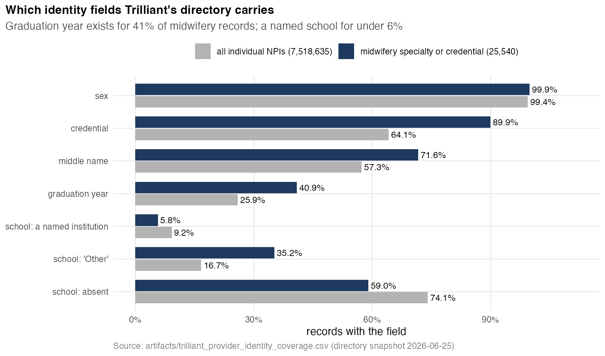
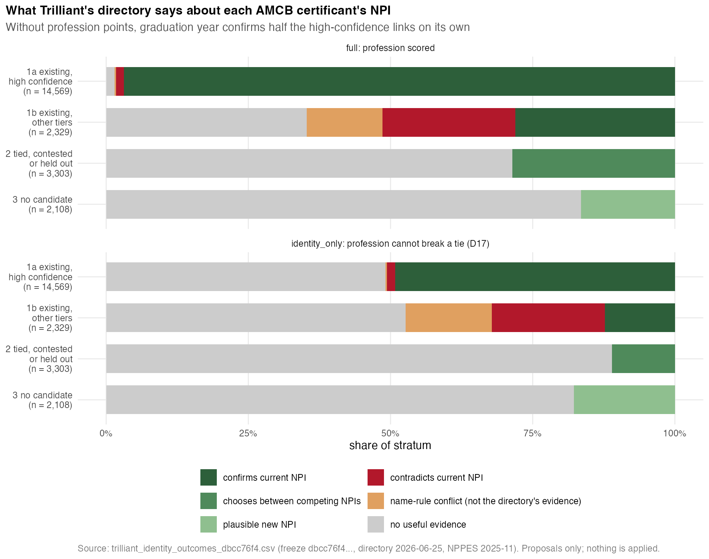
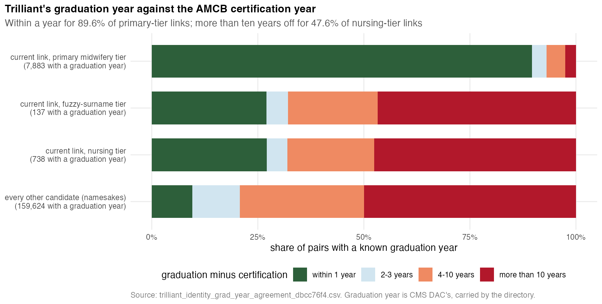

# Technical appendix: Trilliant's provider directory as a second identity source for AMCB → NPI

**Repository**: `midwifery`
**Scripts**: [`build_trilliant_provider_identity_index.R`](../build_trilliant_provider_identity_index.R),
[`experiment_trilliant_identity_linkage.R`](../experiment_trilliant_identity_linkage.R)
**Library**: [`R/lib/trilliant_identity.R`](../R/lib/trilliant_identity.R), tested by
[`tests/test_trilliant_identity.R`](../tests/test_trilliant_identity.R) (22 checks, run in CI)
**Freeze scored**: the 2026-08-10 freeze, sha256 `dbcc76f4…` (22,309 certificants), accepted on
purpose with `ALLOW_FREEZE_SHA256`. **It is not the current freeze** (`1a7bd6a8…`); see §9.
**Directory**: Trilliant `directory_provider`, snapshot 2026-06-25. **NPPES**: November 2025 bulk file.
**Date**: 2026-09-14
**Status**: an experiment. Nothing here changes the linkage, the matcher or mysterynpi.

---

## 1. The question

The linkage resolves an AMCB certificant to an NPI on name evidence alone,
because AMCB publishes a name, a credential and certification dates and nothing
else ([`TECHNICAL_APPENDIX_RECORD_LINKAGE.md`](TECHNICAL_APPENDIX_RECORD_LINKAGE.md)).
Trilliant's directory is a second, independently assembled record for 7.5
million individual NPIs. Before anything in mysterynpi changes, this experiment
asks what that second record adds, in four directions:

1. For an existing link: does the directory **confirm** the current NPI, or
   **contradict** it?
2. For a certificant quarantined as tied or contested: does it **choose between
   competing NPIs**?
3. For a certificant with no candidate: does it produce a **plausible new NPI**?
4. How often does it offer **no useful evidence**?

## 2. What the directory can and cannot say about identity



`build_trilliant_provider_identity_index.R` writes one row for every
individual NPI in the directory, 7,518,635 of them (one row per NPI, checked).
Each identity field is kept raw beside the normalised key the linkage compares
on. The keys come from the same mysterynpi functions `match_amcb_to_npi.R` uses.
Coverage, from `artifacts/trilliant_provider_identity_coverage.csv`:

| field | all individual NPIs | midwifery specialty or credential (25,540) |
|---|---:|---:|
| sex | 99.4% | 99.9% |
| credential | 64.1% | 90.0% |
| middle name | 57.3% | 71.6% |
| graduation year | 25.9% | 40.9% |
| school: a named institution | 9.2% | **5.8%** |
| school: the placeholder "Other" | 16.7% | 35.2% |
| school: absent | 74.1% | 59.0% |

Among the certificants whose current NPI is in the directory, stratum 1a
(14,501; `artifacts/trilliant_identity_field_coverage_dbcc76f4.csv`):

- **Profession:**
  - midwifery specialty 91.9%
  - midwifery credential 86.6%
  - any NPPES taxonomy midwifery 97.3%
- **Graduation year** 54.0%
- **Middle name** 76.0%
- **NPPES "other last name"** 13.2%
- **Practice-1 state** 72.8%, and the same state as the NPPES practice address for 63.7%
- **School** named for 7.6%; "Other" for 46.5%, absent for 46.0%

Each field then falls into one of three roles:

- **Scored as identity evidence.** Name (surname, given, middle), profession
  (specialty, credential, every NPPES taxonomy), and graduation year against the
  AMCB certification year. Sex is only a mild penalty for MALE: AMCB publishes
  no sex, so there is nothing to agree with, and 99% of the cohort is female.
- **Carried, never scored.** School, practice state, billing organisation,
  `active_provider` and the patient panel.
  - School, state and organisation have nothing on the AMCB side to agree with;
    they can only compare two NPIs with each other.
  - The others are claims-derived. Trilliant attributes a clinician to any
    organisation whose claim carries their NPI in an ordering role, so they
    describe activity, not identity (see the Darney case, isochrones PR #897).
- **Excluded.** `provider_estimated_age` is graduation year minus a constant
  ([`TECHNICAL_APPENDIX_TRILLIANT.md`](TECHNICAL_APPENDIX_TRILLIANT.md) §7).

**School is not usable for midwives.** The brief asked for it to be inspected
before it was assumed meaningful. Inspection says it is the CMS medical-school
field, "Other" or blank for 92% of linked midwives.

## 3. Candidates: exact keys only

Every certificant in the freeze was searched against the whole directory, not
only the linked ones. Each pair records the rule that produced it:

| rule | block | pairs |
|---|---|---:|
| `exact_name` | surname key + given-name key, any profession | 115,421 directory rows |
| `surname_initial` | surname key + first initial, nursing or midwifery records | 200,056 directory rows |
| `pool_surname_drift` | given-name key within midwifery records; surname within edit distance 2, or sharing a surname component, or carried as the other's middle name | 4,962 |
| `pool_surname_change` | given-name key within midwifery records; surname different; a full middle name agrees **and** graduation is within a year of certification | 893 |
| `incumbent`, `freeze_class5` | the NPI the freeze holds, and its held-out class-5 candidate, always scored | |

There is no fuzzy join. Edit distance is computed only inside a block that an
exact given-name key has already formed, which is 1,958,919 pairs, cut to 5,855.
In total: **655,646 candidate pairs, 20,997 certificants, 282,407 NPIs.** Every
candidate NPI was then looked up in NPPES for its other last name, all 15
taxonomies, and any deactivation.

## 4. Evidence and scores

Each pair gets categorical evidence, from mysterynpi's own comparators where
one exists (`surname_agreement()`, `middle_agreement()`,
`nickname_agreement()`), and points from a table fixed in advance
(`TRL_IDENTITY_WEIGHTS`):

| field | levels (points) |
|---|---|
| surname | exact 4; shared component or maiden-in-middle 3; NPPES other last name 3; edit distance ≤2 2; different 0 |
| given | exact 3; fused or split (compound) 3; nickname 2; one-edit variant of a ≥6-letter name 2; given name kept as a middle 1.5; initial 1; conflict 0 |
| middle | corroborates 2; initial only 1; uninformative 0; **conflicts −2** |
| profession | midwifery 5; nursing 1; unknown 0; **physician or other −5** |
| graduation − certification year | within 1: 3; within 3: 1.5; within 10: 0; **beyond 10: −3**; unknown 0 |
| sex | MALE −1 |

A **contradiction** is any bold level, or a given-name conflict. `ACCEPT`
(`trl_decide()`) requires all of:

- a single best candidate;
- no contradiction on it;
- a score of at least the accept threshold;
- a lead of at least the margin over the runner-up (being unopposed counts);
- a non-name field in support;
- surname evidence of some kind;
- an NPI no other certificant holds.

Anything that misses one of these is `REVIEW`, and the reason is named. Two
certificants accepting one NPI are both demoted to `REVIEW`.

**Two variants, because the repository has an open ruling.** The resolver
refuses to let taxonomy break a tie ([`DECISIONS_CONTRACT.md`](DECISIONS_CONTRACT.md)
D17, "RULING: none"). Every pair is therefore scored twice:

- `full` scores profession, as the brief asks. Thresholds: plausible 9,
  accept 12, margin 4.
- `identity_only` gives profession no points and keeps it only as a filter.
  Thresholds: 7, 10 and 3.

Neither is applied.

**Where a contradiction comes from** (`trl_contradiction_source()`). The first
run counted 578 given-name conflicts on class-3 links as Trilliant
contradicting them. In every one, the directory's given name was the one in the
freeze's own NPPES record: the conflict was the matcher's first-initial rule
(same surname and initial, different given name), not new evidence.

In the final run, after the given-name fixes, 545 class-3 incumbents still
carry a given-name conflict. For 532 of them the directory's name equals the
NPI's current NPPES name; the 13 that differ are credited to the directory
(`artifacts/trilliant_identity_evidence_dbcc76f4.csv`, section D). A
contradiction is now credited to the directory only when:

- the directory supplied the fact: graduation year or current profession
  (`directory_fields`); or
- the directory's name differs from NPPES (`directory_name`).

A name conflict on the name NPPES already carries is `name_rule`. It is
reported separately and never counted as the directory contradicting a link.

## 5. Results



From `artifacts/trilliant_identity_outcomes_dbcc76f4.csv`. Every breakdown
quoted below it comes from `artifacts/trilliant_identity_evidence_dbcc76f4.csv`,
written by `summarise_trilliant_identity_evidence.R`; its section letter is
given where a number is used. The strata follow `trl_stratum()`:

- **1a:** primary tier, evidence class 1–2
- **1b:** every other existing link
- **2:** quarantined without an NPI
- **3:** no candidate

| stratum | n | outcome | full | identity_only |
|---|---:|---|---:|---:|
| 1a existing, high confidence | 14,569 | confirms | 14,111 (96.9%) | 7,164 (49.2%) |
| | | contradicts | 205 (1.4%) | 214 (1.5%) |
| | | name-rule conflict | 39 (0.3%) | 39 (0.3%) |
| | | no useful evidence | 214 (1.5%) | 7,152 (49.1%) |
| 1b existing, other | 2,329 | confirms | 654 (28.1%) | 287 (12.3%) |
| | | contradicts | 543 (23.3%) | 463 (19.9%) |
| | | name-rule conflict | 310 (13.3%) | 353 (15.2%) |
| | | no useful evidence | 822 (35.3%) | 1,226 (52.6%) |
| 2 ambiguous | 3,303 | chooses between competing NPIs | 945 (28.6%) | 366 (11.1%) |
| | | no useful evidence | 2,358 | 2,937 |
| 3 unmatched | 2,108 | plausible new NPI (ACCEPT + REVIEW) | 244 + 104 = 348 (16.5%) | 88 + 286 = 374 (17.7%) |
| | | no useful evidence | 1,760 | 1,734 |

### 5.1 High-confidence links: 96.9% "confirmed" is mostly circular

A primary-tier link is primary *because* its NPPES record carries a midwifery
taxonomy. Trilliant's primary specialty is that same NPPES taxonomy, so a
midwifery profession "confirms" a primary link almost by construction. The
`full` variant's 96.9% measures agreement between two copies of one field.

**The independent test is `identity_only`: 49.2%.** Its ceiling is set by
coverage, because only 54.0% of these certificants' records carry a graduation
year. Where one exists, it is within a year of certification for 7,023 of
7,833 (89.7%). What remains is:

- **Graduation year discordant:** 198 links (2.5% of those with a year) are more
  than ten years off. Of these, 88 graduated long before certifying and 110 long
  after (section B). Either direction has a same-person explanation (the year of an earlier
  nursing degree, or of a later doctorate), so these are flags, not verdicts.
- **Profession:** 10 links carry a physician or other profession and no nursing
  or midwifery source at all.
- **Absent from the directory:** 68 incumbents: 38 deceased, 22 lapsed, 7
  retired, 1 revoked (section C). In stratum 1b, 12 more are absent, one of
  them ACTIVE. The directory is a current register, and absence is not
  evidence either way.

### 5.2 The nursing tier: the directory's clearest contribution

The nursing tier (`sensitivity_nursing`) holds certificants resolved to a
record carrying only a nursing taxonomy. The graduation year separates these
links sharply from the primary tier:



| incumbent tier | year known | within 1 year | beyond 10 years |
|---|---:|---:|---:|
| primary midwifery | 7,883 | 89.6% | 2.5% |
| sensitivity nursing | 738 | 27.1% | **47.6%** |
| sensitivity fuzzy | 137 | 27.0% | **46.7%** |

Of the 351 nursing-tier links more than ten years off (section B):

- 290 belong to someone who graduated more than ten years *after* the
  certificant certified;
- 205 more than 20 years after;
- 113 more than 30 years after.

Someone who graduated decades after the certificant certified is a younger
nurse with the same name, not the certificant. The other 61 graduated more than
ten years *before* certifying, which an earlier nursing degree can explain.
These are the directory's strongest false-link detections, and they sit in
exactly the tier the linkage already treats as a sensitivity analysis.

**Graduation year as evidence, measured** (section A). Take primary-tier
incumbents as likely matches and every other candidate as likely non-matches,
among pairs with a known year (7,883 and 159,624):

| graduation − certification | likely matches | likely non-matches | likelihood ratio |
|---|---:|---:|---:|
| within 1 | 89.6% | 9.5% | 9.4 |
| within 3 | 3.4% | 11.2% | **0.30** |
| within 10 | 4.4% | 29.2% | 0.15 |
| beyond 10 | 2.5% | 50.0% | 0.05 |

Two readings follow:

- **Beyond ten years is strong evidence against a link.** Its ratio is 0.05, a
  stronger signal than within one year is for.
- **Two or three years off is also evidence *against* a link.** The
  pre-specified weight scores it +1.5 and the data say about −1.7. It is
  reported, not corrected, so that this run stays the pre-specified one. Any
  future version must change it.

### 5.3 Ambiguous certificants: most separations need taxonomy

In the `full` variant, 945 of the 3,303 quarantined certificants get a unique,
uncontradicted, corroborated best candidate. Of those (section E):

- 815 agree on surname and given name exactly;
- 565 have a graduation year within one of certification;
- 159 certified in 2024 or later;
- 71 have an NPI that is not in the November 2025 NPPES file.

**`identity_only` accepts 366** (section F):

| | accepted with profession | not accepted with profession |
|---|---:|---:|
| accepted without profession | 329 | 37 |
| not accepted without profession | 616 (469 to REVIEW, 147 to UNRESOLVED) | 2,321 |

The 616 need profession points to separate. That is precisely the taxonomy
tie-break D17 leaves unruled. A typical case is two same-name records, one CNM
and one nurse practitioner, with no graduation year on either.

The 37 run the other way: graduation year separates them, but `full` does not
accept them. Their `full` reasons (in `trilliant_identity_decisions_<sha8>.csv`)
are:

- **Margin (35).** The lead falls below 4 once a runner-up's profession
  counts.
- **Score (8).** The candidate stays under `full`'s higher accept score of 12.
  An exact name and a matching graduation year on a nursing record score 11.

Some fail on both, which is why the two counts sum to more than 37.

**Emptied pools** (DECISIONS_CONTRACT D17 requires them to be reported apart):

- 908 ambiguous certificants have every candidate contradicted: 847 on directory
  evidence, 61 on name rules alone.
- If these were acted on, they would move from "tied" to "no candidate". A
  reader cannot tell that apart from absence from the registry.

### 5.4 Unmatched certificants: recent enumerations and hidden taxonomies

The `full` variant accepts 244 of the 2,108 certificants with no candidate, and
another 104 are REVIEW. The freeze says no midwifery or nursing record shared
their name. The accepted 244 are (section E):

- **Exact name matches:** 234 agree on surname and given name exactly. So
  the freeze's candidate universe did not hold these NPIs, rather than the
  names failing to match.
- **Recent enumerations:** 85 NPIs are not in the November 2025 NPPES file, 9
  more were enumerated in 2025 or later, and 103 of the certificants certified
  in 2024 or later. The 2026-08-10 freeze's panel ends in 2025. **The current
  freeze extended the candidate window through 2026 and may already hold many
  of these.**
- **Hidden taxonomy:** 61 carry a midwifery credential under a non-midwifery
  taxonomy, some of it a physician code. A taxonomy-restricted panel can never
  see these.
- **Unexplained:** the two groups overlap by 8 and together cover 147 of the
  244. **The other 97 are older NPIs** (enumerated 2005–2024; 50 under a
  midwifery specialty, 47 under nursing) that the freeze's 2007–2025 name panel
  should have held. This experiment does not establish why the matcher missed
  them. It is the most useful thing to check against the current freeze.

### 5.5 Proposals

Every change is written to `trilliant_identity_proposals_<sha8>.csv`
(person-level, gitignored). Each row carries the prior NPI, the candidate NPI,
both sides' fields (`prior_*`, `cand_*`), both scores, the runner-up score,
the margin and a machine-readable reason.

| action | full | identity_only |
|---|---:|---:|
| propose a link (strata 2–3, ACCEPT) | 1,189 | 454 |
| review a link (strata 2–3, REVIEW) | 1,057 | 1,344 |
| propose a replacement (existing link displaced by an ACCEPT) | 165 | 58 |
| quarantine an existing link for re-adjudication (directory contradiction) | 583 | 619 |
| name-rule conflict on an existing link (not the directory's evidence) | 349 | 392 |

## 6. What this says about adopting it

1. **Graduation year against certification year is the one new identity field
   worth formalising.** It confirms half the high-confidence links
   independently. It flags 2.5% of them, and nearly half of the nursing and
   fuzzy tiers. It scores with a measured likelihood ratio, not a guess.
   Recalibrate its bands first (§5.2).
2. **Profession mostly restates what the candidate pool already selected on.**
   Its separations among ties need a D17 ruling before any of them could count.
3. **The directory widens the candidate universe.** The accepted unmatched
   recoveries (244) fall into three groups:
   - recent enumerations (94), which a current NPPES window captures;
   - midwives filed under a non-midwifery taxonomy (61), which only a
     taxonomy-free search captures;
   - 97 older NPIs with neither explanation, which point at the matcher itself.

   The first two overlap by 8.
4. **School, state, organisation, activity and panel are not identity evidence
   for this cohort,** for the reasons in §2.

## 7. Blinding

These outputs are matcher output. The v1 adjudication instrument is sealed
while adjudication is under way ([`artifacts/truth/README.md`](../artifacts/truth/README.md)).
Nothing here reads it, and nothing here may reach a reviewer: no score, rule,
reason or proposal. Any proposal can be tested only after unblinding, through
the scoring phase that protocol defines.

## 8. Reproducing it

```sh
Rscript build_trilliant_provider_identity_index.R        # ~2 min; 454 MB index
FROZEN_CSV=<freeze> [ALLOW_FREEZE_SHA256=<sha>] \
  Rscript experiment_trilliant_identity_linkage.R        # ~20 min cold (11 GB NPPES scan), ~15 warm
Rscript summarise_trilliant_identity_evidence.R          # seconds; the breakdowns in section 5
Rscript make_trilliant_identity_figures.R                # the three figures, from tracked aggregates
Rscript tests/test_trilliant_identity.R                  # hermetic; in CI
```

The NPPES extract is cached as `artifacts/trilliant_identity_nppes_extract.parquet`.
It is reused only when it covers every candidate NPI and came from the same bulk
file.

## 9. Limitations

- **Not the current freeze.** The current freeze (`1a7bd6a8…`, 22,357 rows)
  was not on the machine that ran this. Its candidate window runs through 2026,
  so the recent-enumeration recoveries (§5.4) are the numbers most likely to
  shrink. Every output carries the freeze's sha8 in its name, so a rerun writes
  new files beside these.
- **No truth.** No score is calibrated against adjudicated pairs, and every
  proposal is unvalidated.
- **One change was made after looking.** The given-name levels `compound`,
  `spelling_variant` and `given_in_middle` were added after the first run
  counted fused names ("ROSEANNE" / "Rose Anne"), one-edit variants (KATHRYN /
  KATHRIN) and names used as a middle name as contradictions of correct links.
  No weight was retuned.
- **Surname changes are searched only among midwifery records.** A
  nursing-only record with a changed surname is not a candidate, because that
  block would be the whole registered-nurse population.
- **Graduation year comes from CMS DAC.** It exists only for Medicare-enrolled
  clinicians, and can mean an earlier or later degree.
- **Two vintages.** The directory is June 2026 and NPPES is November 2025.
  An NPI newer than the NPPES file has no NPPES fields.

## 10. A defect found while building this: duckplyr and row order

`library(duckplyr)` routes dplyr verbs on *ordinary* data frames through
DuckDB, not only on duckplyr frames, and DuckDB joins do not keep row order.
A `left_join()` of a shuffled 50,000-row tibble came back reordered.

The first three runs attached each candidate's profession by position after a
join, so 22 of 655,646 candidates carried another row's profession. Two runs on
identical inputs then disagreed by one certificant in five cells. This was
found only because a rerun did not reproduce.

Both scripts now call `duckplyr::methods_restore()`, so duckplyr drives only the
lazy parquet and CSV scans. Profession is computed from each row's own columns.
The experiment also stops if any row's recorded profession differs from one
recomputed from that row.

The index was checked the same way. Every one of its 914,330 surname, 386,056
first-name, 246,281 middle-name and 32,046 credential keys matches a fresh
recomputation, so it was unaffected. The numbers above come from the corrected
code, and two consecutive runs produced byte-identical outputs.

The same pattern is in `analyze_trilliant_activity_flag.R`,
`build_trilliant_work_sites.R` and `enrich_trilliant_demographics.R`. All three
attach duckplyr and then work on collected tibbles. Neither was changed here; they should be checked for a
positional assignment after a join.
