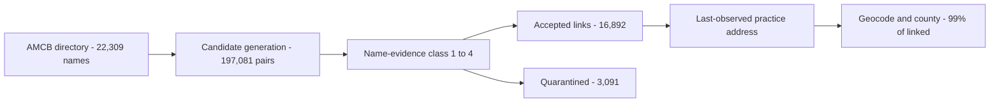

# Mermaid bisect — block 1

Isolated from `README.md` line 9. If this page renders the diagram, the block is fine on its own; if it shows *"Unable to render rich display"*, this is the block breaking the README.

