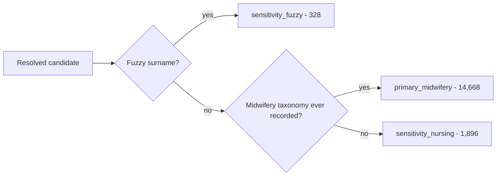

# Mermaid bisect — block 3

Isolated from `README.md` line 106. If this page renders the diagram, the block is fine on its own; if it shows *"Unable to render rich display"*, this is the block breaking the README.

