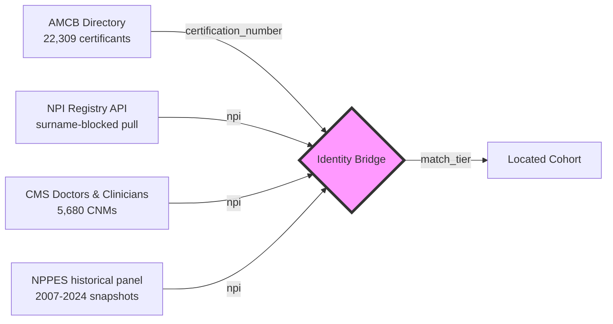
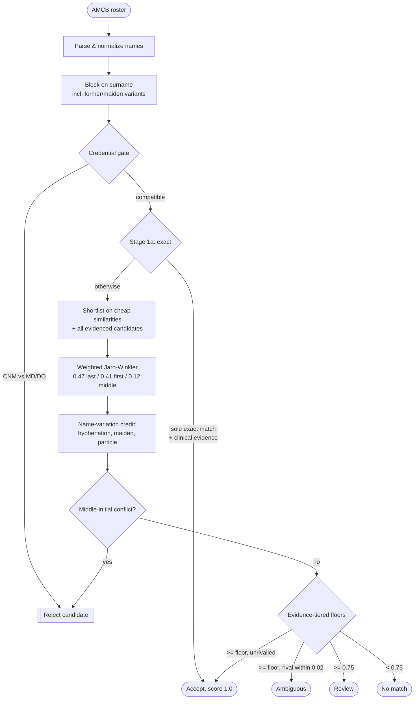
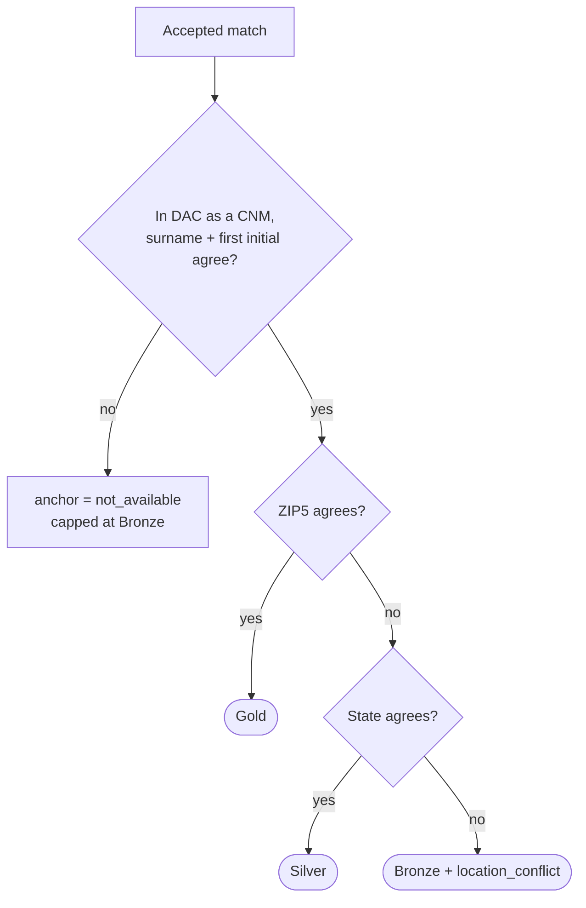
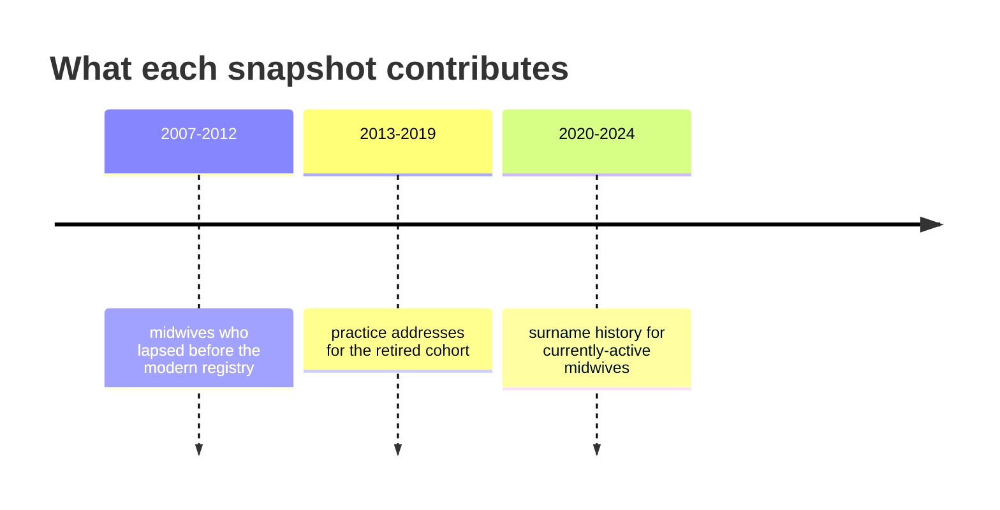
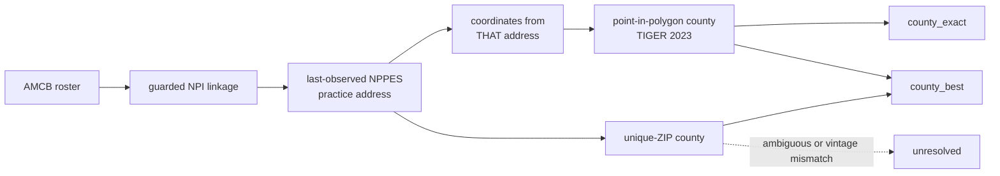

## Overview

The American Midwifery Certification Board publishes a certification directory
of 22,309 records. It gives certification number, status, dates and name --
and **no location whatsoever**. City and state sit behind AMCB's paid
primary-source verification.

This vignette documents how those 22,309 names are resolved to NPIs, and
therefore to practice locations, without touching that paywall. It follows the
structure of `isochrones::vignettes/step-1-npi-matching.Rmd` and notes where
this cohort forces a departure from it.

The departures are not stylistic. Two properties of this population break
assumptions that hold for the ABOG physician roster:

- **There is no roster location.** The Spatial Anchor, the central
  anti-"identity theft" gate of the physician pipeline, has nothing to anchor
  *to*. It is reconstructed here from corroboration between independent
  sources rather than from roster-to-candidate agreement.
- **The cohort is ~99% women, certified over four decades.** Surname change is
  not an edge case; it is a leading cause of non-match, and it drives the
  design of both the candidate pull and the temporal panel.

---

## The Identity Bridge



---

## Why candidates come from surnames, not taxonomy

The obvious approach -- pull every NPPES provider carrying a midwifery
taxonomy and match names within that set -- was the first implementation, and
it capped recall at 45%. Two reasons, both confirmed by inspecting failures:

1. **A midwife need not be enumerated as one.** A certified nurse-midwife
   registered under a Women's Health Nurse Practitioner taxonomy is invisible
   to a taxonomy filter. Taxonomy belongs in the *decision*, not in the
   *candidate generation*.
2. **The bulk file is stale.** The local dissemination file was two years old,
   so recently certified midwives were absent from it entirely.

Candidates are therefore pulled from the live NPI Registry API keyed on
surname, which also returns each provider's `other_names` -- the former and
maiden names that this cohort needs.

| Approach | Accepted |
|:---|---:|
| Taxonomy-filtered bulk file (March 2024) | 45.1% |
| Surname-blocked live API + evidence tiers | 73.3% |

---

## Name normalization

```mermaid
flowchart LR
    In([Raw AMCB name]) --> P[parse_physician_name_enhanced]
    P --> U[Unicode NFC<br/>+ transliteration]
    U --> S[Suffix / particle<br/>handling]
    S --> Out[/first, middle, last/]

    subgraph Examples
        direction TB
        E1["'Tracy Ann Steinke' -> first=TRACY, middle=ANN STEINKE"]
        E2["'Maria O&#8217;Brien' -> O'BRIEN"]
        E3["'Sarah Al&#8211;Hashi' -> AL-HASHI"]
    end
```



AMCB packs middle names into the first-name field. Compared whole against an
NPPES first name, genuine matches scored as low as 0.78 and fell out of the
accept band. `parse_physician_name_enhanced()`
(`isochrones::R/name_parsing_protocol_enhanced.R`, non-negotiable #3) resolves
this along with smart apostrophes, en dashes and diacritics.

---

## The matching cascade



---

## Acceptance scales with clinical evidence

Because the candidate pool is *every same-surname provider*, a perfect name
score is not sufficient evidence of identity -- "Dani Abella" matches a
behaviour technician perfectly. Each candidate is assigned an evidence tier,
and the score required to accept it scales inversely with that evidence:

| Evidence | Signal | Accept floor |
|:---|:---|---:|
| **strong** | Midwifery taxonomy, CNM/CM credential, or listed in DAC as a CNM | 0.82 |
| **weak** | Nursing or women's-health taxonomy/credential | 0.88 |
| **none** | Unrelated specialty | 0.95, and only if sole candidate |

Credentials are matched on a de-punctuated form: `C.N.M.` is common in NPPES
and never matches a `\bCNM\b` pattern.

> The project's own credential gate cannot be reused as-is.
> `normalize_credential()` maps anything outside MD/DO to `UNKNOWN`, and the
> hardened `are_credentials_compatible()` fails *closed* on unknown enums. A
> CNM therefore either disables the gate or is rejected by it, depending on
> which is called. `credential_compatibility.R` extends the enum instead --
> making it a genuine precision lever, since an AMCB midwife matching an
> NPPES record credentialed MD is almost certainly a namesake.
>
> Gender blocking is deliberately **not** used: it discriminates poorly in a
> cohort that is ~99% women, silently no-ops when a column is missing, and
> infers a person's gender from their first name.

---

## The Spatial Anchor, reconstructed

The physician pipeline rejects a name-only agreement when the candidate shares
neither ZIP nor state with the roster record. AMCB publishes no location, so
there is nothing to anchor against -- the anchor cannot be applied literally.

The substitute is corroboration *between the two independent sources that do
carry location*: the live NPI Registry and CMS Doctors and Clinicians. When
both list the matched NPI and agree on ZIP (or state), two separately
maintained rosters place the same name at the same practice.



Where DAC has no row for the NPI the anchor simply cannot run, and the match
is capped at Bronze rather than being credited with corroboration it never
received.

| Tier | Meaning |
|:---|:---|
| **Gold** | Two independent rosters agree on identity **and** ZIP |
| **Silver** | Two independent rosters agree on identity **and** state |
| **Bronze** | Strong clinical evidence, no independent location corroboration |
| **Lead** | Weak or absent evidence |

---

## Recovering the people who left the registry

Match rate falls monotonically with certification status, and the reason is
structural rather than algorithmic: the live registry only knows who is
enumerated **today**.

| Status | n | Matched | Rate |
|:---|---:|---:|---:|
| ACTIVE | 15,285 | 12,987 | 85.0% |
| EMERITUS | 27 | 22 | 81.5% |
| RETIRED | 1,278 | 700 | 54.8% |
| LAPSED | 5,175 | 2,535 | 49.0% |
| DECEASED | 499 | 72 | 14.4% |

A midwife who retired in 2016 is not in the 2026 registry to be found. She
*is* in the 2016 dissemination file. `build_midwife_panel.R` scans one NPPES
snapshot per year from 2007 to 2024 and keeps every provider carrying a
midwifery taxonomy in any of the 15 taxonomy slots.



The panel yields two things nothing else does:

1. **Historical practice addresses** for midwives absent from the live
   registry -- directly addressing the LAPSED, RETIRED and DECEASED rows above.
2. **Surname history.** The same NPI appears under different last names across
   snapshots. Each historical surname becomes an additional blocking key, which
   in this cohort is the largest single recall lever available.

> The NBER temporal panel (`temporal_all_years_fixed`) is **not** a substitute:
> it is scoped to OB/GYN and contains exactly 3 midwives.

---

## Sources, and what each is worth

| Source | Adds | Assessment |
|:---|:---|:---|
| NPI Registry API (surname-blocked) | Candidates, former names | Primary pull; 1.28M candidate name-rows |
| CMS Doctors &amp; Clinicians 2026-06 | CNM specialty, address, anchor | 5,680 CNMs. The 2022 copy had 3,259 -- always fetch current |
| NPPES historical snapshots 2007-2024 | Departed midwives, surname history | Highest-value remaining source |
| Medicare Physician &amp; Other Practitioners | `Rndrng_Prvdr_Type = "Certified Nurse Midwife"` + address + RUCA | Only **943** CNM rows in the latest year; most midwives bill under a facility |
| NBER `temporal_all_years_fixed` | -- | OB/GYN-scoped; 3 midwives. Not usable |

---

## Quality gates

- **Match rate** ≥ 65%. Currently 73.3%. **PASS**
- **High-confidence rate** (Gold + Silver) ≥ 50%. **FAIL** -- and the ceiling
  is DAC coverage, not match quality: only NPIs present in Doctors and
  Clinicians can be anchored at all, so this gate is unreachable from NPPES
  alone. Report it, do not redefine it to pass.
- **Cohort conservation.** Every `certification_number` in the input appears
  exactly once in the output. Enforced by `validate_pipeline_output()`.
- **One NPI, one person.** Where two certificants claim the same NPI, the
  stronger score keeps it and the others drop to Ambiguous; ties break on
  `certification_number` so the output is reproducible.

Every candidate pair considered is written to `artifacts/match_ledger.csv`,
and every exclusion to `artifacts/exclusion_ledger.csv` (non-negotiable #15).

---

## Stage 3: geography, and why it is a separate provenance stage

The linkage artifact and the geography derived from it are deliberately kept
apart. `amcb_npi_linkage_FROZEN.csv` answers *who is this person*;
`midwives_geography_guarded.csv` answers *where was that person last observed*.
Re-deriving geography must never silently alter identity, so Stage 3 reads the
frozen linkage and never writes back to it.



**Coordinates and ZIP must share an address vintage.** They did not
originally: coordinates were geocoded from a previous roster's address and
keyed on certification number, while the ZIP came from the panel snapshot named
in `nppes_location_year`. That compares two different practice locations for
one person. Agreement fell to 94.47%, below the pipeline's own 95% gate --
which is the gate doing its job, not a nuisance. Among discordant rows the two
rosters' ZIPs differed 71.8% of the time against 5.0% among validation rows
overall, and only 42 of 216 involved an actual NPI change.
`geocode_panel_addresses.R` now geocodes the address the linkage actually used.

### Validation

| Measure | Result |
|:---|:---|
| Coordinate vs unique-ZIP county agreement | **98.34%** (3,980 / 4,047) |
| Excluding the Connecticut vintage rows | **100%** (3,980 / 3,980) |
| Discordant cases | 67, **all Connecticut** |

Coverage is not evidence; agreement is. Midwives holding both a
coordinate-derived and a unique-ZIP county are an internal validation sample,
and the fallback reproduces the coordinate answer empirically.

### Ascertainment

| Measure | n | % |
|:---|---:|---:|
| `county_exact` (coordinates only) | 4,809 | 30.6% of linked |
| `county_best` (+ unique ZIP) | 13,467 | 85.7% of linked |
| **`county_best` as a share of the full AMCB roster** | **13,467 / 22,309** | **60.4%** |
| Primary linkage | | 85.8% |
| Fuzzy sensitivity linkage | | 82.1% |

Fuzzy-surname matches remain **sensitivity-only** and are never pooled into the
primary cohort.

### What is deliberately left unresolved

* **Connecticut.** 186 records whose unique-ZIP county exists in the 2020
  crosswalk but not in the 2023 analysis universe, because Connecticut replaced
  counties with planning regions in 2022. These are classified
  `zip_vintage_mismatch` and left unresolved rather than force-assigned a GEOID
  that would silently fail to merge.
* **Ambiguous ZIPs.** 1,935 records whose ZIP spans more than one county.

### 60.4% is not a ceiling

**6,793 distinct practice addresses are cache misses and have not been
geocoded.** They sit in `artifacts/panel_geocode_queue.csv`. Running them
through the geocoding pipeline would raise `county_exact` above 30.6%, enlarge
the validation sample, and recover further county assignments. The 60.4% figure
describes the current state of ascertainment, not its limit.

And it carries the same caveat as the linkage itself: 82.3% of ACTIVE
certificants link against 19.6% of DECEASED, so neither the linkage nor the
geography derived from it is a random sample of the roster.

---

## Reproducing

```sh
python3 scrape.py                  # AMCB directory   -> midwives.csv
python3 fetch_npi_candidates.py    # NPI Registry API -> nppes_candidates.csv
Rscript extract_dac_midwives.R     # CMS DAC          -> dac_midwives.csv
Rscript build_midwife_panel.R      # NPPES 2007-2024  -> midwife_panel.csv
Rscript match_nppes.R              #                  -> midwives_with_nppes.csv
Rscript geocode_midwives.R         #                  -> midwives_geocoded.csv
```

`ISOCHRONES_R` points at the isochrones `R/` directory; `DAC_FILE` and
`NPPES_HISTORY` override the CMS and snapshot paths.

## See also

- `isochrones::vignettes/step-1-npi-matching.Rmd` -- the physician-cohort original
- `credential_compatibility.R` -- why the credential gate is re-implemented
